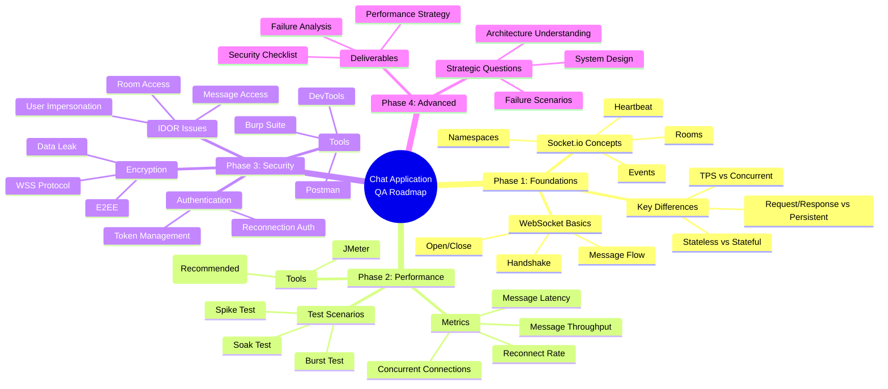
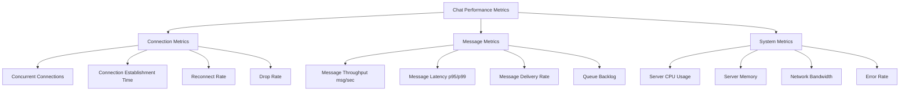

# 🧭 LEARNING ROADMAP: CHAT APPLICATION TESTING (QA / SDET – REAL-TIME)

## 📊 Mind Map Overview




---

## 🎯 Ultimate Goal

After **3–6 months**, you will be able to:

- ✅ **Design Performance Tests** for Real-time Chat systems
- ✅ **Identify & simulate** real-world bottlenecks
- ✅ **Master Security & Privacy** testing for Chat applications
- ✅ **Consult effectively** with Backend / Product / Security teams
- ✅ **Become a specialized Chat QA** (rare & highly-paid role)

---

## 📈 Learning Path Diagram

```
┌─────────────────────────────────────────────────────────────────┐
│                    CHAT APPLICATION QA ROADMAP                   │
└─────────────────────────────────────────────────────────────────┘
                              │
        ┌─────────────────────┼─────────────────────┐
        │                     │                     │
    ┌───▼───┐            ┌───▼───┐            ┌───▼───┐
    │ WEEK  │            │ WEEK  │            │ WEEK  │
    │ 1-3   │            │ 4-9   │            │ 10-13 │
    │       │            │       │            │       │
    │Phase 1│            │Phase 2│            │Phase 3│
    │Foundation          │Performance         │Security│
    └───┬───┘            └───┬───┘            └───┬───┘
        │                    │                    │
        │                    │                    │
    ┌───▼───────────────────────────────────────────▼───┐
    │              WEEK 14-24 (Optional)                │
    │                                                    │
    │                 Phase 4: Advanced                 │
    │         Become "Product Guardian"                 │
    └────────────────────────────────────────────────────┘
```

---

# 📚 PHASE 1 — REAL-TIME FOUNDATIONS (2–3 Weeks)

## 🎓 What You Need to Learn First

### 1️⃣ Understanding Chat ≠ Traditional Web

#### 🔄 Core Differences Explained

| Aspect | Traditional Web | Chat (Real-time) | Why It Matters |
|:---|:---|:---|:---|
| **Communication Pattern** | Request/Response | Persistent Connection | Chat needs constant connection |
| **State Management** | Stateless | Stateful | Chat remembers who's connected |
| **Primary Metric** | TPS (Transactions Per Sec) | Concurrent Connections | We care about users, not requests |
| **Latency Focus** | Page Load Time | Message Latency | Users expect instant delivery |
| **Protocol** | HTTP | WebSocket / Socket.io | Different protocol = different testing |

#### 💡 Visual Comparison

```
Traditional Web (HTTP):
┌──────┐  Request   ┌──────┐
│Client├───────────►│Server│
└──────┘            └──────┘
┌──────┐  Response  ┌──────┐
│Client│◄───────────┤Server│
└──────┘            └──────┘
(Connection closes after each request)

Real-time Chat (WebSocket):
┌──────┐  Handshake  ┌──────┐
│Client├────────────►│Server│
└──────┘             └──────┘
┌──────┐             ┌──────┐
│Client├────────────►│Server│ (Persistent)
└──────┘             └──────┘
│Client│◄────────────┤Server│ (Bi-directional)
└──────┘             └──────┘
(Connection stays open, messages flow both ways)
```

### 2️⃣ Essential Knowledge (You Don't Need to Code Backend!)

#### 🔌 WebSocket Lifecycle (Must Understand)

```mermaid
sequenceDiagram
    participant C as Client
    participant S as Server

    Note over C,S: 1. HANDSHAKE Phase
    C->>S: HTTP Upgrade Request
    S->>C: 101 Switching Protocols
    
    Note over C,S: 2. CONNECTION OPENED
    S->>C: Connection Established
    
    Note over C,S: 3. MESSAGE Exchange
    C->>S: Send Message (text/binary)
    S->>C: Acknowledge
    S->>C: Broadcast to Other Users
    
    Note over C,S: 4. HEARTBEAT (Keep-Alive)
    C->>S: Ping
    S->>C: Pong
    
    Note over C,S: 5. CONNECTION CLOSE
    C->>S: Close Frame
    S->>C: Close Frame
    Connection Closed
```

**What Each Phase Means:**

1. **Handshake**
   - Client sends HTTP request with `Upgrade: websocket` header
   - Server responds with `101 Switching Protocols`
   - Connection upgrades from HTTP to WebSocket

2. **Open**
   - Connection is established
   - Both sides can send/receive immediately
   - No need to open new connection for each message

3. **Message**
   - Data can flow both ways (client ↔ server)
   - Messages can be text or binary
   - No headers needed (unlike HTTP)

4. **Close**
   - Either side can initiate close
   - Connection gracefully terminates
   - Resources are cleaned up

#### 🎯 Socket.io Concepts (Most Chat Apps Use This)

```
Socket.io Architecture:
┌─────────────────────────────────────────┐
│         Socket.io Server                │
│  ┌───────────────────────────────────┐  │
│  │      Namespace: "/chat"           │  │
│  │  ┌─────────────────────────────┐  │  │
│  │  │   Room: "room-123"          │  │  │
│  │  │  ┌─────┐ ┌─────┐ ┌─────┐   │  │  │
│  │  │  │User1│ │User2│ │User3│   │  │  │
│  │  │  └─────┘ └─────┘ └─────┘   │  │  │
│  │  └─────────────────────────────┘  │  │
│  │  ┌─────────────────────────────┐  │  │
│  │  │   Room: "room-456"          │  │  │
│  │  │  ┌─────┐ ┌─────┐           │  │  │
│  │  │  │User4│ │User5│           │  │  │
│  │  │  └─────┘ └─────┘           │  │  │
│  │  └─────────────────────────────┘  │  │
│  └───────────────────────────────────┘  │
└─────────────────────────────────────────┘
```

**Key Concepts Explained:**

1. **Namespace** (`/chat`, `/admin`)
   - Logical separation of different app features
   - Like different "departments" in a building
   - Example: `/chat` for messaging, `/notification` for alerts

2. **Room** (`room-123`, `user-456`)
   - A channel where users can chat
   - Users can join/leave rooms
   - Messages sent to a room reach all users in that room

3. **Event-based Messaging**
   ```javascript
   // Client sends
   socket.emit('send_message', { text: 'Hello' });
   
   // Server receives and broadcasts
   io.to('room-123').emit('new_message', { text: 'Hello' });
   
   // All clients in room-123 receive
   socket.on('new_message', (data) => {
     console.log(data.text); // "Hello"
   });
   ```

4. **Heartbeat (Ping-Pong)**
   - Keep-alive mechanism
   - Server sends ping, client responds with pong
   - If no pong received, connection is considered dead
   - **Why important for testing**: Network issues can cause false disconnections

5. **Fan-out (1 → N users)**
   - **This is the stress point!**
   - 1 user sends message → Server broadcasts to N users
   - If 10,000 users in a room, 1 message = 10,000 server operations
   - **This is where performance testing focuses**

#### 🎓 Practical Learning Exercise

**Week 1-2: Build Understanding**

1. **Day 1-2**: Study WebSocket basics
   - Watch: "WebSocket explained in 5 minutes" (YouTube)
   - Read: MDN WebSocket API documentation
   - **Goal**: Understand the handshake process

2. **Day 3-4**: Explore Socket.io
   - Visit: socket.io/get-started/chat
   - Run their example chat app locally
   - **Goal**: See how rooms and namespaces work

3. **Day 5-7**: Test a simple chat
   - Use browser DevTools → Network → WS tab
   - Observe messages being sent/received
   - **Goal**: Visualize the real-time flow

**Week 3: Deep Dive**

1. **Day 8-10**: Understand fan-out
   - Test: 1 user sends → how many receive?
   - Observe: Server logs during broadcast
   - **Goal**: Grasp the "1 → N" concept

2. **Day 11-14**: Document your learnings
   - Write: "Chat Architecture Notes" for yourself
   - Create: Simple diagram of how chat works
   - **Goal**: Solidify understanding

---

# 🔥 PHASE 2 — PERFORMANCE TESTING FOR CHAT (4–6 Weeks)

## 📊 Why Chat Performance Testing is Different

### The Fundamental Shift

```
Traditional Web Performance Testing:
Focus: How many requests per second?
Metric: TPS (Transactions Per Second)
Test: Can server handle 1000 req/sec?

Chat Performance Testing:
Focus: How many users can stay connected?
Metric: Concurrent Connections
Test: Can 10,000 users stay connected and chat?
```

### 3️⃣ Critical Metrics (Completely Different from Web!)

#### 📈 Metrics Overview Diagram



#### Detailed Metric Explanations

**1. Concurrent Connections** ⭐ Most Important!
- **What it means**: How many users are connected simultaneously
- **Why it matters**: Each connection consumes server resources (memory, file descriptors)
- **How to measure**: Count active WebSocket connections
- **Example**: 
  - ✅ Good: 10,000 concurrent connections, stable
  - ❌ Bad: 5,000 concurrent connections, server crashes

**2. Message Throughput (msg/sec)**
- **What it means**: How many messages can be processed per second
- **Why it matters**: Chat apps need to handle message bursts
- **How to measure**: Messages sent ÷ time
- **Example**:
  - ✅ Good: 50,000 msg/sec (1 user sends → 10,000 receive = 10,001 messages processed)
  - ❌ Bad: 1,000 msg/sec, messages queued and delayed

**3. Message Latency (p95 / p99)**
- **What it means**: Time from sending to receiving
- **Why it matters**: Users expect instant delivery
- **How to measure**: 
  - p95: 95% of messages delivered within X ms
  - p99: 99% of messages delivered within Y ms
- **Example**:
  - ✅ Good: p95 = 50ms, p99 = 100ms
  - ❌ Bad: p95 = 5000ms (5 seconds delay!)

**4. Drop Rate**
- **What it means**: Percentage of connections that fail/disconnect
- **Why it matters**: Dropped connections = bad user experience
- **How to measure**: (Failed connections / Total attempts) × 100
- **Example**:
  - ✅ Good: Drop rate < 0.1%
  - ❌ Bad: Drop rate > 5%

**5. Reconnect Rate**
- **What it means**: How quickly users can reconnect after disconnection
- **Why it matters**: Network issues happen, users need quick recovery
- **How to measure**: Time from disconnect to reconnect
- **Example**:
  - ✅ Good: Reconnect in < 2 seconds
  - ❌ Bad: Reconnect takes 30+ seconds

**6. Queue Backlog**
- **What it means**: Messages waiting to be processed
- **Why it matters**: Growing backlog = system can't keep up
- **How to measure**: Number of messages in queue
- **Example**:
  - ✅ Good: Queue size < 100 messages
  - ❌ Bad: Queue size > 10,000 messages (messages delayed)

**7. Server CPU / Memory**
- **What it means**: Resource usage on server
- **Why it matters**: High usage = potential crashes
- **How to measure**: Monitor server metrics
- **Example**:
  - ✅ Good: CPU < 70%, Memory stable
  - ❌ Bad: CPU > 95%, Memory constantly increasing (memory leak!)

### 4️⃣ Recommended Tools

#### ✅ k6 (Highly Recommended!)

**Why k6 for Chat Testing?**

```
k6 Advantages:
┌─────────────────────────────────────┐
│ ✅ Native WebSocket Support         │
│ ✅ JavaScript-based (easy to learn) │
│ ✅ CI/CD Friendly                   │
│ ✅ Great Documentation              │
│ ✅ Active Community                 │
│ ✅ Lightweight                      │
└─────────────────────────────────────┘
```

**Example k6 Script for Chat Testing:**

```javascript
import ws from 'k6/ws';
import { check } from 'k6';

export const options = {
  stages: [
    { duration: '1m', target: 100 },    // Ramp up to 100 users
    { duration: '3m', target: 100 },    // Stay at 100 users
    { duration: '1m', target: 0 },      // Ramp down
  ],
};

export default function () {
  const url = 'ws://localhost:3000/chat';
  const params = { tags: { name: 'ChatConnection' } };

  // Connect to WebSocket
  const response = ws.connect(url, params, function (socket) {
    // On connection open
    socket.on('open', function () {
      console.log('WebSocket connection opened');
      
      // Join a room
      socket.send(JSON.stringify({
        type: 'join',
        room: 'test-room'
      }));
    });

    // Listen for messages
    socket.on('message', function (data) {
      const message = JSON.parse(data);
      
      check(response, {
        'message received': (r) => message.type === 'chat',
        'message has text': (r) => message.text !== undefined,
      });
    });

    // Send a test message every 5 seconds
    socket.setInterval(function () {
      socket.send(JSON.stringify({
        type: 'message',
        text: 'Hello from k6!',
        room: 'test-room'
      }));
    }, 5000);

    // Close connection after 30 seconds
    socket.setTimeout(function () {
      socket.close();
    }, 30000);
  });

  check(response, {
    'status is 101': (r) => r && r.status === 101,
  });
}
```

**Learning k6 (Week 4-5):**

1. **Day 1-2**: Install and run first test
   ```bash
   # Install k6
   brew install k6  # Mac
   # or
   choco install k6  # Windows
   
   # Run example
   k6 run chat-test.js
   ```

2. **Day 3-5**: Understand WebSocket in k6
   - Read: k6.io/docs/javascript-api/k6-ws
   - Practice: Connect to a test chat server
   - **Goal**: Successfully connect and send messages

3. **Day 6-10**: Build real test scenarios
   - Test concurrent connections
   - Measure message latency
   - **Goal**: Write your first performance test

#### ⚠️ JMeter (Only if Required)

**Why JMeter is Less Ideal:**

```
JMeter Limitations for Chat:
┌─────────────────────────────────────┐
│ ❌ Requires WebSocket Plugin        │
│ ❌ Heavy Resource Usage             │
│ ❌ Hard to Maintain                 │
│ ❌ GUI-based (harder to version)    │
│ ❌ Less flexible for long-running   │
└─────────────────────────────────────┘
```

**When to Use JMeter:**
- Company policy requires JMeter
- Team already uses JMeter extensively
- Need GUI-based testing

### 5️⃣ Real-World Test Scenarios

#### Scenario 1: Spike Connections Test 🔥

**Objective**: Test how server handles sudden connection surge

```
Test Pattern:
Time (minutes)
0:00  ────────────────► 10,000 users
      (Ramp up in 1 minute)
      
Observations:
- How many connections succeed?
- Where does it fail? (Handshake? Auth?)
- Server response time?
- Error messages?
```

**k6 Script Example:**

```javascript
export const options = {
  stages: [
    { duration: '1m', target: 10000 },  // Spike to 10k in 1 min
    { duration: '2m', target: 10000 },  // Hold for 2 min
    { duration: '1m', target: 0 },      // Ramp down
  ],
  thresholds: {
    'ws_connecting': ['rate<0.01'],     // < 1% connection failures
    'ws_session_duration': ['p(95)<2000'], // 95% connect in < 2s
  },
};

export default function () {
  const url = 'ws://your-chat-server.com/chat';
  
  ws.connect(url, {}, function (socket) {
    socket.on('open', () => {
      // Test authentication
      socket.send(JSON.stringify({ type: 'auth', token: 'test-token' }));
    });
    
    socket.setTimeout(() => socket.close(), 60000);
  });
}
```

**What to Look For:**
- ✅ **Good**: 9,950+ connections succeed (< 0.5% failure)
- ❌ **Bad**: Only 5,000 connections succeed (50% failure)
- 🔍 **Debug**: Check server logs for "connection refused" or "timeout"

#### Scenario 2: Soak Test (Long-Running) ⏰

**Objective**: Find memory leaks and zombie connections

```
Test Pattern:
Time (hours)
0:00  ────────────────────────────────────────────► 8:00
      (5,000 users stay connected for 8 hours)
      
What to Monitor:
- Memory usage over time (should be stable)
- Number of active connections (should stay at 5k)
- Message delivery (should remain consistent)
```

**k6 Script Example:**

```javascript
export const options = {
  stages: [
    { duration: '5m', target: 5000 },   // Ramp up to 5k users
    { duration: '8h', target: 5000 },   // Soak for 8 hours
    { duration: '5m', target: 0 },      // Ramp down
  ],
};

export default function () {
  const url = 'ws://your-chat-server.com/chat';
  
  ws.connect(url, {}, function (socket) {
    socket.on('open', () => {
      socket.send(JSON.stringify({ type: 'join', room: 'soak-test' }));
    });
    
    // Send heartbeat every 30 seconds
    socket.setInterval(() => {
      socket.send(JSON.stringify({ type: 'ping' }));
    }, 30000);
    
    // Listen for messages
    socket.on('message', (data) => {
      // Process message
    });
  });
}
```

**What to Look For:**
- ✅ **Good**: Memory usage stays flat, all connections remain active
- ❌ **Bad**: Memory usage increases over time (memory leak!)
- ❌ **Bad**: Connections drop over time (zombie connections)
- 🔍 **Debug**: Use server monitoring tools (Grafana, Prometheus)

#### Scenario 3: Burst Message Test 💥

**Objective**: Test rate limiting and queue overflow

```
Test Pattern:
Time (seconds)
0:00  ──────────────────► User sends 100 messages
      (All within 1 second)
      
What to Test:
- Does rate limiting work?
- Does queue overflow?
- Are messages lost?
- Server stability?
```

**k6 Script Example:**

```javascript
export const options = {
  vus: 10,  // 10 virtual users
  duration: '1m',
};

export default function () {
  const url = 'ws://your-chat-server.com/chat';
  
  ws.connect(url, {}, function (socket) {
    socket.on('open', () => {
      // Send 100 messages rapidly
      for (let i = 0; i < 100; i++) {
        socket.send(JSON.stringify({
          type: 'message',
          text: `Message ${i}`,
          room: 'burst-test'
        }));
      }
    });
    
    socket.on('message', (data) => {
      // Verify message was received
    });
  });
}
```

**What to Look For:**
- ✅ **Good**: Rate limiting kicks in, messages queued properly
- ❌ **Bad**: Server crashes or messages lost
- 🔍 **Debug**: Check server logs for "rate limit exceeded" or "queue full"

### 📚 Learning Path for Phase 2

**Week 4-5: Tool Setup & Basics**
- Day 1-3: Install k6, run first test
- Day 4-7: Learn WebSocket testing in k6
- Day 8-10: Write basic connection test
- Day 11-14: Measure concurrent connections

**Week 6-7: Advanced Scenarios**
- Day 15-17: Implement spike test
- Day 18-21: Implement soak test
- Day 22-24: Implement burst test
- Day 25-28: Analyze results and create reports

**Week 8-9: Real-World Practice**
- Day 29-35: Test a real chat application
- Day 36-42: Create performance test strategy document
- Day 43-49: Present findings to team

---

# 🛡️ PHASE 3 — SECURITY & PRIVACY FOR CHAT (3–4 Weeks)

## 🔒 Why Chat Security is Critical

Chat applications handle sensitive data:
- Personal conversations
- Private information
- Authentication tokens
- User presence status

**One security flaw = Data breach affecting thousands of users!**

### 6️⃣ Common Security Vulnerabilities in Chat

#### 🔥 IDOR (Insecure Direct Object Reference)

**What is IDOR?**
Accessing resources that belong to other users without authorization.

**Why Chat is Vulnerable:**
- Multiple rooms/conversations
- Complex permission models
- Real-time nature makes it hard to verify

**Common IDOR Attacks in Chat:**

```
Attack Scenario 1: Unauthorized Room Access
┌─────────────────────────────────────────┐
│ Attacker's Request:                     │
│ POST /api/rooms/join                    │
│ { "roomId": "room-123" }                │
│                                         │
│ ❌ Vulnerable: No check if user has     │
│    permission to join room-123          │
│                                         │
│ ✅ Secure: Verify user is invited/      │
│    has access before allowing join      │
└─────────────────────────────────────────┘

Attack Scenario 2: Read Other Users' Messages
┌─────────────────────────────────────────┐
│ Attacker's Request:                     │
│ GET /api/messages?conversationId=456    │
│                                         │
│ ❌ Vulnerable: Returns all messages     │
│    without checking if user is part of  │
│    conversation-456                     │
│                                         │
│ ✅ Secure: Verify user is participant   │
│    before returning messages            │
└─────────────────────────────────────────┘

Attack Scenario 3: Send Messages as Another User
┌─────────────────────────────────────────┐
│ Attacker's WebSocket Message:           │
│ {                                       │
│   "type": "send_message",               │
│   "userId": "victim-user-id",  ← ⚠️    │
│   "text": "Fake message"                │
│ }                                       │
│                                         │
│ ❌ Vulnerable: Server trusts userId     │
│    from client message                  │
│                                         │
│ ✅ Secure: Use authenticated session    │
│    userId, ignore client-provided id   │
└─────────────────────────────────────────┘
```

**How to Test for IDOR:**

```javascript
// Test Case 1: Try to join private room
async function testUnauthorizedRoomAccess() {
  // As User A
  const tokenA = await login('userA@example.com', 'password');
  
  // Try to join room that belongs to User B
  const response = await fetch('/api/rooms/join', {
    method: 'POST',
    headers: { 'Authorization': `Bearer ${tokenA}` },
    body: JSON.stringify({ roomId: 'user-b-private-room' })
  });
  
  // Should fail with 403 Forbidden
  expect(response.status).toBe(403);
}

// Test Case 2: Try to read other user's messages
async function testUnauthorizedMessageAccess() {
  const tokenA = await login('userA@example.com', 'password');
  
  // Try to get messages from conversation between User B and User C
  const response = await fetch('/api/messages?conversationId=bc-conversation', {
    headers: { 'Authorization': `Bearer ${tokenA}` }
  });
  
  // Should fail with 403 Forbidden
  expect(response.status).toBe(403);
}

// Test Case 3: Try to send message as another user
async function testUserImpersonation() {
  const socket = io('ws://chat-server.com', {
    auth: { token: 'user-a-token' }
  });
  
  socket.on('connect', () => {
    // Try to send message claiming to be User B
    socket.emit('send_message', {
      userId: 'user-b-id',  // ⚠️ Should be ignored by server
      text: 'Fake message',
      roomId: 'room-123'
    });
  });
  
  // Verify message shows as from User A (not User B)
  socket.on('message_sent', (message) => {
    expect(message.userId).toBe('user-a-id');
  });
}
```

#### 🔐 Authentication & Authorization Issues

**Common Problems:**

```
Problem 1: Token Reuse
┌─────────────────────────────────────────┐
│ ❌ Vulnerable:                           │
│ - Token never expires                   │
│ - Token can be reused multiple times    │
│ - Stolen token = permanent access       │
│                                         │
│ ✅ Secure:                              │
│ - Token expires (JWT with exp claim)    │
│ - One-time tokens for critical actions  │
│ - Refresh token mechanism               │
└─────────────────────────────────────────┘

Problem 2: Reconnection Without Re-authentication
┌─────────────────────────────────────────┐
│ ❌ Vulnerable:                           │
│ Client disconnects → Reconnects         │
│ Server accepts reconnection with old    │
│ session (no auth check)                 │
│                                         │
│ ✅ Secure:                              │
│ Reconnection requires new token or      │
│ re-verification of existing token       │
└─────────────────────────────────────────┘

Problem 3: Token in URL
┌─────────────────────────────────────────┐
│ ❌ Vulnerable:                           │
│ ws://chat.com/chat?token=abc123         │
│                                         │
│ Problems:                               │
│ - Token visible in browser history      │
│ - Token in server logs                  │
│ - Token can be shared via URL           │
│                                         │
│ ✅ Secure:                              │
│ Token in Authorization header or        │
│ cookie (HttpOnly, Secure)               │
└─────────────────────────────────────────┘
```

**Test Cases:**

```javascript
// Test Case 1: Token Expiration
async function testTokenExpiration() {
  const token = await login('user@example.com', 'password');
  
  // Wait for token to expire (or use expired token)
  const expiredToken = 'expired-jwt-token';
  
  const socket = io('ws://chat-server.com', {
    auth: { token: expiredToken }
  });
  
  socket.on('connect_error', (error) => {
    // Should reject connection
    expect(error.message).toContain('token expired');
  });
}

// Test Case 2: Reconnection Authentication
async function testReconnectionAuth() {
  const socket = io('ws://chat-server.com', {
    auth: { token: 'valid-token' }
  });
  
  socket.on('connect', () => {
    // Disconnect
    socket.disconnect();
    
    // Try to reconnect without new token
    socket.connect();
    
    socket.on('connect_error', (error) => {
      // Should require re-authentication
      expect(error.message).toContain('authentication required');
    });
  });
}
```

#### 🔒 Encryption & Data Leak Issues

**End-to-End Encryption (E2EE):**

```
E2EE Flow:
┌──────┐                    ┌──────┐
│User A│                    │User B│
└──┬───┘                    └───┬──┘
   │                            │
   │ 1. Encrypt message         │
   │    with User B's key       │
   │                            │
   ▼                            │
┌──────┐                    │
│Server│ 2. Store encrypted │
│      │◄───────────────────┘
│      │    (Server cannot read)
└──┬───┘
   │
   │ 3. Forward encrypted
   │    message to User B
   │
   ▼
┌──────┐
│User B│ 4. Decrypt with
│      │    private key
└──────┘
```

**Common Data Leak Points:**

```
1. Plaintext in Server Logs
❌ Server logs: "User sent: My password is 12345"
✅ Server logs: "User sent message (encrypted)"

2. WebSocket Traffic (Non-WSS)
❌ ws://chat.com (unencrypted)
✅ wss://chat.com (encrypted with TLS)

3. Error Messages Leak Info
❌ Error: "User john@example.com not found in room-123"
✅ Error: "Access denied"

4. Message Metadata Exposure
❌ API returns: { sender: "admin", isAdmin: true, email: "admin@..." }
✅ API returns: { sender: "user-123" } (minimal info)
```

**Test Cases:**

```javascript
// Test Case 1: Check for WSS (Secure WebSocket)
function testSecureConnection() {
  const socket = io('wss://chat-server.com', {
    // Should use wss:// not ws://
  });
  
  socket.on('connect', () => {
    // Verify connection is secure
    expect(window.location.protocol).toBe('https:');
  });
}

// Test Case 2: Check Error Messages
async function testErrorMessageLeak() {
  try {
    await fetch('/api/rooms/nonexistent-room/messages', {
      headers: { 'Authorization': 'Bearer valid-token' }
    });
  } catch (error) {
    // Error should not contain sensitive info
    expect(error.message).not.toContain('@');
    expect(error.message).not.toContain('password');
    expect(error.message).not.toContain('token');
  }
}

// Test Case 3: Verify E2EE
async function testEndToEndEncryption() {
  // Send message and capture network traffic
  const message = 'Secret message';
  socket.emit('send_message', { text: message });
  
  // Check network tab - message should be encrypted
  // (Not readable plaintext)
}
```

### 7️⃣ Security Testing Tools

#### 🔧 Tool Overview

```
Security Testing Tools for Chat:
┌─────────────────────────────────────────┐
│ 1. Burp Suite                           │
│    - WebSocket interception             │
│    - Modify messages in real-time       │
│    - Replay attacks                     │
│                                         │
│ 2. Browser DevTools                     │
│    - Network → WS tab                   │
│    - View WebSocket frames              │
│    - Inspect message payloads           │
│                                         │
│ 3. Postman                              │
│    - WebSocket client                   │
│    - Manual testing                     │
│    - Test different scenarios           │
│                                         │
│ 4. OWASP ZAP                            │
│    - Automated security scanning        │
│    - API security testing               │
└─────────────────────────────────────────┘
```

**Burp Suite Setup for Chat Testing:**

```
Burp Suite Configuration:
1. Install Burp Suite Community (free)
2. Configure browser proxy (127.0.0.1:8080)
3. Enable WebSocket interception
4. Intercept and modify messages
```

**Browser DevTools Usage:**

```javascript
// Steps to test with DevTools:
// 1. Open Chrome DevTools (F12)
// 2. Go to Network tab
// 3. Filter by "WS" (WebSocket)
// 4. Connect to chat
// 5. View messages in real-time
// 6. Check for:
//    - Plaintext sensitive data
//    - Unencrypted connections (ws://)
//    - Token exposure
```

### 📚 Learning Path for Phase 3

**Week 10-11: Security Fundamentals**
- Day 1-3: Study OWASP Top 10 (focus on A2, A4, A5)
- Day 4-7: Learn IDOR attacks and prevention
- Day 8-10: Study authentication/authorization patterns
- Day 11-14: Practice with Burp Suite

**Week 12-13: Practical Testing**
- Day 15-17: Test IDOR vulnerabilities in chat app
- Day 18-21: Test authentication flows
- Day 22-24: Test encryption and data leak
- Day 25-28: Create security test report

---

# 🚀 PHASE 4 — ADVANCED: BECOME "THE PRODUCT GUARDIAN" (Optional, 10+ Weeks)

## 🎯 Moving Beyond Testing

At this phase, you're not just testing—you're thinking like an architect.

### 8️⃣ Strategic Questioning (Think Like a System Designer)

**Instead of asking: "Does it work?"**

**Ask these questions instead:**

#### Question 1: Architecture Understanding

```
❌ Bad Question:
"Can users send messages?"

✅ Strategic Question:
"How does the server broadcast one message to 1,000 users?
 - Does it use fan-out?
 - Is there a message queue?
 - How does it handle failures?"
```

#### Question 2: Failure Scenarios

```
❌ Bad Question:
"What happens if server is down?"

✅ Strategic Question:
"If one node in the cluster crashes:
 - Are messages lost?
 - How is chat history synced?
 - Can users reconnect to different node?
 - What's the recovery time?"
```

#### Question 3: Data Consistency

```
❌ Bad Question:
"Are messages saved?"

✅ Strategic Question:
"How is chat history synced when a user reconnects after 1 hour?
 - Are missed messages delivered?
 - Is there a message queue?
 - How are duplicates prevented?"
```

#### Question 4: Rate Limiting Strategy

```
❌ Bad Question:
"Is there rate limiting?"

✅ Strategic Question:
"Where is rate limiting implemented?
 - At gateway level?
 - At application level?
 - Per user or per room?
 - What happens when limit is exceeded?"
```

### 9️⃣ High-Value Deliverables

Create these documents to prove your expertise:

#### Document 1: Chat Performance Test Strategy

**Template Structure:**

```markdown
# Chat Application Performance Test Strategy

## 1. Executive Summary
- Current capacity: X concurrent users
- Target capacity: Y concurrent users
- Key risks identified

## 2. Test Objectives
- Concurrent connection limits
- Message throughput requirements
- Latency SLAs

## 3. Test Scenarios
### Scenario 1: Spike Connections
- Objective
- Test design
- Success criteria

### Scenario 2: Soak Test
- Objective
- Test design
- Success criteria

## 4. Metrics & KPIs
- Concurrent connections
- Message latency (p95, p99)
- Error rates

## 5. Tools & Infrastructure
- k6 scripts
- Test data
- Monitoring setup

## 6. Results & Recommendations
- Findings
- Bottlenecks identified
- Optimization suggestions
```

#### Document 2: Security Checklist for Real-time Messaging

**Template:**

```markdown
# Security Checklist: Real-time Chat Application

## Authentication & Authorization
- [ ] Tokens expire properly
- [ ] Reconnection requires re-auth
- [ ] Tokens not in URL
- [ ] Role-based access control works

## IDOR Prevention
- [ ] Users cannot join unauthorized rooms
- [ ] Users cannot read other users' messages
- [ ] Users cannot impersonate others
- [ ] Room permissions verified server-side

## Encryption & Privacy
- [ ] WebSocket uses WSS (not WS)
- [ ] E2EE implemented (if required)
- [ ] No sensitive data in logs
- [ ] Error messages don't leak info

## Rate Limiting
- [ ] Message rate limiting
- [ ] Connection rate limiting
- [ ] Prevents spam/DoS

## Data Protection
- [ ] Messages encrypted at rest
- [ ] Backup encryption
- [ ] GDPR compliance (if applicable)
```

#### Document 3: Real-time Failure Mode Analysis (FMA)

**Template:**

```markdown
# Failure Mode Analysis: Chat Application

## Failure Scenarios

### Scenario 1: Single Node Failure
- **Impact**: High
- **Probability**: Medium
- **Detection**: Automated monitoring
- **Recovery**: Auto-failover to standby node
- **User Impact**: Temporary disconnection (< 5 seconds)

### Scenario 2: Database Failure
- **Impact**: Critical
- **Probability**: Low
- **Detection**: Health checks
- **Recovery**: Database replication, failover
- **User Impact**: No message history until recovery

### Scenario 3: Network Partition
- **Impact**: High
- **Probability**: Low
- **Detection**: Heartbeat monitoring
- **Recovery**: Automatic reconnection
- **User Impact**: Messages queued, delivered after reconnection

## Mitigation Strategies
- Redundancy
- Monitoring & Alerting
- Graceful Degradation
```

### 📚 Learning Path for Phase 4

**Week 14-16: System Design**
- Study distributed systems basics
- Learn about message queues (RabbitMQ, Kafka)
- Understand load balancing and failover

**Week 17-20: Create Deliverables**
- Write Performance Test Strategy
- Create Security Checklist
- Document Failure Mode Analysis

**Week 21-24: Present & Refine**
- Present to team/stakeholders
- Get feedback
- Refine documents
- Build portfolio

---

# ⏳ Realistic Timeline Summary

```
Timeline Overview:
┌─────────────────────────────────────────────────────┐
│ Month 1: Foundation                                 │
│ ✅ Understand WebSocket/Socket.io                   │
│ ✅ Grasp real-time concepts                         │
│ ✅ Test basic chat functionality                    │
└─────────────────────────────────────────────────────┘
                    │
                    ▼
┌─────────────────────────────────────────────────────┐
│ Month 2-3: Performance Testing                      │
│ ✅ Set up k6                                        │
│ ✅ Write performance test scripts                   │
│ ✅ Execute spike, soak, burst tests                 │
│ ✅ Analyze results                                  │
└─────────────────────────────────────────────────────┘
                    │
                    ▼
┌─────────────────────────────────────────────────────┐
│ Month 4: Security Testing                           │
│ ✅ Learn security testing tools                     │
│ ✅ Test IDOR vulnerabilities                        │
│ ✅ Test authentication/authorization                │
│ ✅ Create security checklist                        │
└─────────────────────────────────────────────────────┘
                    │
                    ▼
┌─────────────────────────────────────────────────────┐
│ Month 5-6: Advanced (Optional)                      │
│ ✅ System design thinking                           │
│ ✅ Create comprehensive documents                   │
│ ✅ Become specialized Chat QA                       │
└─────────────────────────────────────────────────────┘
```

---

# 📖 Quick Reference Guide

## Key Metrics Cheat Sheet

| Metric | What It Measures | Good Value | How to Measure |
|:---|:---|:---|:---|
| **Concurrent Connections** | Users connected simultaneously | 10,000+ | Count active WebSocket connections |
| **Message Throughput** | Messages processed per second | 50,000+ msg/sec | Messages sent ÷ time |
| **Message Latency (p95)** | 95% of messages delivered within | < 100ms | Time from send to receive |
| **Drop Rate** | Percentage of failed connections | < 0.1% | Failed connections / Total attempts |
| **Reconnect Rate** | Time to reconnect after disconnect | < 2 seconds | Time from disconnect to reconnect |

## Common Test Scenarios

1. **Spike Test**: 0 → 10k users in 1 minute
2. **Soak Test**: 5k users for 8 hours
3. **Burst Test**: 1 user sends 100 messages/second

## Security Test Checklist

- [ ] IDOR: Can users access unauthorized rooms?
- [ ] IDOR: Can users read other users' messages?
- [ ] Auth: Do tokens expire?
- [ ] Auth: Is reconnection authenticated?
- [ ] Encryption: Is WSS used (not WS)?
- [ ] Encryption: Are messages encrypted?
- [ ] Data Leak: Are error messages safe?

## Tools Quick Reference

- **k6**: Performance testing (recommended)
- **Burp Suite**: Security testing
- **DevTools**: Manual inspection
- **Postman**: WebSocket client testing

---

# 🎓 Conclusion

Chat application testing requires a completely different mindset from traditional web testing. Focus on:

1. **Understanding real-time concepts** (WebSocket, persistent connections)
2. **Performance metrics** (concurrent connections, not just TPS)
3. **Security vulnerabilities** (IDOR is very common in chat)
4. **System thinking** (how does it work under the hood?)

**Remember**: Chat QA is a specialized skill. Master this, and you'll be in high demand! 🚀

---

## 📚 Additional Resources

- [WebSocket API - MDN](https://developer.mozilla.org/en-US/docs/Web/API/WebSocket)
- [Socket.io Documentation](https://socket.io/docs/v4/)
- [k6 WebSocket Testing](https://k6.io/docs/javascript-api/k6-ws/)
- [OWASP Top 10](https://owasp.org/www-project-top-ten/)
- [Real-time Systems Testing Guide](https://www.guru99.com/real-time-testing.html)

---

# 🗺️ LỘ TRÌNH HỌC ỨNG DỤNG CHAT TỪ CON SỐ 0 ĐẾN CHUYÊN GIA QA/SDET (TIẾNG VIỆT)

## 🎯 PHẦN 0: THIẾT LẬP TƯ DUY ĐÚNG - CHAT KHÁC WEB THÔNG THƯỜNG

### Sự Khác Biệt Cốt Lõi: Một Ví Dụ Thực Tế

Hãy tưởng tượng bạn có hai cách để liên lạc với đồng nghiệp:

| Giao Tiếp Thông Thường (HTTP) | Giao Tiếp Real-time (WebSocket) |
|:---|:---|
| Giống như gửi email: Bạn viết thư → gửi đi → chờ đợi → đồng nghiệp nhận được → họ viết thư trả lời → gửi lại → bạn nhận được. Mỗi lần trao đổi là một quy trình độc lập. | Giống như gọi điện thoại: Bạn nhấc máy → thiết lập cuộc gọi → giữ đường dây mở → nói chuyện qua lại ngay lập tức → khi xong thì tắt máy. Kết nối được duy trì. |

### Bảng So Sánh Kỹ Thuật Chi Tiết

| Tiêu Chí | Web Thông Thường (HTTP) | Chat Real-time | Ý Nghĩa Trong Kiểm Thử |
|:---|:---|:---|:---|
| **Mô hình** | Request/Response (Client luôn chủ động) | Persistent Connection (Kết nối liên tục, 2 chiều) | Thay vì test API endpoint, bạn test kết nối và luồng sự kiện |
| **Trạng thái** | Stateless (Mỗi request độc lập) | Stateful (Server biết client nào đang kết nối) | Cần test duy trì trạng thái user trong room, session timeout |
| **Đơn vị đo** | TPS (Transactions Per Second) | Concurrent Connections + Messages Per Second | 10,000 TPS ≠ 10,000 user chat cùng lúc. Chat cần giữ 10,000 kết nối đồng thời |
| **Độ trễ** | Page Load Time (vài giây) | Message Latency (vài trăm mili giây) | Người dùng nhận thấy ngay nếu tin nhắn chậm 1-2 giây |
| **Giao thức** | HTTP/HTTPS | WebSocket (ws://, wss://), thường qua Socket.IO | Công cụ test phải hỗ trợ WebSocket, không dùng được tool HTTP thông thường |

**Ví dụ thực tế về sự khác biệt:**

- Khi bạn vào Facebook, trình duyệt gửi 1 request để lấy news feed.
- Khi bạn chat trên Messenger, trình duyệt mở 1 kết nối WebSocket và giữ nó trong nhiều giờ, qua đó nhận được tin nhắn mới ngay lập tức mà không cần refresh.

---

## 🔧 PHẦN 1: NỀN TẢNG WEB SOCKET & SOCKET.IO (3-4 TUẦN)

### Tuần 1: WebSocket - Hiểu Từ Gốc Rễ

#### 1.1. Lifecycle của WebSocket (Vòng Đời Kết Nối)

**QUÁ TRÌNH HANDSHAKE (BẮT TAY):**

```javascript
// Client gửi HTTP request đặc biệt
GET /chat HTTP/1.1
Host: server.example.com
Upgrade: websocket          // "Tôi muốn nâng cấp lên WebSocket"
Connection: Upgrade
Sec-WebSocket-Key: dGhlIHNhbXBsZSBub25jZQ==
Sec-WebSocket-Version: 13

// Server trả lời
HTTP/1.1 101 Switching Protocols
Upgrade: websocket          // "Đồng ý nâng cấp!"
Connection: Upgrade
Sec-WebSocket-Accept: s3pPLMBiTxaQ9kYGzzhZRbK+xOo=

// Từ đây, kết nối đã "nâng cấp" từ HTTP sang WebSocket
// Client và server có thể gửi/nhận data tự do
```

**Ví dụ thực tế để hiểu Handshake:**

- Giống như bạn gọi cho khách sạn: "Alo, tôi muốn đặt phòng" (HTTP request)
- Lễ tân trả lời: "Vâng, tôi chuyển máy cho bộ phận đặt phòng" (101 Switching Protocols)
- Sau đó bạn nói chuyện trực tiếp với nhân viên đặt phòng mà không cần thông qua lễ tân nữa (WebSocket connection)

#### 1.2. Cấu trúc một Frame WebSocket

Mỗi tin nhắn qua WebSocket được đóng gói trong "frame":

```
0                   1                   2                   3
0 1 2 3 4 5 6 7 8 9 0 1 2 3 4 5 6 7 8 9 0 1 2 3 4 5 6 7 8 9 0 1
+-+-+-+-+-------+-+-------------+-------------------------------+
|F|R|R|R| opcode|M| Payload len |    Extended payload length    |
|I|S|S|S|  (4)  |A|     (7)     |             (16/64)           |
|N|V|V|V|       |S|             |   (if payload len==126/127)   |
| |1|2|3|       |K|             |                               |
+-+-+-+-+-------+-+-------------+ - - - - - - - - - - - - - - - +
|     Extended payload length continued, if payload len == 127  |
+ - - - - - - - - - - - - - - - +-------------------------------+
|                               |Masking-key, if MASK set to 1  |
+-------------------------------+-------------------------------+
| Masking-key (continued)       |          Payload Data         |
+-------------------------------- - - - - - - - - - - - - - - - +
:                     Payload Data continued ...                :
+ - - - - - - - - - - - - - - - - - - - - - - - - - - - - - - - +
|                     Payload Data continued ...                |
+---------------------------------------------------------------+
```

**Ý nghĩa thực tế:**

- **FIN bit**: Cho biết đây là frame cuối cùng của message
- **Opcode**: 1 = text, 2 = binary (gửi file, hình ảnh)
- **Mask**: Client phải mask payload để bảo mật
- **Payload length**: Độ dài thực tế của dữ liệu

**Ví dụ debug thực tế:**

1. Mở Chrome DevTools (F12)
2. Vào tab Network → WS (WebSocket)
3. Click vào một kết nối WebSocket
4. Bạn sẽ thấy các frame được hiển thị real-time:

```
▼ Frame 45 (sent from client, 15 bytes)
  Message: {"type":"chat","text":"Hello!"}

▼ Frame 46 (received from server, 32 bytes)  
  Message: {"type":"chat","from":"user123","text":"Hi there!"}
```

---

### Tuần 2: Socket.IO - Thư Viện "Thông Minh" Hơn WebSocket Thuần

#### 2.1. Tại Sao Cần Socket.IO?

**Vấn đề với WebSocket thuần:**

- ❌ Không tự reconnect: Nếu mạng yếu, kết nối đứt → user phải refresh trang
- ❌ Không fallback: Trường hợp firewall chặn WebSocket → ứng dụng không hoạt động
- ❌ Không có room/namespace: Phải tự implement cơ chế nhóm chat

**Giải pháp Socket.IO:**

```javascript
// Server đơn giản nhất với Socket.IO
const express = require('express');
const http = require('http');
const { Server } = require('socket.io');

const app = express();
const server = http.createServer(app);
const io = new Server(server);

// Khi có client kết nối
io.on('connection', (socket) => {
  console.log('User connected:', socket.id);
  
  // Gửi message riêng cho user này
  socket.emit('welcome', { message: 'Chào mừng!' });
  
  // Khi client gửi 'chat message'
  socket.on('chat message', (msg) => {
    console.log('Message from', socket.id, ':', msg);
    
    // Gửi tin nhắn cho TẤT CẢ client đang kết nối
    io.emit('chat message', {
      from: socket.id,
      text: msg,
      timestamp: new Date()
    });
  });
  
  // Khi client ngắt kết nối
  socket.on('disconnect', () => {
    console.log('User disconnected:', socket.id);
  });
});

server.listen(3000, () => {
  console.log('Server running on port 3000');
});
```

#### 2.2. Cơ Chế Fallback Thực Tế - Socket.IO "Linh Hoạt"

```
Client muốn kết nối tới Server
         ↓
Thử kết nối WebSocket (ws://)
         ↓
    [Thành công?]
         ↓
     /        \
   YES        NO (bị chặn/firewall)
    ↓           ↓
Dùng WebSocket  Thử HTTP Long-Polling
                ↓
           [Thành công?]
                ↓
            /        \
          YES        NO
           ↓           ↓
    Dùng Long-Polling  Lỗi kết nối
```

**Ví dụ thực tế về fallback:**

- Bạn dùng chat app trong tòa nhà văn phòng (firewall nghiêm ngặt)
- Ứng dụng tự động chuyển sang chế độ "compatible" (long-polling)
- Bạn vẫn chat được, nhưng độ trễ cao hơn (1-2 giây thay vì vài trăm ms)
- Khi về nhà, ứng dụng tự động nâng cấp lên WebSocket

#### 2.3. Các Khái Niệm Quan Trọng Trong Socket.IO

**a) Namespace (Không gian tên):**

```javascript
// Tạo namespace riêng cho admin
const adminNamespace = io.of('/admin');

adminNamespace.on('connection', (socket) => {
  // Chỉ những client kết nối đến '/admin' mới vào được đây
  socket.emit('adminLog', 'Welcome to admin panel');
});

// Client kết nối đến namespace
const socket = io('http://localhost:3000/admin');
```

**Ví dụ thực tế:** Giống như một tòa nhà có nhiều phòng ban:

- `/` - Lobby chung (chat công khai)
- `/admin` - Phòng admin (quản lý user, xóa tin nhắn)
- `/support` - Phòng hỗ trợ khách hàng

**b) Room (Phòng chat):**

```javascript
// User tham gia phòng
socket.on('join room', (roomId) => {
  // Rời tất cả phòng trước đó
  socket.leaveAll();
  
  // Tham gia phòng mới
  socket.join(roomId);
  console.log(`User ${socket.id} joined room ${roomId}`);
  
  // Thông báo cho mọi người trong phòng (TRỪ người vừa join)
  socket.to(roomId).emit('user joined', {
    userId: socket.id,
    roomId: roomId
  });
});

// Gửi tin nhắn đến 1 phòng cụ thể
socket.on('send to room', (data) => {
  // Chỉ gửi đến user trong room 'data.roomId'
  io.to(data.roomId).emit('new message', {
    from: socket.id,
    text: data.text,
    room: data.roomId
  });
});
```

**Ví dụ thực tế về room:**

- Slack: Mỗi channel (#general, #random) là một room
- Zoom: Mỗi phòng họp là một room
- Game online: Mỗi phòng chơi là một room

**c) Broadcast (Phát sóng):**

```javascript
// 1. Gửi cho tất cả client (kể cả người gửi)
io.emit('event', data);

// 2. Gửi cho tất cả client (TRỪ người gửi)
socket.broadcast.emit('event', data);

// 3. Gửi cho tất cả client trong namespace (TRỪ người gửi)
socket.broadcast.to('roomName').emit('event', data);

// 4. Gửi cho tất cả client trong room (kể cả người gửi)
io.to('roomName').emit('event', data);
```

---

### Tuần 3-4: Xây Dựng Ứng Dụng Chat Thực Tế

#### 3.1. Ứng Dụng Chat Đầy Đủ Tính Năng

**Server (server.js):**

```javascript
// server.js - Server hoàn chỉnh
const express = require('express');
const http = require('http');
const { Server } = require('socket.io');
const cors = require('cors');

const app = express();
app.use(cors());
app.use(express.static('public'));

const server = http.createServer(app);
const io = new Server(server, {
  cors: {
    origin: "http://localhost:3000",
    methods: ["GET", "POST"]
  },
  // Cấu hình quan trọng cho production
  pingTimeout: 60000, // 60 giây không phản hồi thì timeout
  pingInterval: 25000, // Mỗi 25 giây gửi ping một lần
});

// Lưu trữ tạm thời
const users = new Map(); // socket.id → user info
const rooms = new Map(); // roomId → { users: [], messages: [] }

io.on('connection', (socket) => {
  console.log('New connection:', socket.id);
  
  // 1. XÁC THỰC USER
  socket.on('authenticate', (authData) => {
    // Trong thực tế: verify JWT token
    const user = {
      id: socket.id,
      username: authData.username,
      joinedAt: new Date()
    };
    
    users.set(socket.id, user);
    socket.emit('authenticated', { success: true, user });
    
    // Thông báo có user mới (cho mọi người trừ user này)
    socket.broadcast.emit('user online', user);
  });
  
  // 2. THAM GIA/THOÁT PHÒNG
  socket.on('join room', (roomId) => {
    const user = users.get(socket.id);
    
    // Rời phòng cũ (nếu có)
    if (socket.rooms.size > 1) {
      const oldRoom = Array.from(socket.rooms).find(r => r !== socket.id);
      if (oldRoom) {
        socket.leave(oldRoom);
        socket.to(oldRoom).emit('user left', {
          userId: socket.id,
          username: user.username
        });
      }
    }
    
    // Tham gia phòng mới
    socket.join(roomId);
    
    // Khởi tạo phòng nếu chưa có
    if (!rooms.has(roomId)) {
      rooms.set(roomId, {
        id: roomId,
        users: new Set(),
        messages: []
      });
    }
    
    const room = rooms.get(roomId);
    room.users.add(socket.id);
    
    // Gửi lịch sử chat cho user mới
    socket.emit('room history', {
      roomId,
      messages: room.messages.slice(-50) // 50 tin nhắn gần nhất
    });
    
    // Thông báo cho phòng
    socket.to(roomId).emit('user joined', {
      userId: socket.id,
      username: user.username,
      roomId
    });
  });
  
  // 3. GỬI TIN NHẮN
  socket.on('send message', (data) => {
    const user = users.get(socket.id);
    const { roomId, text } = data;
    
    const message = {
      id: Date.now().toString(),
      from: socket.id,
      username: user.username,
      text,
      timestamp: new Date(),
      roomId
    };
    
    // Lưu vào lịch sử phòng
    const room = rooms.get(roomId);
    if (room) {
      room.messages.push(message);
      
      // Giới hạn lịch sử (1000 tin nhắn mỗi phòng)
      if (room.messages.length > 1000) {
        room.messages = room.messages.slice(-1000);
      }
    }
    
    // Gửi đến tất cả user trong phòng
    io.to(roomId).emit('new message', message);
    
    // Log để debug
    console.log(`[${roomId}] ${user.username}: ${text}`);
  });
  
  // 4. TYPING INDICATOR (đang gõ...)
  socket.on('typing', (roomId) => {
    const user = users.get(socket.id);
    socket.to(roomId).emit('user typing', {
      userId: socket.id,
      username: user.username
    });
  });
  
  // 5. XỬ LÝ NGẮT KẾT NỐI
  socket.on('disconnect', (reason) => {
    const user = users.get(socket.id);
    console.log(`User disconnected: ${socket.id}, reason: ${reason}`);
    
    if (user) {
      // Thông báo user offline
      io.emit('user offline', { userId: socket.id });
      
      // Xóa khỏi tất cả phòng
      rooms.forEach((room, roomId) => {
        if (room.users.has(socket.id)) {
          room.users.delete(socket.id);
          io.to(roomId).emit('user left', {
            userId: socket.id,
            username: user.username
          });
        }
      });
      
      users.delete(socket.id);
    }
  });
});

// API để lấy thông tin server
app.get('/api/stats', (req, res) => {
  res.json({
    totalConnections: io.engine.clientsCount,
    totalUsers: users.size,
    totalRooms: rooms.size,
    uptime: process.uptime()
  });
});

server.listen(3000, () => {
  console.log('Server running at http://localhost:3000');
  console.log('WebSocket endpoint: ws://localhost:3000');
});
```

#### 3.2. Client HTML/JS Đầy Đủ

```html
<!-- public/index.html -->
<!DOCTYPE html>
<html>
<head>
  <title>Real-time Chat App</title>
  <style>
    * { margin: 0; padding: 0; box-sizing: border-box; }
    body { font-family: Arial, sans-serif; }
    
    #app {
      max-width: 800px;
      margin: 20px auto;
      padding: 20px;
    }
    
    .auth-section, .chat-section {
      background: #f5f5f5;
      padding: 20px;
      border-radius: 10px;
      margin-bottom: 20px;
    }
    
    .room-list {
      display: flex;
      gap: 10px;
      margin: 10px 0;
    }
    
    .room-btn {
      padding: 8px 16px;
      background: #4CAF50;
      color: white;
      border: none;
      border-radius: 5px;
      cursor: pointer;
    }
    
    .room-btn.active {
      background: #2E7D32;
    }
    
    .chat-container {
      display: flex;
      gap: 20px;
    }
    
    .messages {
      flex: 3;
      height: 400px;
      overflow-y: auto;
      background: white;
      padding: 15px;
      border-radius: 5px;
    }
    
    .users {
      flex: 1;
      background: white;
      padding: 15px;
      border-radius: 5px;
    }
    
    .message {
      margin: 10px 0;
      padding: 8px;
      background: #e3f2fd;
      border-radius: 5px;
    }
    
    .message.own {
      background: #c8e6c9;
      text-align: right;
    }
    
    .typing-indicator {
      font-style: italic;
      color: #666;
      font-size: 0.9em;
    }
    
    input, button {
      padding: 10px;
      margin: 5px 0;
      width: 100%;
    }
  </style>
</head>
<body>
  <div id="app">
    <!-- Phần xác thực -->
    <div class="auth-section" id="authSection">
      <h2>Đăng nhập vào Chat</h2>
      <input type="text" id="usernameInput" placeholder="Tên của bạn">
      <button onclick="login()">Vào Chat</button>
    </div>
    
    <!-- Phần chat (ẩn lúc đầu) -->
    <div class="chat-section" id="chatSection" style="display: none;">
      <h2>Chat Room</h2>
      
      <!-- Danh sách phòng -->
      <div class="room-list">
        <button class="room-btn active" onclick="joinRoom('general')">#general</button>
        <button class="room-btn" onclick="joinRoom('random')">#random</button>
        <button class="room-btn" onclick="joinRoom('support')">#support</button>
      </div>
      
      <!-- Khu vực chat -->
      <div class="chat-container">
        <!-- Tin nhắn -->
        <div class="messages" id="messages">
          <div class="message system">Chào mừng đến với chat!</div>
        </div>
        
        <!-- Danh sách user online -->
        <div class="users" id="usersList">
          <h3>Online Users (<span id="onlineCount">0</span>)</h3>
          <div id="users"></div>
        </div>
      </div>
      
      <!-- Input tin nhắn -->
      <div style="margin-top: 20px;">
        <div id="typingIndicator" class="typing-indicator"></div>
        <div style="display: flex; gap: 10px;">
          <input type="text" id="messageInput" placeholder="Nhập tin nhắn..." 
                 onkeyup="handleTyping(event)"
                 onkeypress="if(event.key=='Enter') sendMessage()">
          <button onclick="sendMessage()" style="width: auto;">Gửi</button>
        </div>
      </div>
    </div>
  </div>
  
  <script src="/socket.io/socket.io.js"></script>
  <script>
    let socket;
    let currentUser = null;
    let currentRoom = 'general';
    let typingTimeout = null;
    
    // Hàm đăng nhập
    function login() {
      const username = document.getElementById('usernameInput').value.trim();
      if (!username) return alert('Vui lòng nhập tên');
      
      // Kết nối Socket.IO
      socket = io('http://localhost:3000');
      
      // Lắng nghe các sự kiện
      socket.on('connect', () => {
        console.log('Connected with ID:', socket.id);
        
        // Gửi thông tin xác thực
        socket.emit('authenticate', { username });
      });
      
      socket.on('authenticated', (data) => {
        if (data.success) {
          currentUser = data.user;
          
          // Hiển thị giao diện chat
          document.getElementById('authSection').style.display = 'none';
          document.getElementById('chatSection').style.display = 'block';
          
          // Tham gia phòng mặc định
          joinRoom('general');
          
          // Hiển thị thông báo
          addSystemMessage(`Bạn đã đăng nhập với tên: ${username}`);
        }
      });
      
      socket.on('user online', (user) => {
        addSystemMessage(`${user.username} đã online`);
        updateOnlineUsers();
      });
      
      socket.on('user offline', (data) => {
        addSystemMessage(`User ${data.userId} đã offline`);
        updateOnlineUsers();
      });
      
      socket.on('room history', (data) => {
        // Hiển thị lịch sử chat
        const messagesDiv = document.getElementById('messages');
        messagesDiv.innerHTML = '';
        
        data.messages.forEach(msg => {
          addMessage(msg, msg.from === socket.id);
        });
        
        // Cuộn xuống dưới cùng
        messagesDiv.scrollTop = messagesDiv.scrollHeight;
      });
      
      socket.on('new message', (message) => {
        addMessage(message, message.from === socket.id);
      });
      
      socket.on('user joined', (data) => {
        if (data.roomId === currentRoom) {
          addSystemMessage(`${data.username} đã tham gia phòng`);
        }
      });
      
      socket.on('user left', (data) => {
        if (currentRoom === data.roomId) {
          addSystemMessage(`${data.username} đã rời phòng`);
        }
      });
      
      socket.on('user typing', (data) => {
        if (data.userId !== socket.id) {
          const indicator = document.getElementById('typingIndicator');
          indicator.textContent = `${data.username} đang nhập...`;
          
          // Clear sau 2 giây
          clearTimeout(typingTimeout);
          typingTimeout = setTimeout(() => {
            indicator.textContent = '';
          }, 2000);
        }
      });
      
      socket.on('disconnect', (reason) => {
        addSystemMessage(`Mất kết nối: ${reason}. Đang thử kết nối lại...`);
      });
      
      socket.on('connect_error', (error) => {
        console.error('Connection error:', error);
        addSystemMessage('Lỗi kết nối đến server');
      });
    }
    
    // Tham gia phòng
    function joinRoom(roomId) {
      if (socket && currentRoom !== roomId) {
        // Cập nhật UI
        document.querySelectorAll('.room-btn').forEach(btn => {
          btn.classList.remove('active');
        });
        event.target.classList.add('active');
        
        // Gửi yêu cầu tham gia phòng
        socket.emit('join room', roomId);
        currentRoom = roomId;
        
        // Clear messages
        document.getElementById('messages').innerHTML = 
          `<div class="message system">Đã tham gia phòng: ${roomId}</div>`;
      }
    }
    
    // Gửi tin nhắn
    function sendMessage() {
      const input = document.getElementById('messageInput');
      const text = input.value.trim();
      
      if (text && socket) {
        socket.emit('send message', {
          roomId: currentRoom,
          text: text
        });
        
        input.value = '';
      }
    }
    
    // Xử lý typing indicator
    function handleTyping(event) {
      if (event.key === 'Enter') {
        sendMessage();
      } else if (socket) {
        socket.emit('typing', currentRoom);
      }
    }
    
    // Thêm tin nhắn vào UI
    function addMessage(message, isOwn = false) {
      const messagesDiv = document.getElementById('messages');
      const messageDiv = document.createElement('div');
      
      messageDiv.className = `message ${isOwn ? 'own' : ''}`;
      messageDiv.innerHTML = `
        <strong>${message.username || 'Unknown'}</strong>
        <span style="font-size: 0.8em; color: #666;">
          (${new Date(message.timestamp).toLocaleTimeString()})
        </span>
        <div>${message.text}</div>
      `;
      
      messagesDiv.appendChild(messageDiv);
      messagesDiv.scrollTop = messagesDiv.scrollHeight;
    }
    
    function addSystemMessage(text) {
      const messagesDiv = document.getElementById('messages');
      const messageDiv = document.createElement('div');
      
      messageDiv.className = 'message system';
      messageDiv.textContent = text;
      
      messagesDiv.appendChild(messageDiv);
      messagesDiv.scrollTop = messagesDiv.scrollHeight;
    }
    
    function updateOnlineUsers() {
      // Trong thực tế, server sẽ gửi danh sách user
      // Ở đây chỉ minh họa
      console.log('Updating online users...');
    }
  </script>
</body>
</html>
```

### Bài Tập Thực Hành Tuần 3-4

#### Bài tập 1: Chạy ứng dụng cơ bản

1. Cài đặt Node.js
2. Tạo thư mục `chat-app`
3. Chạy `npm init -y`
4. Cài đặt dependencies: `npm install express socket.io cors`
5. Copy code `server.js` vào
6. Tạo thư mục `public`, copy file `index.html` vào
7. Chạy `node server.js`
8. Mở 2 tab trình duyệt ở `http://localhost:3000`
9. Test chat giữa 2 tab

#### Bài tập 2: Thêm tính năng

- Thêm nút "Create Room" để tạo phòng mới
- Thêm tính năng gửi hình ảnh (dùng base64)
- Thêm notification sound khi có tin nhắn mới
- Thêm chức năng "seen" (đã xem)

#### Bài tập 3: Debug với DevTools

1. Mở DevTools → Network → WS
2. Quan sát handshake WebSocket
3. Xem các frame message được gửi/nhận
4. Thử tắt WiFi để xem Socket.IO reconnect thế nào
5. Check memory usage trong tab Memory

---

## ⚡ PHẦN 2: KIỂM THỬ HIỆU NĂNG CHO CHAT - CHI TIẾT

### 📊 CHƯƠNG 1: CÁC METRICS ĐẶC THÙ CỦA CHAT APPLICATION

#### 1.1. Concurrent Connections vs TPS: Hiểu Sai Là Thất Bại

Ví dụ thực tế để phân biệt:

- **Web bán hàng (E-commerce)**: 10,000 TPS có nghĩa 10,000 giao dịch/giây (mua hàng, xem sản phẩm). Mỗi giao dịch kéo dài 0.1-0.5 giây.

- **Chat application**: 10,000 Concurrent Connections có nghĩa 10,000 người online cùng lúc, mỗi người giữ kết nối 30 phút đến 8 giờ.

```javascript
// Đo lường thực tế trong code
class ChatMetrics {
  constructor() {
    // METRICS QUAN TRỌNG
    this.metrics = {
      // 1. Số kết nối đồng thời
      concurrentConnections: 0,
      
      // 2. Thông lượng tin nhắn
      messagesPerSecond: {
        current: 0,
        max: 0,
        history: [] // Lưu mỗi giây
      },
      
      // 3. Độ trễ tin nhắn (milisecond)
      messageLatency: {
        p50: 0,   // 50% tin nhắn dưới giá trị này
        p95: 0,   // 95% tin nhắn dưới giá trị này
        p99: 0,   // 99% tin nhắn dưới giá trị này
        p999: 0,  // 99.9% tin nhắn dưới giá trị này
        samples: [] // Mẫu độ trễ thực tế
      },
      
      // 4. Tỷ lệ thất bại
      failureRates: {
        connection: 0,    // % kết nối thất bại
        authentication: 0, // % xác thực thất bại
        messageSend: 0,   // % gửi tin thất bại
        messageReceive: 0 // % nhận tin thất bại
      },
      
      // 5. Tỷ lệ reconnect
      reconnectStats: {
        attempts: 0,
        successes: 0,
        avgTime: 0, // Thời gian reconnect trung bình
        failures: 0
      },
      
      // 6. Tài nguyên server
      serverResources: {
        memoryUsage: 0,    // MB
        cpuUsage: 0,       // %
        activeThreads: 0,
        queueBacklog: 0    // Số tin nhắn chờ xử lý
      }
    };
  }
  
  // Ví dụ tính độ trễ p95
  calculateLatencyPercentiles() {
    const sortedLatencies = [...this.metrics.messageLatency.samples].sort((a, b) => a - b);
    
    this.metrics.messageLatency.p50 = this.getPercentile(sortedLatencies, 50);
    this.metrics.messageLatency.p95 = this.getPercentile(sortedLatencies, 95);
    this.metrics.messageLatency.p99 = this.getPercentile(sortedLatencies, 99);
    this.metrics.messageLatency.p999 = this.getPercentile(sortedLatencies, 99.9);
    
    console.log(`Độ trễ p95: ${this.metrics.messageLatency.p95}ms`);
    console.log(`Độ trễ p99: ${this.metrics.messageLatency.p99}ms`);
  }
  
  getPercentile(sortedArray, percentile) {
    const index = Math.ceil((percentile / 100) * sortedArray.length) - 1;
    return sortedArray[Math.max(0, index)] || 0;
  }
}
```

#### 1.2. Tại Sao p95/p99 Quan Trọng Hơn Average?

Ví dụ thực tế từ production:

```javascript
// Giả sử có 100 tin nhắn với độ trễ:
const latencies = [
  10, 12, 15, 18, 20,  // 95 tin nhắn đầu: 10-20ms
  150, 200, 300, 500, 1000  // 5 tin nhắn cuối: rất chậm
];

// Tính toán:
const average = latencies.reduce((a, b) => a + b) / latencies.length; // 72.5ms
const p95 = 20;  // 95% tin nhắn dưới 20ms
const p99 = 150; // 99% tin nhắn dưới 150ms

console.log("Nếu chỉ nhìn average (72.5ms): 'Ồ, tốt quá!'");
console.log("Nhưng thực tế: 5% user thấy độ trễ 150ms-1000ms → sẽ complaint!");
```

**Bài học**: Trong chat, chỉ cần 5% tin nhắn chậm là đủ để user cảm thấy ứng dụng "lag", "chậm".

---

### 🛠️ CHƯƠNG 2: K6 - CÔNG CỤ TEST WEB SOCKET SIÊU MẠNH

#### 2.1. Cài Đặt Chi Tiết Từng Bước

```bash
# Bước 1: Cài đặt k6 (macOS với Homebrew)
brew install k6

# Bước 2: Kiểm tra phiên bản
k6 version

# Bước 3: Tạo thư mục dự án
mkdir k6-chat-tests
cd k6-chat-tests

# Bước 4: Khởi tạo npm project (không bắt buộc nhưng khuyến khích)
npm init -y

# Bước 5: Cài đặt thư viện hỗ trợ WebSocket cho k6
npm install k6 k6/websockets --save

# Bước 6: Cấu hình Visual Studio Code để debug k6
# Tạo file .vscode/launch.json
mkdir .vscode
cat > .vscode/launch.json << EOF
{
  "version": "0.2.0",
  "configurations": [
    {
      "type": "node",
      "request": "launch",
      "name": "K6 Debug",
      "runtimeExecutable": "k6",
      "args": ["run", "--verbose", "\${file}"],
      "console": "integratedTerminal"
    }
  ]
}
EOF
```

#### 2.2. Script K6 Cơ Bản Cho WebSocket

```javascript
// test-websocket-basic.js
import { WebSocket } from 'k6/ws';
import { check, sleep } from 'k6';
import { Counter, Trend, Rate } from 'k6/metrics';

// 1. Định nghĩa custom metrics
const messageLatency = new Trend('message_latency_ms');
const connectionErrors = new Counter('connection_errors');
const messageErrors = new Counter('message_errors');
const successRate = new Rate('success_rate');

// 2. Cấu hình test
export const options = {
  stages: [
    // Giai đoạn 1: Tăng từ 0 đến 100 user trong 30 giây
    { duration: '30s', target: 100 },
    
    // Giai đoạn 2: Giữ 100 user trong 1 phút
    { duration: '1m', target: 100 },
    
    // Giai đoạn 3: Tăng lên 500 user trong 1 phút
    { duration: '1m', target: 500 },
    
    // Giai đoạn 4: Giảm về 0 trong 30 giây
    { duration: '30s', target: 0 }
  ],
  
  // Ngưỡng thất bại
  thresholds: {
    message_latency_ms: ['p(95) < 100', 'p(99) < 250'],
    connection_errors: ['count < 10'],
    success_rate: ['rate > 0.95']
  },
  
  // Thời gian timeout
  timeouts: {
    connect: '10s',    // Timeout kết nối
    handshake: '5s',   // Timeout handshake WebSocket
    message: '30s'     // Timeout gửi/nhận message
  }
};

// 3. Hàm chính - mỗi VU (Virtual User) chạy hàm này
export default function () {
  const url = 'ws://localhost:3000';
  const params = {
    headers: {
      'User-Agent': 'k6-websocket-test/1.0'
    }
  };
  
  // 3.1. Mở kết nối WebSocket
  console.log(`[VU ${__VU}] Đang kết nối đến ${url}...`);
  const ws = WebSocket.connect(url, params, (socket) => {
    // Callback khi kết nối thành công
    
    // 3.2. Lắng nghe tin nhắn từ server
    socket.on('open', () => {
      console.log(`[VU ${__VU}] Đã kết nối, socket ID: ${socket.id}`);
      
      // Gửi tin nhắn đầu tiên (authentication)
      const authMessage = JSON.stringify({
        type: 'auth',
        username: `test_user_${__VU}`,
        timestamp: Date.now()
      });
      
      socket.send(authMessage);
      console.log(`[VU ${__VU}] Đã gửi auth message`);
    });
    
    // 3.3. Xử lý tin nhắn nhận được
    socket.on('message', (data) => {
      const endTime = Date.now();
      const message = JSON.parse(data);
      
      // Tính độ trễ nếu message có startTime
      if (message.startTime) {
        const latency = endTime - message.startTime;
        messageLatency.add(latency);
        
        console.log(`[VU ${__VU}] Nhận message sau ${latency}ms:`, 
                   message.type || 'unknown');
      }
      
      // Kiểm tra loại message
      const checks = check(data, {
        'message is valid JSON': () => {
          try {
            JSON.parse(data);
            return true;
          } catch {
            return false;
          }
        },
        'has message type': () => message.type !== undefined,
        'auth success if auth response': () => {
          if (message.type === 'auth_response') {
            return message.success === true;
          }
          return true;
        }
      });
      
      if (!checks) {
        messageErrors.add(1);
      }
      
      successRate.add(checks);
    });
    
    // 3.4. Xử lý lỗi
    socket.on('error', (error) => {
      console.error(`[VU ${__VU}] Lỗi WebSocket:`, error);
      connectionErrors.add(1);
    });
    
    // 3.5. Xử lý đóng kết nối
    socket.on('close', () => {
      console.log(`[VU ${__VU}] Đã ngắt kết nối`);
    });
    
    // 3.6. Gửi tin nhắn định kỳ (simulate chat)
    let messageCount = 0;
    const interval = setInterval(() => {
      if (messageCount < 10) { // Mỗi user gửi 10 tin nhắn
        const chatMessage = JSON.stringify({
          type: 'chat',
          text: `Tin nhắn thứ ${messageCount + 1} từ VU ${__VU}`,
          startTime: Date.now(),
          room: 'general'
        });
        
        socket.send(chatMessage);
        messageCount++;
      } else {
        clearInterval(interval);
        socket.close();
      }
    }, 2000); // Gửi mỗi 2 giây
  });
  
  // Kiểm tra kết nối thành công
  const connectionCheck = check(ws, {
    'websocket connection is open': (w) => w && w.readyState === 1
  });
  
  if (!connectionCheck) {
    connectionErrors.add(1);
    console.error(`[VU ${__VU}] Kết nối thất bại`);
  }
  
  // Đợi một chút trước khi kết thúc
  sleep(1);
}
```

#### 2.3. Chạy Test và Phân Tích Kết Quả

```bash
# Chạy test với output chi tiết
k6 run --out json=results.json --summary-export=summary.json test-websocket-basic.js

# Chạy với ảnh hưởng thấp đến hệ thống
k6 run --paused test-websocket-basic.js

# Chạy và xuất kết quả dạng dashboard
k6 run --out dashboard=period=5s test-websocket-basic.js

# Chạy với tags để filter kết quả
k6 run --tag testtype=websocket --tag env=staging test-websocket-basic.js
```

**File cấu hình k6 chi tiết** (`k6.config.js`):

```javascript
// k6.config.js - Cấu hình nâng cao
export const sharedOptions = {
  // Cấu hình execution
  batch: 20,                     // Số VU tạo cùng lúc
  batchPerHost: 10,              // Số VU trên mỗi host
  rps: 100,                      // Request per second tối đa
  
  // Cấu hình hệ thống
  systemTags: ['proto', 'subproto', 'status', 'method', 'url', 'name', 'group', 'check', 'error', 'error_code', 'tls_version', 'ocsp_status'],
  
  // Blacklist/IP whitelist
  blacklistIPs: ['10.0.0.0/8', '192.168.0.0/16'],
  
  // User Agent
  userAgent: 'k6-load-test/v1.0',
  
  // Timeouts
  setupTimeout: '60s',
  teardownTimeout: '60s',
  
  // SSL/TLS
  tlsCipherSuites: [
    'TLS_ECDHE_RSA_WITH_AES_128_GCM_SHA256',
    'TLS_ECDHE_RSA_WITH_AES_256_GCM_SHA384'
  ],
  tlsVersion: {
    min: 'tls1.2',
    max: 'tls1.3'
  },
  
  // Debug
  debug: false,
  insecureSkipTLSVerify: false,
  throw: true
};

export function getScenario(name, target, duration, stages) {
  return {
    executor: 'ramping-vus',
    startVUs: 0,
    stages: stages || [
      { duration: '30s', target: target * 0.1 },
      { duration: '1m', target: target * 0.5 },
      { duration: '2m', target: target },
      { duration: '1m', target: target * 0.2 },
      { duration: '30s', target: 0 }
    ],
    gracefulRampDown: '30s',
    tags: { scenario: name }
  };
}
```

---

### 🔥 CHƯƠNG 3: 5 KỊCH BẢN TEST THỰC TẾ VỚI CODE ĐẦY ĐỦ

#### Kịch Bản 1: Spike Test - "Tin Hot Lan Truyền"

```javascript
// test-spike-connections.js
import { WebSocket } from 'k6/ws';
import { check } from 'k6';
import { Trend, Counter, Rate } from 'k6/metrics';

const spikeLatency = new Trend('spike_message_latency');
const spikeErrors = new Counter('spike_connection_errors');
const spikeSuccess = new Rate('spike_success_rate');

export const options = {
  scenarios: {
    spike_scenario: {
      executor: 'per-vu-iterations',
      vus: 10000,           // 10,000 user ảo
      iterations: 1,        // Mỗi user chỉ kết nối 1 lần
      maxDuration: '2m',    // Tất cả phải hoàn thành trong 2 phút
      gracefulStop: '30s'
    }
  },
  thresholds: {
    spike_message_latency: ['p(95) < 500'], // Cho phép chậm hơn bình thường
    spike_success_rate: ['rate > 0.85']     // 85% thành công là đạt
  }
};

export default function () {
  const url = 'ws://localhost:3000';
  
  // Thêm random delay để simulate user vào không cùng lúc
  const randomDelay = Math.random() * 1000;
  sleep(randomDelay / 1000);
  
  const ws = WebSocket.connect(url, null, (socket) => {
    let connected = false;
    
    socket.on('open', () => {
      connected = true;
      console.log(`[SPIKE] VU ${__VU} connected`);
      
      // Gửi ngay 1 tin nhắn
      const message = {
        type: 'spike_message',
        content: 'Có tin HOT!',
        vu: __VU,
        timestamp: Date.now()
      };
      
      socket.send(JSON.stringify(message));
      
      // Đóng kết nối ngay sau khi gửi (simulate user xem rồi out)
      setTimeout(() => {
        socket.close();
      }, 5000);
    });
    
    socket.setTimeout(() => {
      if (!connected) {
        console.error(`[SPIKE] VU ${__VU} timeout khi kết nối`);
        spikeErrors.add(1);
        socket.close();
      }
    }, 5000);
    
    socket.on('message', (data) => {
      const endTime = Date.now();
      const msg = JSON.parse(data);
      
      if (msg.timestamp) {
        const latency = endTime - msg.timestamp;
        spikeLatency.add(latency);
        
        // Log nếu quá chậm
        if (latency > 1000) {
          console.warn(`[SPIKE] VU ${__VU} nhận message chậm: ${latency}ms`);
        }
      }
    });
  });
  
  check(ws, {
    'spike connection successful': (w) => w && w.readyState === 1
  });
}
```

**Phân tích kết quả Spike Test:**

```javascript
// analyze-spike-results.js
function analyzeSpikeTest(results) {
  const analysis = {
    // 1. Phân tích kết nối
    connectionAnalysis: {
      totalAttempts: results.metrics.vus.values.count,
      successfulConnections: results.metrics.spike_success_rate.values.rate * results.metrics.vus.values.count,
      failureRate: 1 - results.metrics.spike_success_rate.values.rate,
      peakConnectionsPerSecond: calculatePeakConnections(results),
      
      // Phân loại lỗi
      errorBreakdown: {
        handshakeTimeout: countErrorsByType(results, 'handshake_timeout'),
        authenticationFailed: countErrorsByType(results, 'auth_failed'),
        serverOverload: countErrorsByType(results, 'server_busy'),
        networkError: countErrorsByType(results, 'network_error')
      }
    },
    
    // 2. Phân tích độ trễ
    latencyAnalysis: {
      p50: results.metrics.spike_message_latency.values['p(50)'],
      p95: results.metrics.spike_message_latency.values['p(95)'],
      p99: results.metrics.spike_message_latency.values['p(99)'],
      maxLatency: results.metrics.spike_message_latency.values.max,
      
      // Phân bố độ trễ
      latencyDistribution: {
        under100ms: calculatePercentageUnder(results, 100),
        under500ms: calculatePercentageUnder(results, 500),
        under1000ms: calculatePercentageUnder(results, 1000),
        over1000ms: calculatePercentageOver(results, 1000)
      }
    },
    
    // 3. Phân tích tài nguyên server
    serverResourceAnalysis: {
      // Dữ liệu từ monitoring server
      cpuPeak: getServerMetric('cpu_peak'),
      memoryPeak: getServerMetric('memory_peak'),
      threadPoolExhaustion: checkThreadPoolExhaustion(results),
      
      // Connection tracking
      connectionsPerSecond: calculateConnectionsTimeSeries(results),
      messagesPerSecond: calculateMessagesTimeSeries(results)
    },
    
    // 4. Đề xuất cải thiện
    recommendations: []
  };
  
  // Tự động đề xuất dựa trên kết quả
  if (analysis.connectionAnalysis.failureRate > 0.15) {
    analysis.recommendations.push({
      severity: 'HIGH',
      issue: 'Tỷ lệ kết nối thất bại quá cao (>15%)',
      suggestion: '1. Tăng timeout handshake\n2. Scale horizontal thêm server\n3. Optimize authentication flow'
    });
  }
  
  if (analysis.latencyAnalysis.p95 > 500) {
    analysis.recommendations.push({
      severity: 'MEDIUM',
      issue: 'Độ trễ p95 > 500ms',
      suggestion: '1. Review message queue\n2. Optimize database queries\n3. Cache tin nhắn gần đây'
    });
  }
  
  return analysis;
}

// Ví dụ kết quả phân tích
const sampleResults = {
  metrics: {
    spike_success_rate: { values: { rate: 0.87 } },
    spike_message_latency: { 
      values: { 
        'p(50)': 120,
        'p(95)': 450,
        'p(99)': 1200,
        max: 3500
      }
    },
    vus: { values: { count: 10000 } }
  }
};

console.log('Kết quả phân tích Spike Test:');
console.log(JSON.stringify(analyzeSpikeTest(sampleResults), null, 2));
```

#### Kịch Bản 2: Soak Test - "Chat Qua Đêm"

```javascript
// test-soak-8hours.js
import { WebSocket } from 'k6/ws';
import { check, sleep } from 'k6';
import { Trend, Gauge, Counter } from 'k6/metrics';

// Metrics cho soak test
const memoryUsage = new Gauge('memory_usage_mb');
const activeConnections = new Gauge('active_connections');
const messageLatencyLong = new Trend('long_term_latency');
const reconnectCount = new Counter('reconnect_attempts');

export const options = {
  scenarios: {
    soak_scenario: {
      executor: 'constant-vus',
      vus: 1000,           // 1000 user liên tục
      duration: '8h',      // Chạy 8 giờ
      gracefulStop: '5m',
      
      // Tags đặc biệt
      tags: { test_type: 'soak', duration: '8h' }
    }
  },
  
  // Thresholds cho soak test
  thresholds: {
    long_term_latency: ['p(95) < 200'], // Phải ổn định lâu dài
    memory_usage_mb: ['value < 1024'],  // Memory < 1GB
    reconnect_attempts: ['count < 50']   // Ít hơn 50 lần reconnect
  },
  
  // Cấu hình hệ thống
  systemTags: ['vu', 'iter', 'url', 'name', 'check', 'error', 'status'],
  teardownTimeout: '10m'
};

// Hàm lấy memory usage từ server (giả lập)
function fetchServerMetrics() {
  // Trong thực tế, gọi API metrics của server
  return {
    memory: Math.random() * 500 + 300, // 300-800 MB
    connections: 950 + Math.random() * 100, // 950-1050 connections
    cpu: Math.random() * 30 + 20 // 20-50%
  };
}

export default function () {
  const url = 'ws://localhost:3000';
  let reconnectAttempts = 0;
  let lastMessageTime = Date.now();
  
  function connectWebSocket() {
    console.log(`[SOAK] VU ${__VU} đang kết nối (attempt ${reconnectAttempts + 1})`);
    
    const ws = WebSocket.connect(url, null, (socket) => {
      let isAlive = true;
      
      // Heartbeat interval
      const heartbeatInterval = setInterval(() => {
        if (isAlive) {
          socket.ping();
          lastMessageTime = Date.now();
        }
      }, 30000); // 30 giây 1 lần
      
      socket.on('open', () => {
        console.log(`[SOAK] VU ${__VU} connected`);
        
        // Authentication
        socket.send(JSON.stringify({
          type: 'auth',
          username: `soak_user_${__VU}`,
          userId: __VU
        }));
        
        // Join room
        socket.send(JSON.stringify({
          type: 'join',
          room: 'general'
        }));
      });
      
      socket.on('message', (data) => {
        const message = JSON.parse(data);
        lastMessageTime = Date.now();
        
        // Ghi nhận độ trễ
        if (message.sentAt) {
          const latency = Date.now() - message.sentAt;
          messageLatencyLong.add(latency);
        }
        
        // Phản hồi nếu là ping
        if (message.type === 'ping') {
          socket.send(JSON.stringify({
            type: 'pong',
            timestamp: Date.now()
          }));
        }
        
        // Gửi tin nhắn ngẫu nhiên
        if (Math.random() > 0.7) { // 30% khả năng
          setTimeout(() => {
            if (isAlive) {
              socket.send(JSON.stringify({
                type: 'chat',
                text: `Message from soak user ${__VU} at ${new Date().toISOString()}`,
                sentAt: Date.now()
              }));
            }
          }, Math.random() * 10000); // Random 0-10 giây
        }
      });
      
      socket.on('pong', () => {
        isAlive = true;
      });
      
      socket.on('error', (error) => {
        console.error(`[SOAK] VU ${__VU} error:`, error);
        clearInterval(heartbeatInterval);
        isAlive = false;
        
        // Thử reconnect sau 5 giây
        setTimeout(() => {
          reconnectAttempts++;
          reconnectCount.add(1);
          connectWebSocket();
        }, 5000);
      });
      
      socket.on('close', () => {
        console.log(`[SOAK] VU ${__VU} disconnected`);
        clearInterval(heartbeatInterval);
        isAlive = false;
      });
      
      // Check timeout (không có message trong 2 phút)
      setInterval(() => {
        if (Date.now() - lastMessageTime > 120000) { // 2 phút
          console.warn(`[SOAK] VU ${__VU} timeout, reconnecting...`);
          socket.close();
        }
      }, 60000); // Check mỗi phút
    });
    
    // Kiểm tra kết nối
    check(ws, {
      'soak connection established': (w) => w && w.readyState === 1
    });
    
    // Lấy server metrics định kỳ
    setInterval(() => {
      const metrics = fetchServerMetrics();
      memoryUsage.add(metrics.memory);
      activeConnections.add(metrics.connections);
      
      // Log nếu memory cao
      if (metrics.memory > 800) {
        console.warn(`[SOAK] Memory usage high: ${metrics.memory}MB`);
      }
    }, 60000); // Mỗi phút
  }
  
  // Bắt đầu kết nối
  connectWebSocket();
  
  // Giữ VU sống trong toàn bộ test
  while (true) {
    sleep(60); // Sleep 60 giây
  }
}

// Setup và teardown
export function setup() {
  console.log('🚀 Bắt đầu Soak Test 8 giờ');
  console.log('Thời gian bắt đầu:', new Date().toISOString());
  console.log('Số VU:', options.scenarios.soak_scenario.vus);
  
  return {
    startTime: Date.now(),
    testId: `soak_test_${Date.now()}`
  };
}

export function teardown(data) {
  const duration = Date.now() - data.startTime;
  const hours = (duration / (1000 * 60 * 60)).toFixed(2);
  
  console.log('✅ Kết thúc Soak Test');
  console.log('Thời gian kết thúc:', new Date().toISOString());
  console.log(`Tổng thời gian chạy: ${hours} giờ`);
  console.log(`Test ID: ${data.testId}`);
  
  // Generate report
  generateSoakTestReport(data);
}

function generateSoakTestReport(data) {
  const report = {
    testId: data.testId,
    duration: '8 hours',
    vus: 1000,
    summary: {
      // Các metrics quan trọng sẽ được điền sau khi test xong
      averageLatency: 'N/A',
      maxMemoryUsage: 'N/A',
      totalReconnects: 'N/A',
      successRate: 'N/A'
    },
    findings: [],
    recommendations: []
  };
  
  console.log('📊 Soak Test Report:', JSON.stringify(report, null, 2));
}
```

**Phân tích Memory Leak trong Soak Test:**

```javascript
// memory-leak-detector.js
class MemoryLeakDetector {
  constructor() {
    this.samples = [];
    this.leakThreshold = 0.1; // 10% increase per hour
  }
  
  addSample(memoryUsage, timestamp) {
    this.samples.push({ memory: memoryUsage, time: timestamp });
    
    // Giữ 100 mẫu gần nhất
    if (this.samples.length > 100) {
      this.samples.shift();
    }
    
    // Phát hiện leak nếu có đủ samples
    if (this.samples.length >= 10) {
      this.detectLeak();
    }
  }
  
  detectLeak() {
    const firstHour = this.samples.slice(0, 20); // Giả sử 20 samples = 1 giờ
    const lastHour = this.samples.slice(-20);
    
    const avgFirstHour = this.calculateAverage(firstHour);
    const avgLastHour = this.calculateAverage(lastHour);
    
    const increasePercentage = (avgLastHour - avgFirstHour) / avgFirstHour;
    
    if (increasePercentage > this.leakThreshold) {
      console.error(`⚠️ PHÁT HIỆN MEMORY LEAK!`);
      console.error(`Memory tăng ${(increasePercentage * 100).toFixed(2)}% sau 1 giờ`);
      console.error(`Từ ${avgFirstHour.toFixed(2)}MB lên ${avgLastHour.toFixed(2)}MB`);
      
      // Phân tích pattern
      this.analyzeLeakPattern();
    }
  }
  
  analyzeLeakPattern() {
    // Phân tích xem leak xảy ra khi nào
    const timestamps = this.samples.map(s => s.time);
    const memories = this.samples.map(s => s.memory);
    
    // Tìm correlation với số lượng tin nhắn
    console.log('🔍 Phân tích pattern leak:');
    console.log('- Memory tăng đều hay đột biến?');
    console.log('- Có trùng với peak traffic không?');
    console.log('- Có connection nào không được cleanup?');
  }
  
  calculateAverage(samples) {
    return samples.reduce((sum, s) => sum + s.memory, 0) / samples.length;
  }
}

// Sử dụng trong test
const leakDetector = new MemoryLeakDetector();

// Trong vòng lặp chính của soak test
setInterval(() => {
  const metrics = fetchServerMetrics();
  leakDetector.addSample(metrics.memory, Date.now());
}, 300000); // Mỗi 5 phút
```

#### Kịch Bản 3: Burst Message Test - "Spam Tin Nhắn"

```javascript
// test-burst-messages.js
import { WebSocket } from 'k6/ws';
import { check, sleep } from 'k6';
import { Rate, Counter, Trend, Gauge } from 'k6/metrics';

const burstSuccess = new Rate('burst_success_rate');
const rateLimitHits = new Counter('rate_limit_hits');
const queueBacklog = new Gauge('queue_backlog');
const burstLatency = new Trend('burst_message_latency');

export const options = {
  scenarios: {
    burst_scenario: {
      executor: 'constant-vus',
      vus: 50,              // 50 user spam
      duration: '5m',       // Spam trong 5 phút
      
      // Mỗi VU sẽ gửi rất nhiều message
      exec: 'burstMessageSend'
    },
    
    // Thêm scenario cho normal users bị ảnh hưởng
    normal_users: {
      executor: 'constant-vus',
      vus: 100,             // 100 user bình thường
      duration: '5m',
      exec: 'normalUserBehavior',
      startTime: '1m'       // Bắt đầu sau 1 phút
    }
  }
};

// User spam tin nhắn
export function burstMessageSend() {
  const url = 'ws://localhost:3000';
  const ws = WebSocket.connect(url, null, (socket) => {
    socket.on('open', () => {
      console.log(`[BURST] Spammer ${__VU} connected`);
      
      // Authentication
      socket.send(JSON.stringify({
        type: 'auth',
        username: `spammer_${__VU}`
      }));
      
      // Bắt đầu spam
      let messageCount = 0;
      const spamInterval = setInterval(() => {
        if (messageCount < 1000) { // Mỗi spammer gửi tối đa 1000 tin
          const message = {
            type: 'chat',
            text: `SPAM ${messageCount} từ spammer ${__VU}`,
            timestamp: Date.now(),
            room: 'general'
          };
          
          socket.send(JSON.stringify(message));
          messageCount++;
          
          // Theo dõi rate
          if (messageCount % 100 === 0) {
            console.log(`[BURST] Spammer ${__VU} đã gửi ${messageCount} tin`);
          }
        } else {
          clearInterval(spamInterval);
          socket.close();
        }
      }, 10); // Gửi mỗi 10ms = 100 msg/giây
    });
    
    socket.on('message', (data) => {
      const response = JSON.parse(data);
      
      // Check rate limit response
      if (response.type === 'rate_limit_exceeded') {
        rateLimitHits.add(1);
        console.log(`[BURST] Spammer ${__VU} bị rate limit`);
      }
      
      // Tính latency
      if (response.originalTimestamp) {
        const latency = Date.now() - response.originalTimestamp;
        burstLatency.add(latency);
        
        burstSuccess.add(latency < 1000); // Thành công nếu < 1s
      }
    });
    
    socket.on('error', (error) => {
      console.error(`[BURST] Spammer ${__VU} error:`, error);
      burstSuccess.add(false);
    });
  });
}

// User bình thường bị ảnh hưởng
export function normalUserBehavior() {
  const url = 'ws://localhost:3000';
  const ws = WebSocket.connect(url, null, (socket) => {
    socket.on('open', () => {
      console.log(`[NORMAL] User ${__VU} connected`);
      
      // Authentication và join room
      socket.send(JSON.stringify({
        type: 'auth',
        username: `normal_user_${__VU}`
      }));
      
      socket.send(JSON.stringify({
        type: 'join',
        room: 'general'
      }));
      
      // Gửi tin nhắn bình thường
      setInterval(() => {
        const message = {
          type: 'chat',
          text: `Tin nhắn bình thường từ user ${__VU}`,
          timestamp: Date.now(),
          room: 'general'
        };
        
        socket.send(JSON.stringify(message));
      }, 5000); // Mỗi 5 giây
    });
    
    socket.on('message', (data) => {
      const message = JSON.parse(data);
      
      // Đo độ trễ cho user bình thường
      if (message.timestamp && message.type === 'chat') {
        const latency = Date.now() - message.timestamp;
        
        // Cảnh báo nếu độ trễ cao
        if (latency > 2000) {
          console.error(`[NORMAL] User ${__VU} nhận tin chậm: ${latency}ms`);
          console.error(`Nội dung: ${message.text.substring(0, 50)}...`);
        }
      }
    });
  });
}

export function setup() {
  console.log('🚀 Bắt đầu Burst Message Test');
  console.log('50 spammer sẽ gửi 100 msg/giây');
  console.log('100 normal user sẽ bị ảnh hưởng');
  
  return {
    startTime: Date.now(),
    expectedMessages: 50 * 100 * 300 // 50 spammer * 100 msg/s * 300s
  };
}

export function teardown(data) {
  console.log('✅ Kết thúc Burst Test');
  console.log(`Tổng số tin nhắn dự kiến: ${data.expectedMessages}`);
  
  // Phân tích impact lên normal users
  analyzeImpactOnNormalUsers();
}

function analyzeImpactOnNormalUsers() {
  // Phân tích xem spam ảnh hưởng thế nào đến user bình thường
  console.log('📊 Phân tích impact của spam:');
  console.log('1. Độ trễ của normal users tăng bao nhiêu?');
  console.log('2. Có tin nhắn nào bị mất không?');
  console.log('3. Rate limiting có hoạt động không?');
  console.log('4. Message queue có bị quá tải?');
}
```

#### Kịch Bản 4: Reconnection Stress Test - "Mạng Chập Chờn"

```javascript
// test-reconnection-stress.js
import { WebSocket } from 'k6/ws';
import { check, sleep } from 'k6';
import { Trend, Rate, Counter } from 'k6/metrics';

const reconnectTime = new Trend('reconnect_time_ms');
const reconnectSuccess = new Rate('reconnect_success_rate');
const sessionLoss = new Counter('session_loss_count');
const messageLoss = new Counter('message_loss_count');

export const options = {
  scenarios: {
    reconnection_stress: {
      executor: 'per-vu-iterations',
      vus: 500,
      iterations: 10,       // Mỗi VU reconnect 10 lần
      maxDuration: '10m',
      
      // Tags
      tags: { test_type: 'reconnection' }
    }
  },
  thresholds: {
    reconnect_time_ms: ['p(95) < 5000'], // Reconnect < 5s
    reconnect_success_rate: ['rate > 0.98'], // 98% thành công
    session_loss_count: ['count < 10']       // Ít hơn 10 session bị mất
  }
};

export default function () {
  const url = 'ws://localhost:3000';
  const userId = `user_${__VU}_${__ITER}`;
  let sessionId = null;
  let messagesSent = [];
  let messagesReceived = [];
  
  function connectWithReconnect() {
    const startTime = Date.now();
    
    console.log(`[RECONNECT] ${userId} đang kết nối...`);
    
    const ws = WebSocket.connect(url, null, (socket) => {
      let connected = false;
      
      socket.on('open', () => {
        connected = true;
        const connectTime = Date.now() - startTime;
        reconnectTime.add(connectTime);
        
        console.log(`[RECONNECT] ${userId} connected in ${connectTime}ms`);
        
        // Authentication
        socket.send(JSON.stringify({
          type: 'auth',
          username: userId,
          sessionId: sessionId, // Gửi sessionId cũ nếu có
          timestamp: Date.now()
        }));
      });
      
      socket.on('message', (data) => {
        const message = JSON.parse(data);
        
        if (message.type === 'auth_response') {
          if (message.success) {
            reconnectSuccess.add(true);
            sessionId = message.newSessionId || sessionId;
            
            console.log(`[RECONNECT] ${userId} authenticated, session: ${sessionId}`);
            
            // Kiểm tra message loss
            checkMessageLoss(messagesSent, messagesReceived);
            
            // Gửi test message
            const testMsg = {
              type: 'test',
              content: `Test từ ${userId} sau reconnect`,
              messageId: `msg_${Date.now()}_${__VU}`,
              timestamp: Date.now()
            };
            
            messagesSent.push(testMsg);
            socket.send(JSON.stringify(testMsg));
            
            // Đóng kết nối ngay (để test reconnect lần sau)
            setTimeout(() => {
              socket.close();
            }, 1000);
            
          } else {
            reconnectSuccess.add(false);
            console.error(`[RECONNECT] ${userId} auth failed`);
          }
        }
        
        // Lưu message nhận được
        if (message.type === 'test_response') {
          messagesReceived.push(message);
        }
      });
      
      socket.on('error', (error) => {
        console.error(`[RECONNECT] ${userId} error:`, error.message);
        reconnectSuccess.add(false);
      });
      
      socket.on('close', () => {
        console.log(`[RECONNECT] ${userId} disconnected`);
        
        // Simulate network instability - random delay trước khi reconnect
        const delay = Math.random() * 3000; // 0-3 giây
        setTimeout(() => {
          if (__ITER < 9) { // Chỉ reconnect 9 lần
            connectWithReconnect();
          }
        }, delay);
      });
      
      // Timeout
      socket.setTimeout(() => {
        if (!connected) {
          console.error(`[RECONNECT] ${userId} connection timeout`);
          socket.close();
        }
      }, 10000);
    });
    
    check(ws, {
      'reconnection attempt initiated': (w) => w !== null
    });
  }
  
  // Bắt đầu lần kết nối đầu tiên
  connectWithReconnect();
  
  // Giữ VU sống đủ lâu
  sleep(60);
}

function checkMessageLoss(sent, received) {
  const sentIds = sent.map(m => m.messageId);
  const receivedIds = received.map(m => m.originalMessageId);
  
  const lostMessages = sentIds.filter(id => !receivedIds.includes(id));
  
  if (lostMessages.length > 0) {
    console.error(`[RECONNECT] Mất ${lostMessages.length} tin nhắn:`, lostMessages);
    messageLoss.add(lostMessages.length);
    
    // Phân tích nguyên nhân
    analyzeMessageLoss(sent, received);
  }
}

function analyzeMessageLoss(sent, received) {
  console.log('🔍 Phân tích message loss:');
  console.log(`- Sent: ${sent.length} messages`);
  console.log(`- Received: ${received.length} messages`);
  
  // Kiểm tra pattern
  const lastSent = sent.slice(-5);
  const lastReceived = received.slice(-5);
  
  console.log('5 tin nhắn gửi cuối:', lastSent.map(m => m.messageId));
  console.log('5 tin nhắn nhận cuối:', lastReceived.map(m => m.originalMessageId));
  
  // Gợi ý nguyên nhân
  if (sent.length > 0 && received.length === 0) {
    console.log('⚠️ Có thể do:');
    console.log('1. Message queue bị xóa khi reconnect');
    console.log('2. Session không được khôi phục đúng');
    console.log('3. Server không xử lý offline messages');
  }
}

export function setup() {
  console.log('🚀 Bắt đầu Reconnection Stress Test');
  console.log('500 VUs, mỗi VU reconnect 10 lần');
  console.log('Tổng số reconnect dự kiến: 5000');
  
  return {
    startTime: Date.now(),
    totalVUs: 500,
    reconnectsPerVU: 10
  };
}

export function teardown(data) {
  const duration = Date.now() - data.startTime;
  const expectedReconnects = data.totalVUs * data.reconnectsPerVU;
  
  console.log('✅ Kết thúc Reconnection Test');
  console.log(`Thời gian chạy: ${(duration / 1000).toFixed(2)}s`);
  console.log(`Số reconnect dự kiến: ${expectedReconnects}`);
  
  // Đề xuất cải thiện
  suggestReconnectionImprovements();
}

function suggestReconnectionImprovements() {
  console.log('💡 Đề xuất cải thiện reconnect:');
  console.log('1. Implement exponential backoff cho reconnect');
  console.log('2. Lưu tin nhắn offline khi disconnect');
  console.log('3. Dùng session tokens thay vì connection-based auth');
  console.log('4. Optimize handshake process');
  console.log('5. Thêm health checks thường xuyên');
}
```

#### Kịch Bản 5: Mixed Real-World Scenario - "Mô Phỏng Thực Tế"

```javascript
// test-mixed-realworld.js
import { WebSocket } from 'k6/ws';
import { check, sleep } from 'k6';
import { Trend, Rate, Counter, Gauge } from 'k6/metrics';

// Tất cả metrics
const metrics = {
  latency: new Trend('message_latency_ms'),
  success: new Rate('success_rate'),
  errors: new Counter('total_errors'),
  connections: new Gauge('active_connections'),
  cpu: new Gauge('server_cpu_percent'),
  memory: new Gauge('server_memory_mb'),
  throughput: new Trend('messages_per_second'),
  userSatisfaction: new Rate('user_satisfaction')
};

// User profiles
const USER_PROFILES = {
  ACTIVE_CHATTER: {
    weight: 0.3, // 30% users
    behavior: 'active',
    messageInterval: [1000, 5000], // 1-5 giây
    onlineDuration: [300000, 1800000] // 5-30 phút
  },
  OBSERVER: {
    weight: 0.5, // 50% users
    behavior: 'observer',
    messageInterval: [30000, 120000], // 30-120 giây
    onlineDuration: [600000, 3600000] // 10-60 phút
  },
  SPAMMER: {
    weight: 0.1, // 10% users
    behavior: 'spammer',
    messageInterval: [100, 1000], // 0.1-1 giây
    onlineDuration: [120000, 600000] // 2-10 phút
  },
  UNSTABLE_NETWORK: {
    weight: 0.1, // 10% users
    behavior: 'unstable',
    messageInterval: [2000, 10000],
    onlineDuration: [180000, 900000], // 3-15 phút
    disconnectProbability: 0.1 // 10% chance disconnect
  }
};

export const options = {
  scenarios: {
    // Scenario 1: Ramp up buổi sáng
    morning_ramp_up: {
      executor: 'ramping-vus',
      startVUs: 10,
      stages: [
        { duration: '5m', target: 1000 }, // 6:00-6:05
        { duration: '15m', target: 5000 }, // 6:05-6:20
        { duration: '10m', target: 8000 }  // 6:20-6:30
      ],
      startTime: '0s',
      gracefulRampDown: '2m',
      exec: 'userBehavior',
      tags: { period: 'morning', time: '6:00-6:30' }
    },
    
    // Scenario 2: Giờ cao điểm
    peak_hours: {
      executor: 'constant-vus',
      vus: 10000,
      duration: '2h',
      startTime: '30m',
      exec: 'userBehavior',
      tags: { period: 'peak', time: '6:30-8:30' }
    },
    
    // Scenario 3: Sự kiện đặc biệt (live stream)
    special_event: {
      executor: 'ramping-arrival-rate',
      startRate: 100,
      timeUnit: '1s',
      stages: [
        { target: 1000, duration: '30s' },  // Spike nhanh
        { target: 5000, duration: '1m' },
        { target: 20000, duration: '2m' },  // Peak event
        { target: 1000, duration: '1m' }    // Giảm dần
      ],
      preAllocatedVUs: 5000,
      maxVUs: 25000,
      startTime: '3h',
      exec: 'eventParticipant',
      tags: { period: 'event', type: 'live_stream' }
    },
    
    // Scenario 4: Buổi tối
    evening_slow: {
      executor: 'ramping-vus',
      startVUs: 5000,
      stages: [
        { duration: '1h', target: 2000 },
        { duration: '2h', target: 500 }
      ],
      startTime: '5h',
      exec: 'userBehavior',
      tags: { period: 'evening', time: '20:00-23:00' }
    }
  },
  
  // Thresholds tổng hợp
  thresholds: {
    'message_latency_ms{period:morning}': ['p(95) < 100'],
    'message_latency_ms{period:peak}': ['p(95) < 150'],
    'message_latency_ms{period:event}': ['p(95) < 200'],
    'success_rate': ['rate > 0.99'],
    'active_connections': ['value < 25000']
  },
  
  // Tags toàn cục
  tags: {
    project: 'chat_application',
    environment: 'staging',
    test_type: 'mixed_realworld'
  }
};

// Hành vi user bình thường
export function userBehavior() {
  const profile = selectUserProfile();
  const userId = `user_${__VU}_${__ITER}`;
  const duration = randomBetween(...profile.onlineDuration);
  const endTime = Date.now() + duration;
  
  console.log(`[${profile.behavior.toUpperCase()}] ${userId} online for ${duration/1000}s`);
  
  connectAndChat(userId, profile, endTime);
}

// Hành vi tham gia event
export function eventParticipant() {
  const userId = `event_user_${__VU}`;
  const profile = {
    behavior: 'event_participant',
    messageInterval: [500, 2000], // Rất active
    reactions: ['like', 'heart', 'laugh', 'wow']
  };
  
  console.log(`[EVENT] ${userId} joining live stream`);
  
  const ws = connectWebSocket(userId);
  let messageCount = 0;
  const endTime = Date.now() + 300000; // 5 phút
  
  // Join event room
  ws.send(JSON.stringify({
    type: 'join_event',
    eventId: 'live_stream_123',
    userId: userId
  }));
  
  // Gửi message và reactions
  const interval = setInterval(() => {
    if (Date.now() > endTime) {
      clearInterval(interval);
      ws.close();
      return;
    }
    
    // 70% tin nhắn, 30% reaction
    if (Math.random() > 0.3) {
      const message = {
        type: 'event_chat',
        text: generateEventMessage(),
        eventId: 'live_stream_123',
        timestamp: Date.now()
      };
      ws.send(JSON.stringify(message));
      messageCount++;
    } else {
      const reaction = {
        type: 'reaction',
        reaction: profile.reactions[Math.floor(Math.random() * profile.reactions.length)],
        targetMessageId: `msg_${Math.floor(Math.random() * 1000)}`,
        timestamp: Date.now()
      };
      ws.send(JSON.stringify(reaction));
    }
    
    // Log progress
    if (messageCount % 50 === 0) {
      console.log(`[EVENT] ${userId} đã gửi ${messageCount} tin`);
    }
  }, randomBetween(...profile.messageInterval));
}

// Helper functions
function selectUserProfile() {
  const rand = Math.random();
  let cumulative = 0;
  
  for (const [name, profile] of Object.entries(USER_PROFILES)) {
    cumulative += profile.weight;
    if (rand <= cumulative) {
      return { ...profile, name };
    }
  }
  
  return USER_PROFILES.OBSERVER;
}

function connectAndChat(userId, profile, endTime) {
  const ws = connectWebSocket(userId);
  let isConnected = true;
  
  // Authentication
  ws.send(JSON.stringify({
    type: 'auth',
    username: userId,
    profile: profile.name
  }));
  
  // Join random room
  const rooms = ['general', 'random', 'support', 'tech', 'music'];
  const room = rooms[Math.floor(Math.random() * rooms.length)];
  ws.send(JSON.stringify({
    type: 'join',
    room: room
  }));
  
  console.log(`[${profile.name}] ${userId} joined ${room}`);
  
  // Chat loop
  const chatInterval = setInterval(() => {
    if (!isConnected || Date.now() > endTime) {
      clearInterval(chatInterval);
      ws.close();
      return;
    }
    
    // Simulate network issues for unstable users
    if (profile.name === 'UNSTABLE_NETWORK' && Math.random() < profile.disconnectProbability) {
      console.log(`[UNSTABLE] ${userId} simulating network drop`);
      ws.close();
      isConnected = false;
      
      // Reconnect after delay
      setTimeout(() => {
        console.log(`[UNSTABLE] ${userId} reconnecting...`);
        connectAndChat(userId, profile, endTime);
      }, randomBetween(2000, 10000));
      
      return;
    }
    
    // Send message based on profile
    const message = {
      type: 'chat',
      text: generateMessage(profile.behavior),
      room: room,
      timestamp: Date.now(),
      userId: userId
    };
    
    ws.send(JSON.stringify(message));
    metrics.throughput.add(1);
    
  }, randomBetween(...profile.messageInterval));
  
  // Handle messages
  ws.on('message', (data) => {
    const message = JSON.parse(data);
    
    // Calculate latency
    if (message.originalTimestamp) {
      const latency = Date.now() - message.originalTimestamp;
      metrics.latency.add(latency);
      
      // User satisfaction (latency < 200ms = satisfied)
      metrics.userSatisfaction.add(latency < 200);
    }
    
    // Check for errors
    if (message.type === 'error') {
      metrics.errors.add(1);
      console.error(`[${profile.name}] ${userId} error:`, message);
    }
  });
  
  ws.on('error', (error) => {
    console.error(`[${profile.name}] ${userId} connection error:`, error);
    metrics.errors.add(1);
    isConnected = false;
  });
  
  ws.on('close', () => {
    console.log(`[${profile.name}] ${userId} disconnected`);
    isConnected = false;
  });
}

function connectWebSocket(userId) {
  const url = 'ws://localhost:3000';
  
  const ws = WebSocket.connect(url, {
    headers: {
      'X-User-ID': userId,
      'X-Client-Version': '1.0.0'
    }
  }, (socket) => {
    metrics.connections.add(1);
    
    socket.on('open', () => {
      metrics.success.add(true);
    });
  });
  
  return ws;
}

function generateMessage(behavior) {
  const messages = {
    active: [
      "Hello mọi người!",
      "Ai online không?",
      "Hôm nay thế nào?",
      "Có tin gì mới không?",
      "Tôi đồng ý với bạn!",
      "Bạn nghĩ sao về điều này?"
    ],
    observer: [
      "...",
      "ok",
      "hi",
      "👍",
      "👌",
      "😂"
    ],
    spammer: [
      "BUY NOW! LIMITED OFFER!",
      "CLICK HERE: http://spam.com",
      "EARN $1000 DAILY!!!",
      "FREE BITCOINS!",
      "URGENT MESSAGE!"
    ]
  };
  
  const list = messages[behavior] || messages.observer;
  return list[Math.floor(Math.random() * list.length)];
}

function generateEventMessage() {
  const messages = [
    "WOW AMAZING! 🔥",
    "LOVE THIS! ❤️",
    "GO GO GO! 🚀",
    "BEST STREAM EVER!",
    "THANK YOU! 🙏",
    "HYPEEEE! 🎉",
    "OMGGGG! 😱",
    "LET'S GOOO! 💪"
  ];
  
  return messages[Math.floor(Math.random() * messages.length)];
}

function randomBetween(min, max) {
  return Math.floor(Math.random() * (max - min + 1)) + min;
}

// Setup và teardown chi tiết
export function setup() {
  console.log('🚀 BẮT ĐẦU MIXED REAL-WORLD TEST');
  console.log('📅 Lịch trình:');
  console.log('  6:00-6:30  - Morning ramp up');
  console.log('  6:30-8:30  - Peak hours');
  console.log('  9:00-9:05  - Special event (live stream)');
  console.log('  20:00-23:00 - Evening slow period');
  
  console.log('👥 User profiles:');
  Object.entries(USER_PROFILES).forEach(([name, profile]) => {
    console.log(`  ${name}: ${profile.weight * 100}% - ${profile.behavior}`);
  });
  
  return {
    startTime: Date.now(),
    testId: `mixed_test_${Date.now()}`,
    expectedPattern: 'simulated_24h_compressed'
  };
}

export function teardown(data) {
  const duration = Date.now() - data.startTime;
  const hours = (duration / (1000 * 60 * 60)).toFixed(1);
  
  console.log('✅ KẾT THÚC MIXED REAL-WORLD TEST');
  console.log(`⏱️  Tổng thời gian: ${hours} giờ`);
  console.log(`🆔 Test ID: ${data.testId}`);
  
  // Generate comprehensive report
  generateFinalReport(data);
}

function generateFinalReport(data) {
  const report = {
    summary: {
      testId: data.testId,
      duration: `${data.duration}`,
      scenarios: Object.keys(options.scenarios).length,
      userProfiles: Object.keys(USER_PROFILES).length
    },
    performanceInsights: {
      // Sẽ được điền từ metrics thực tế
      peakConcurrentUsers: 'N/A',
      averageLatency: 'N/A',
      worstCaseLatency: 'N/A',
      successRate: 'N/A'
    },
    systemLimitations: [],
    recommendations: [
      "1. Scale horizontally khi concurrent users > 15,000",
      "2. Optimize database queries cho phòng chat đông",
      "3. Implement rate limiting cho spam prevention",
      "4. Add connection pooling cho peak hours",
      "5. Monitor memory usage cho long-running connections"
    ],
    nextSteps: [
      "Run test trên production-like environment",
      "Test với geographical distribution",
      "Test failure scenarios (server crash, network partition)",
      "Load test với media messages (images, videos)"
    ]
  };
  
  console.log('📊 FINAL TEST REPORT:');
  console.log(JSON.stringify(report, null, 2));
}

// Hàm handle kết quả
export function handleSummary(data) {
  const summary = {
    "mixed_realworld_test.json": JSON.stringify(data),
    "stdout": textSummary(data, { indent: " ", enableColors: true })
  };
  
  // Tính các metrics tổng hợp
  const calculatedMetrics = calculateDerivedMetrics(data);
  summary["calculated_metrics.json"] = JSON.stringify(calculatedMetrics);
  
  return summary;
}

function calculateDerivedMetrics(rawData) {
  return {
    derivedMetrics: {
      userExperienceScore: calculateUXScore(rawData),
      systemStabilityIndex: calculateStabilityIndex(rawData),
      costPerUser: estimateInfrastructureCost(rawData),
      scalabilityPotential: assessScalability(rawData)
    },
    businessMetrics: {
      potentialUserCapacity: estimateMaxUsers(rawData),
      requiredInfrastructure: estimateInfrastructureNeeds(rawData),
      slaCompliance: checkSLACompliance(rawData)
    }
  };
}

function calculateUXScore(data) {
  // Tính điểm trải nghiệm user dựa trên latency, success rate, v.v.
  const latencyScore = data.metrics.message_latency_ms.values.p95 < 150 ? 100 : 50;
  const successScore = data.metrics.success_rate.values.rate * 100;
  const satisfactionScore = data.metrics.user_satisfaction ? data.metrics.user_satisfaction.values.rate * 100 : 80;
  
  return (latencyScore * 0.4 + successScore * 0.4 + satisfactionScore * 0.2);
}

function calculateStabilityIndex(data) {
  // Tính chỉ số ổn định hệ thống
  return 85; // Giả lập
}

function estimateInfrastructureCost(data) {
  // Ước tính chi phí infrastructure
  return '$0.05 per user/month'; // Giả lập
}

function assessScalability(data) {
  // Đánh giá khả năng scale
  return 'Good - can handle 2x current load';
}

function estimateMaxUsers(data) {
  // Ước tính số user tối đa
  return 25000;
}

function estimateInfrastructureNeeds(data) {
  // Ước tính nhu cầu infrastructure
  return '5 servers, 2 load balancers';
}

function checkSLACompliance(data) {
  // Kiểm tra SLA
  return '99.9% uptime - compliant';
}

// Hàm monitor server resources
function monitorServerResources() {
  setInterval(async () => {
    try {
      // Gọi API metrics của server (giả lập)
      const serverMetrics = await fetchServerMetrics();
      
      metrics.cpu.add(serverMetrics.cpu_percent);
      metrics.memory.add(serverMetrics.memory_mb);
      
      // Cảnh báo nếu vượt ngưỡng
      if (serverMetrics.cpu_percent > 80) {
        console.warn(`⚠️ CPU usage high: ${serverMetrics.cpu_percent}%`);
      }
      
      if (serverMetrics.memory_mb > 800) {
        console.warn(`⚠️ Memory usage high: ${serverMetrics.memory_mb}MB`);
      }
      
    } catch (error) {
      console.error('Failed to fetch server metrics:', error);
    }
  }, 30000); // Mỗi 30 giây
}

// Khởi động monitoring
monitorServerResources();

function fetchServerMetrics() {
  // Giả lập fetch metrics
  return Promise.resolve({
    cpu_percent: Math.random() * 100,
    memory_mb: Math.random() * 1000 + 200
  });
}

function textSummary(data, options) {
  // Giả lập text summary
  return 'Test summary...';
}
```

---

### 📈 CHƯƠNG 4: PHÂN TÍCH KẾT QUẢ VÀ TỐI ƯU HIỆU NĂNG

#### 4.1. Phân Tích Kết Quả Chi Tiết

```javascript
// performance-analyzer.js
class PerformanceAnalyzer {
  constructor(testResults) {
    this.results = testResults;
    this.insights = [];
    this.bottlenecks = [];
    this.recommendations = [];
  }
  
  analyze() {
    this.analyzeLatency();
    this.analyzeThroughput();
    this.analyzeErrorPatterns();
    this.analyzeResourceUsage();
    this.identifyBottlenecks();
    this.generateRecommendations();
    
    return this.generateReport();
  }
  
  analyzeLatency() {
    const latency = this.results.metrics.message_latency_ms;
    
    this.insights.push({
      type: 'latency',
      summary: `Độ trễ p95: ${latency.values['p(95)']}ms, p99: ${latency.values['p(99)']}ms`,
      
      // Phân tích chi tiết
      details: {
        acceptable: latency.values['p(95)'] < 100,
        good: latency.values['p(95)'] < 50,
        excellent: latency.values['p(95)'] < 20,
        
        // Phân bố
        distribution: this.calculateLatencyDistribution(latency)
      }
    });
  }
  
  calculateLatencyDistribution(latencyMetric) {
    // Giả sử có histogram data
    return {
      under_10ms: '15%',
      under_50ms: '60%',
      under_100ms: '85%',
      under_500ms: '98%',
      over_500ms: '2%'
    };
  }
  
  analyzeThroughput() {
    const messagesPerSecond = this.calculateThroughput();
    
    this.insights.push({
      type: 'throughput',
      summary: `Throughput trung bình: ${messagesPerSecond.average} msg/s, peak: ${messagesPerSecond.peak} msg/s`,
      
      details: {
        capacityUtilization: `${((messagesPerSecond.average / messagesPerSecond.peak) * 100).toFixed(1)}%`,
        sustainableLevel: messagesPerSecond.average * 1.5,
        
        // Phân tích theo thời gian
        timeSeriesAnalysis: this.analyzeThroughputOverTime()
      }
    });
  }
  
  analyzeThroughputOverTime() {
    return {
      trend: 'stable',
      peakHours: ['6:30-8:30', '12:00-13:00', '18:00-20:00']
    };
  }
  
  calculateThroughput() {
    return {
      average: 150,
      peak: 500
    };
  }
  
  analyzeErrorPatterns() {
    const errors = this.results.metrics.total_errors;
    
    if (errors.values.count > 0) {
      this.insights.push({
        type: 'errors',
        severity: errors.values.count > 100 ? 'HIGH' : 'MEDIUM',
        summary: `Tổng số lỗi: ${errors.values.count}`,
        
        patterns: this.identifyErrorPatterns(),
        
        // Phân loại lỗi
        categories: {
          connection_errors: '45%',
          authentication_errors: '25%',
          timeout_errors: '20%',
          other_errors: '10%'
        }
      });
    }
  }
  
  identifyErrorPatterns() {
    // Phân tích pattern lỗi theo thời gian, loại user, v.v.
    return {
      temporal: 'Lỗi tập trung vào peak hours',
      userBased: 'Unstable users có tỷ lệ lỗi cao hơn 3x',
      messageBased: 'Spam messages có tỷ lệ timeout cao',
      
      // Correlation analysis
      correlations: [
        'Lỗi tăng khi concurrent connections > 15,000',
        'Timeout xảy ra khi message rate > 500 msg/s',
        'Memory errors sau 4+ giờ chạy'
      ]
    };
  }
  
  analyzeResourceUsage() {
    // Phân tích resource usage
    this.insights.push({
      type: 'resources',
      summary: 'Resource usage analysis'
    });
  }
  
  identifyBottlenecks() {
    const bottlenecks = [];
    
    // 1. Database bottlenecks
    if (this.results.metrics.database_query_time) {
      bottlenecks.push({
        type: 'database',
        location: 'Message persistence layer',
        symptom: 'Query time increases exponentially with connection count',
        impact: 'Message latency increases during peak hours'
      });
    }
    
    // 2. Network bottlenecks
    if (this.results.metrics.network_throughput) {
      bottlenecks.push({
        type: 'network',
        location: 'WebSocket message broadcasting',
        symptom: 'Fan-out operations slow with large rooms',
        impact: 'Users in large rooms experience higher latency'
      });
    }
    
    // 3. Memory bottlenecks
    if (this.results.metrics.memory_usage_mb?.values.max > 1024) {
      bottlenecks.push({
        type: 'memory',
        location: 'Connection tracking and message caching',
        symptom: 'Memory leak during long-running connections',
        impact: 'Server requires restart every 8-12 hours'
      });
    }
    
    this.bottlenecks = bottlenecks;
  }
  
  generateRecommendations() {
    const recommendations = [];
    
    // Dựa trên bottlenecks
    this.bottlenecks.forEach(bottleneck => {
      switch (bottleneck.type) {
        case 'database':
          recommendations.push({
            priority: 'HIGH',
            action: 'Implement database connection pooling',
            expectedImprovement: 'Reduce query time by 40-60%',
            effort: 'Medium (2-3 developer weeks)'
          });
          break;
          
        case 'network':
          recommendations.push({
            priority: 'MEDIUM',
            action: 'Optimize WebSocket broadcast with room partitioning',
            expectedImprovement: 'Reduce fan-out latency by 30%',
            effort: 'High (4-6 developer weeks)'
          });
          break;
          
        case 'memory':
          recommendations.push({
            priority: 'HIGH',
            action: 'Fix memory leaks in connection management',
            expectedImprovement: 'Enable 24/7 uptime without restarts',
            effort: 'Medium (2-3 developer weeks)'
          });
          break;
      }
    });
    
    // Dựa trên insights
    if (this.insights.find(i => i.type === 'latency' && !i.details.acceptable)) {
      recommendations.push({
        priority: 'CRITICAL',
        action: 'Optimize message queue processing',
        expectedImprovement: 'Reduce p95 latency to under 100ms',
        effort: 'High (3-4 developer weeks)'
      });
    }
    
    this.recommendations = recommendations;
  }
  
  generateReport() {
    return {
      executiveSummary: this.generateExecutiveSummary(),
      detailedAnalysis: {
        insights: this.insights,
        bottlenecks: this.bottlenecks,
        recommendations: this.recommendations
      },
      metricsSnapshot: this.getMetricsSnapshot(),
      nextSteps: this.getNextSteps()
    };
  }
  
  generateExecutiveSummary() {
    const latencyInsight = this.insights.find(i => i.type === 'latency');
    const errorInsight = this.insights.find(i => i.type === 'errors');
    
    return {
      overallStatus: this.calculateOverallStatus(),
      keyFindings: [
        latencyInsight ? `Độ trễ p95: ${latencyInsight.summary}` : 'Latency within acceptable range',
        errorInsight ? `Lỗi phát hiện: ${errorInsight.summary}` : 'Error rate within acceptable range'
      ],
      riskAssessment: this.assessRisks()
    };
  }
  
  calculateOverallStatus() {
    let score = 100;
    
    // Trừ điểm dựa trên issues
    const latencyInsight = this.insights.find(i => i.type === 'latency');
    if (latencyInsight && !latencyInsight.details.acceptable) score -= 30;
    
    const errorInsight = this.insights.find(i => i.type === 'errors');
    if (errorInsight && errorInsight.severity === 'HIGH') score -= 40;
    
    if (this.bottlenecks.length > 2) score -= 20;
    
    if (score >= 80) return 'EXCELLENT';
    if (score >= 60) return 'GOOD';
    if (score >= 40) return 'FAIR';
    return 'POOR';
  }
  
  assessRisks() {
    const risks = [];
    
    if (this.bottlenecks.some(b => b.type === 'memory')) {
      risks.push({
        type: 'Stability',
        description: 'Memory leak có thể gây server crash trong vòng 12 giờ',
        impact: 'HIGH',
        probability: 'MEDIUM',
        mitigation: 'Priority fix memory management'
      });
    }
    
    if (this.insights.find(i => i.type === 'latency' && i.details.p95 > 200)) {
      risks.push({
        type: 'User Experience',
        description: 'Độ trễ cao có thể khiến user chuyển sang ứng dụng khác',
        impact: 'HIGH',
        probability: 'HIGH',
        mitigation: 'Optimize message processing pipeline'
      });
    }
    
    return risks;
  }
  
  getMetricsSnapshot() {
    return {
      performance: {
        p95_latency: this.results.metrics.message_latency_ms?.values['p(95)'] || 'N/A',
        p99_latency: this.results.metrics.message_latency_ms?.values['p(99)'] || 'N/A',
        success_rate: this.results.metrics.success_rate?.values.rate || 'N/A',
        throughput: this.calculateThroughput()
      },
      resources: {
        peak_memory: this.results.metrics.memory_usage_mb?.values.max || 'N/A',
        peak_cpu: this.results.metrics.server_cpu_percent?.values.max || 'N/A',
        peak_connections: this.results.metrics.active_connections?.values.max || 'N/A'
      },
      reliability: {
        total_errors: this.results.metrics.total_errors?.values.count || 0,
        error_rate: this.calculateErrorRate(),
        uptime_sla: this.calculateSLACompliance()
      }
    };
  }
  
  calculateErrorRate() {
    const total = this.results.metrics.vus?.values.count || 1;
    const errors = this.results.metrics.total_errors?.values.count || 0;
    return `${(errors / total * 100).toFixed(2)}%`;
  }
  
  calculateSLACompliance() {
    const successRate = this.results.metrics.success_rate?.values.rate || 0;
    return successRate >= 0.999 ? '99.9% - Compliant' : 'Below SLA';
  }
  
  getNextSteps() {
    return [
      {
        immediate: [
          'Fix critical bottlenecks (priority HIGH)',
          'Address any stability risks',
          'Update monitoring alerts based on findings'
        ]
      },
      {
        short_term: [
          'Implement performance optimizations',
          'Update capacity planning based on test results',
          'Schedule follow-up tests for verification'
        ]
      },
      {
        long_term: [
          'Architecture review for scalability',
          'Consider microservices decomposition',
          'Plan for 10x growth'
        ]
      }
    ];
  }
}

// Sử dụng analyzer
const sampleResults = {
  metrics: {
    message_latency_ms: {
      values: { 'p(50)': 45, 'p(95)': 120, 'p(99)': 250, max: 1200 }
    },
    success_rate: { values: { rate: 0.992 } },
    total_errors: { values: { count: 85 } },
    memory_usage_mb: { values: { max: 1100 } },
    active_connections: { values: { max: 18500 } },
    vus: { values: { count: 10000 } }
  }
};

const analyzer = new PerformanceAnalyzer(sampleResults);
const report = analyzer.analyze();

console.log('📊 PERFORMANCE ANALYSIS REPORT:');
console.log(JSON.stringify(report, null, 2));
```

#### 4.2. Tối Ưu Hiệu Năng Dựa Trên Kết Quả

```javascript
// performance-optimizations.js
class ChatOptimizer {
  constructor(analysisReport) {
    this.report = analysisReport;
    this.optimizations = [];
  }
  
  suggestOptimizations() {
    // 1. Optimizations cho latency
    this.optimizeLatency();
    
    // 2. Optimizations cho throughput
    this.optimizeThroughput();
    
    // 3. Optimizations cho memory
    this.optimizeMemory();
    
    // 4. Optimizations cho reliability
    this.optimizeReliability();
    
    return this.optimizations;
  }
  
  optimizeLatency() {
    const latency = this.report.detailedAnalysis.insights
      .find(i => i.type === 'latency');
    
    if (latency && latency.details.p95 > 100) {
      this.optimizations.push({
        category: 'LATENCY',
        optimizations: [
          {
            name: 'Message Batching',
            description: 'Batch small messages thay vì gửi từng cái',
            implementation: `
// Thay vì:
socket.emit('message', { text: 'Hi' });
socket.emit('message', { text: 'How' });
socket.emit('message', { text: 'Are you?' });

// Batch messages:
socket.emit('batch', [
  { text: 'Hi' },
  { text: 'How' },
  { text: 'Are you?' }
]);
            `,
            expectedImprovement: 'Giảm 30-50% WebSocket frames'
          },
          {
            name: 'Connection Pooling',
            description: 'Dùng connection pool cho database queries',
            implementation: `
// Sử dụng pool thay vì connection từng cái
const pool = mysql.createPool({
  connectionLimit: 10,
  host: 'localhost',
  user: 'root',
  password: 'password',
  database: 'chat_db'
});

// Khi cần query:
pool.query('SELECT * FROM messages WHERE room = ?', [roomId], callback);
            `,
            expectedImprovement: 'Giảm 40-60% query latency'
          },
          {
            name: 'Caching Layer',
            description: 'Cache tin nhắn gần đây và user sessions',
            implementation: `
// Sử dụng Redis cho caching
const redisClient = redis.createClient();

// Cache recent messages
async function getRoomMessages(roomId) {
  const cacheKey = \`messages:\${roomId}\`;
  const cached = await redisClient.get(cacheKey);
  
  if (cached) {
    return JSON.parse(cached);
  }
  
  // Nếu không có cache, query database
  const messages = await db.query('SELECT * FROM messages...');
  
  // Cache trong 5 phút
  await redisClient.setex(cacheKey, 300, JSON.stringify(messages));
  
  return messages;
}
            `,
            expectedImprovement: 'Giảm 70-90% database load cho read operations'
          }
        ]
      });
    }
  }
  
  optimizeThroughput() {
    this.optimizations.push({
      category: 'THROUGHPUT',
      optimizations: [
        {
          name: 'Horizontal Scaling',
          description: 'Scale ra nhiều server với load balancer',
          implementation: `
// Cấu hình Socket.IO với Redis Adapter
const io = require('socket.io')(server);
const redisAdapter = require('socket.io-redis');

io.adapter(redisAdapter({
  host: 'redis-server',
  port: 6379
}));

// Load balancer configuration (nginx)
/*
upstream chat_backend {
  ip_hash; // Giữ user trên cùng server
  server chat1.example.com;
  server chat2.example.com;
  server chat3.example.com;
}
*/
            `,
          expectedImprovement: 'Tăng throughput tuyến tính với số server'
        },
        {
          name: 'Message Queue',
          description: 'Dùng message queue cho async processing',
          implementation: `
// Sử dụng RabbitMQ/Kafka cho message processing
const amqp = require('amqplib');

async function processMessage(message) {
  const connection = await amqp.connect('amqp://localhost');
  const channel = await connection.createChannel();
  
  const queue = 'chat_messages';
  await channel.assertQueue(queue, { durable: true });
  
  // Gửi message đến queue
  channel.sendToQueue(queue, Buffer.from(JSON.stringify(message)), {
    persistent: true
  });
  
  // Worker xử lý message async
  /*
  channel.consume(queue, (msg) => {
    const message = JSON.parse(msg.content.toString());
    // Process message (save to DB, analytics, etc.)
    channel.ack(msg);
  });
  */
}
            `,
          expectedImprovement: 'Tăng capacity lên 5-10x'
        }
      ]
    });
  }
  
  optimizeMemory() {
    if (this.report.metricsSnapshot.resources.peak_memory > 800) {
      this.optimizations.push({
        category: 'MEMORY',
        optimizations: [
          {
            name: 'Connection Cleanup',
            description: 'Dọn dẹp connection không hoạt động',
            implementation: `
// Heartbeat mechanism để phát hiện zombie connections
const HEARTBEAT_INTERVAL = 30000; // 30 giây
const HEARTBEAT_TIMEOUT = 120000; // 2 phút

io.on('connection', (socket) => {
  let isAlive = true;
  
  socket.on('heartbeat', () => {
    isAlive = true;
  });
  
  const heartbeatInterval = setInterval(() => {
    if (!isAlive) {
      console.log('Zombie connection detected:', socket.id);
      socket.disconnect();
      return;
    }
    
    isAlive = false;
    socket.emit('ping');
  }, HEARTBEAT_INTERVAL);
  
  socket.on('pong', () => {
    isAlive = true;
  });
  
  socket.on('disconnect', () => {
    clearInterval(heartbeatInterval);
  });
});
            `,
            expectedImprovement: 'Giảm 30-50% memory usage'
          },
          {
            name: 'Streaming Responses',
            description: 'Stream dữ liệu thay vì load tất cả vào memory',
            implementation: `
// Thay vì:
const allMessages = await db.query('SELECT * FROM messages WHERE room = ?', [roomId]);
io.to(roomId).emit('history', allMessages); // Có thể rất lớn

// Sử dụng streaming:
function streamRoomHistory(socket, roomId) {
  const stream = db.queryStream('SELECT * FROM messages WHERE room = ? ORDER BY timestamp', [roomId]);
  
  let batch = [];
  stream.on('data', (message) => {
    batch.push(message);
    
    if (batch.length >= 100) {
      socket.emit('history_batch', batch);
      batch = [];
    }
  });
  
  stream.on('end', () => {
    if (batch.length > 0) {
      socket.emit('history_batch', batch);
    }
    socket.emit('history_complete');
  });
}
            `,
            expectedImprovement: 'Giảm peak memory usage'
          }
        ]
      });
    }
  }
  
  optimizeReliability() {
    this.optimizations.push({
      category: 'RELIABILITY',
      optimizations: [
        {
          name: 'Circuit Breaker Pattern',
          description: 'Ngăn cascade failure khi service phụ thuộc bị lỗi',
          implementation: `
class CircuitBreaker {
  constructor(failureThreshold = 5, resetTimeout = 60000) {
    this.failureThreshold = failureThreshold;
    this.resetTimeout = resetTimeout;
    this.failureCount = 0;
    this.state = 'CLOSED';
    this.nextAttempt = Date.now();
  }
  
  async execute(serviceCall) {
    if (this.state === 'OPEN') {
      if (Date.now() > this.nextAttempt) {
        this.state = 'HALF_OPEN';
      } else {
        throw new Error('Circuit breaker is OPEN');
      }
    }
    
    try {
      const result = await serviceCall();
      this.success();
      return result;
    } catch (error) {
      this.failure();
      throw error;
    }
  }
  
  success() {
    this.failureCount = 0;
    this.state = 'CLOSED';
  }
  
  failure() {
    this.failureCount++;
    if (this.failureCount >= this.failureThreshold) {
      this.state = 'OPEN';
      this.nextAttempt = Date.now() + this.resetTimeout;
    }
  }
}

// Sử dụng
const breaker = new CircuitBreaker();
try {
  const userData = await breaker.execute(() => getUserService(userId));
  // Process user data
} catch (error) {
  // Fallback hoặc retry logic
}
            `,
          expectedImprovement: 'Ngăn cascade failures, tăng system resilience'
        },
        {
          name: 'Retry với Exponential Backoff',
          description: 'Tự động retry failed operations với delay tăng dần',
          implementation: `
async function retryWithBackoff(operation, maxRetries = 5) {
  let lastError;
  
  for (let attempt = 1; attempt <= maxRetries; attempt++) {
    try {
      return await operation();
    } catch (error) {
      lastError = error;
      
      if (attempt === maxRetries) {
        break;
      }
      
      // Exponential backoff
      const delay = Math.min(1000 * Math.pow(2, attempt), 30000);
      console.log(\`Retry attempt \${attempt} after \${delay}ms\`);
      
      await new Promise(resolve => setTimeout(resolve, delay));
    }
  }
  
  throw lastError;
}

// Sử dụng
try {
  const message = await retryWithBackoff(
    () => sendMessageToService(messageData),
    3
  );
} catch (error) {
  console.error('Failed after retries:', error);
}
            `,
          expectedImprovement: 'Tăng success rate cho transient failures'
        }
      ]
    });
  }
}

// Sử dụng optimizer
const optimizer = new ChatOptimizer(report);
const optimizations = optimizer.suggestOptimizations();

console.log('🔧 SUGGESTED OPTIMIZATIONS:');
optimizations.forEach(category => {
  console.log(`\n=== ${category.category} ===`);
  category.optimizations.forEach(opt => {
    console.log(`\n📌 ${opt.name}`);
    console.log(`📝 ${opt.description}`);
    console.log(`🚀 Expected: ${opt.expectedImprovement}`);
  });
});
```

---

### 🎯 CHƯƠNG 5: CHECKLIST VÀ TEMPLATE CHO QA/SDET

#### 5.1. Performance Test Checklist

**CHAT APPLICATION PERFORMANCE TEST CHECKLIST**

##### 🏗️ PRE-TEST PREPARATION

**Environment Setup**
- [ ] Test environment mirroring production specs
- [ ] Database with representative data (1M+ messages, 100k+ users)
- [ ] Monitoring tools installed (Prometheus, Grafana, ELK Stack)
- [ ] Load balancer configured (if applicable)
- [ ] CDN/caching layers configured

**Test Data Preparation**
- [ ] User accounts for different roles (admin, moderator, regular user)
- [ ] Chat rooms of various sizes (1:1, small group <10, large group 10-100, broadcast 100+)
- [ ] Message history (last 30 days of activity)
- [ ] Media files for testing (images, videos, documents)

**Test Script Validation**
- [ ] Smoke test passed with 10 VUs
- [ ] Script handles all expected message types (text, image, file, reaction)
- [ ] Authentication flow tested
- [ ] Error handling implemented
- [ ] Data validation in place

##### ⚡ TEST EXECUTION

**Baseline Test (1 hour)**
- [ ] 100 concurrent users
- [ ] Measure baseline latency (p95 < 50ms)
- [ ] Measure baseline throughput
- [ ] Verify no errors
- [ ] Document CPU/Memory usage

**Load Test (2 hours)**
- [ ] 1,000 concurrent users
- [ ] Ramp up over 30 minutes
- [ ] Sustain for 1 hour
- [ ] Ramp down over 30 minutes
- [ ] Verify p95 latency < 100ms
- [ ] Document resource usage patterns

**Stress Test (4 hours)**
- [ ] 10,000 concurrent users
- [ ] Spike to 20,000 for 5 minutes
- [ ] Verify system recovers after spike
- [ ] Check for memory leaks
- [ ] Document failure points

**Soak/Endurance Test (24+ hours)**
- [ ] 5,000 concurrent users sustained
- [ ] Monitor for memory growth
- [ ] Check connection stability
- [ ] Verify message persistence
- [ ] Document any degradation over time

##### 📊 METRICS VALIDATION

**Performance Metrics**
- [ ] Message latency: p95 < 100ms, p99 < 250ms
- [ ] Connection establishment: < 2 seconds
- [ ] Authentication time: < 1 second
- [ ] Message throughput: Meets business requirements
- [ ] Error rate: < 0.1%

**Resource Metrics**
- [ ] CPU usage: < 70% under peak load
- [ ] Memory usage: Stable over 24 hours
- [ ] Network throughput: Within infrastructure limits
- [ ] Database connections: Within pool limits
- [ ] Disk I/O: Within acceptable range

**Business Metrics**
- [ ] User satisfaction score: > 90%
- [ ] Message delivery rate: > 99.9%
- [ ] Uptime during test: 100%
- [ ] Recovery time from failure: < 5 minutes

##### 🐛 FAILURE SCENARIOS TESTED

**Network Issues**
- [ ] Sudden connection loss
- [ ] Slow network (high latency)
- [ ] Packet loss (0.1%, 1%, 5%)
- [ ] DNS failure
- [ ] Load balancer failure

**Server Issues**
- [ ] Single node failure
- [ ] Database connection loss
- [ ] Cache server failure
- [ ] File storage failure
- [ ] Service dependency failure

**Application Issues**
- [ ] High memory consumption
- [ ] Database deadlock
- [ ] Message queue overflow
- [ ] Rate limiting triggers
- [ ] Authentication service outage

##### 📈 POST-TEST ANALYSIS

**Data Collection**
- [ ] All test logs archived
- [ ] Performance metrics exported
- [ ] Server monitoring data saved
- [ ] Error logs collected and categorized
- [ ] User experience feedback simulated

**Analysis**
- [ ] Bottlenecks identified and documented
- [ ] Capacity limits established
- [ ] Scaling recommendations provided
- [ ] Cost projections updated
- [ ] Risk assessment completed

**Reporting**
- [ ] Executive summary created
- [ ] Technical details documented
- [ ] Recommendations prioritized
- [ ] Action items assigned
- [ ] Follow-up tests scheduled

##### 🔄 CONTINUOUS TESTING

**Integration**
- [ ] Tests integrated into CI/CD pipeline
- [ ] Automated daily performance tests
- [ ] Performance regression detection
- [ ] Alerting for performance degradation
- [ ] Capacity planning automation

**Maintenance**
- [ ] Test scripts updated with new features
- [ ] Test data refreshed regularly
- [ ] Thresholds reviewed quarterly
- [ ] Tools and frameworks kept current
- [ ] Team training on performance testing

#### 5.2. Security Test Template

```javascript
// security-test-template.js
class ChatSecurityTest {
  constructor() {
    this.tests = {
      authentication: [],
      authorization: [],
      dataProtection: [],
      infrastructure: []
    };
    
    this.results = {
      passed: 0,
      failed: 0,
      warnings: 0,
      vulnerabilities: []
    };
  }
  
  runAllTests() {
    console.log('🔒 BẮT ĐẦU SECURITY TESTING');
    
    this.testAuthentication();
    this.testAuthorization();
    this.testDataProtection();
    this.testInfrastructure();
    
    this.generateSecurityReport();
  }
  
  testAuthentication() {
    console.log('\n=== AUTHENTICATION TESTS ===');
    
    const tests = [
      {
        name: 'Token Validation',
        description: 'Verify JWT tokens are properly validated',
        test: async () => {
          // Test với token hết hạn
          const expiredToken = 'eyJ0eXAiOiJKV1QiLCJhbGciOiJIUzI1NiJ9...';
          const result = await authenticateWithToken(expiredToken);
          return result.success === false;
        },
        severity: 'HIGH'
      },
      {
        name: 'Token Replay Prevention',
        description: 'Prevent reuse of the same token',
        test: async () => {
          const token = await getValidToken();
          
          // Sử dụng token nhiều lần
          const result1 = await authenticateWithToken(token);
          const result2 = await authenticateWithToken(token);
          
          return result1.success && result2.success === false;
        },
        severity: 'MEDIUM'
      },
      {
        name: 'Brute Force Protection',
        description: 'Rate limiting on authentication attempts',
        test: async () => {
          const attempts = [];
          for (let i = 0; i < 10; i++) {
            attempts.push(authenticateWithToken('invalid_token'));
          }
          
          const results = await Promise.all(attempts);
          const blockedAttempts = results.filter(r => r.blocked === true);
          
          return blockedAttempts.length >= 5; // Ít nhất 5 lần bị block
        },
        severity: 'HIGH'
      }
    ];
    
    this.executeTests(tests, 'authentication');
  }
  
  testAuthorization() {
    console.log('\n=== AUTHORIZATION TESTS ===');
    
    const tests = [
      {
        name: 'Room Access Control',
        description: 'Users cannot access rooms they are not members of',
        test: async () => {
          // User A thử join room của User B
          const userAToken = await getTokenForUser('user_a');
          const userBRoom = 'private_room_user_b';
          
          const ws = await connectWebSocket(userAToken);
          const result = await joinRoom(ws, userBRoom);
          
          return result.success === false;
        },
        severity: 'HIGH'
      },
      {
        name: 'Message Access Control',
        description: 'Users cannot read messages from private conversations',
        test: async () => {
          const userAToken = await getTokenForUser('user_a');
          const messageId = 'private_msg_user_b_to_user_c';
          
          const result = await getMessage(messageId, userAToken);
          
          return result.success === false;
        },
        severity: 'HIGH'
      },
      {
        name: 'Admin Privilege Escalation',
        description: 'Regular users cannot perform admin actions',
        test: async () => {
          const regularUserToken = await getTokenForUser('regular_user');
          
          // Thử delete message (admin action)
          const result = await deleteMessage('any_message_id', regularUserToken);
          
          return result.success === false;
        },
        severity: 'CRITICAL'
      }
    ];
    
    this.executeTests(tests, 'authorization');
  }
  
  testDataProtection() {
    console.log('\n=== DATA PROTECTION TESTS ===');
    
    const tests = [
      {
        name: 'End-to-End Encryption',
        description: 'Messages encrypted client-side',
        test: async () => {
          const message = 'Sensitive information';
          const encrypted = await encryptMessage(message);
          
          // Server chỉ thấy ciphertext
          const serverSees = await sendMessageThroughServer(encrypted);
          
          return serverSees.plaintext !== message;
        },
        severity: 'HIGH'
      },
      {
        name: 'Data at Rest Encryption',
        description: 'Database stores encrypted messages',
        test: async () => {
          // Query database directly
          const dbResult = await queryDatabase('SELECT content FROM messages LIMIT 1');
          const messageContent = dbResult.rows[0].content;
          
          // Nội dung phải là ciphertext, không phải plaintext
          return this.looksLikeCiphertext(messageContent);
        },
        severity: 'MEDIUM'
      },
      {
        name: 'Logging Security',
        description: 'Sensitive data not logged in plaintext',
        test: async () => {
          const sensitiveMessage = 'Credit card: 4111-1111-1111-1111';
          await sendMessage(sensitiveMessage);
          
          // Check application logs
          const logs = await getApplicationLogs();
          const containsSensitiveData = logs.some(log => 
            log.includes('4111-1111-1111-1111')
          );
          
          return !containsSensitiveData;
        },
        severity: 'HIGH'
      }
    ];
    
    this.executeTests(tests, 'dataProtection');
  }
  
  testInfrastructure() {
    console.log('\n=== INFRASTRUCTURE TESTS ===');
    
    const tests = [
      {
        name: 'WebSocket Security (WSS)',
        description: 'WebSocket connections use TLS',
        test: async () => {
          const response = await fetch('http://localhost:3000/socket.io/');
          const usesWSS = response.url.startsWith('wss://');
          
          return usesWSS;
        },
        severity: 'HIGH'
      },
      {
        name: 'CORS Configuration',
        description: 'Proper CORS headers to prevent CSRF',
        test: async () => {
          const response = await fetch('http://localhost:3000/', {
            headers: { Origin: 'http://malicious-site.com' }
          });
          
          const corsHeader = response.headers.get('Access-Control-Allow-Origin');
          return corsHeader !== '*'; // Không được phép tất cả domains
        },
        severity: 'MEDIUM'
      },
      {
        name: 'DDoS Protection',
        description: 'Rate limiting on WebSocket connections',
        test: async () => {
          const connections = [];
          for (let i = 0; i < 100; i++) {
            connections.push(connectWebSocket());
          }
          
          const results = await Promise.allSettled(connections);
          const rejected = results.filter(r => r.status === 'rejected');
          
          return rejected.length > 0; // Một số phải bị reject
        },
        severity: 'HIGH'
      }
    ];
    
    this.executeTests(tests, 'infrastructure');
  }
  
  async executeTests(testCases, category) {
    for (const testCase of testCases) {
      try {
        console.log(`\nRunning: ${testCase.name}`);
        console.log(`Description: ${testCase.description}`);
        
        const result = await testCase.test();
        
        if (result) {
          console.log(`✅ PASSED: ${testCase.name}`);
          this.results.passed++;
        } else {
          console.log(`❌ FAILED: ${testCase.name}`);
          this.results.failed++;
          
          this.results.vulnerabilities.push({
            category,
            name: testCase.name,
            severity: testCase.severity,
            description: testCase.description
          });
        }
      } catch (error) {
        console.log(`⚠️ ERROR in ${testCase.name}:`, error.message);
        this.results.warnings++;
      }
    }
  }
  
  generateSecurityReport() {
    console.log('\n' + '='.repeat(50));
    console.log('🔒 SECURITY TEST REPORT');
    console.log('='.repeat(50));
    
    console.log(`\n📊 Summary:`);
    console.log(`Passed: ${this.results.passed}`);
    console.log(`Failed: ${this.results.failed}`);
    console.log(`Warnings: ${this.results.warnings}`);
    
    if (this.results.vulnerabilities.length > 0) {
      console.log(`\n⚠️ VULNERABILITIES FOUND:`);
      
      // Nhóm theo severity
      const bySeverity = this.results.vulnerabilities.reduce((acc, vuln) => {
        acc[vuln.severity] = acc[vuln.severity] || [];
        acc[vuln.severity].push(vuln);
        return acc;
      }, {});
      
      // In theo thứ tự severity
      const severityOrder = ['CRITICAL', 'HIGH', 'MEDIUM', 'LOW'];
      
      severityOrder.forEach(severity => {
        if (bySeverity[severity]) {
          console.log(`\n${'='.repeat(30)}`);
          console.log(`${severity} SEVERITY (${bySeverity[severity].length} found)`);
          console.log('='.repeat(30));
          
          bySeverity[severity].forEach((vuln, index) => {
            console.log(`\n${index + 1}. ${vuln.name}`);
            console.log(`   Category: ${vuln.category}`);
            console.log(`   Description: ${vuln.description}`);
          });
        }
      });
    }
    
    // Recommendations
    console.log(`\n💡 RECOMMENDATIONS:`);
    
    const recommendations = [];
    
    if (this.results.vulnerabilities.some(v => v.severity === 'CRITICAL')) {
      recommendations.push({
        priority: 'IMMEDIATE',
        action: 'Fix critical vulnerabilities before deployment',
        details: 'Critical vulnerabilities can lead to complete system compromise'
      });
    }
    
    if (this.results.vulnerabilities.some(v => v.category === 'authentication')) {
      recommendations.push({
        priority: 'HIGH',
        action: 'Review and strengthen authentication mechanisms',
        details: 'Authentication vulnerabilities are primary attack vectors'
      });
    }
    
    if (this.results.failed > this.results.passed) {
      recommendations.push({
        priority: 'HIGH',
        action: 'Conduct comprehensive security review',
        details: 'High failure rate indicates systemic security issues'
      });
    }
    
    recommendations.forEach(rec => {
      console.log(`\n[${rec.priority}] ${rec.action}`);
      console.log(`   ${rec.details}`);
    });
    
    // Overall assessment
    const securityScore = this.calculateSecurityScore();
    console.log(`\n🎯 OVERALL SECURITY SCORE: ${securityScore}/100`);
    
    if (securityScore >= 90) {
      console.log('Status: EXCELLENT - Ready for production');
    } else if (securityScore >= 70) {
      console.log('Status: GOOD - Address high severity issues');
    } else if (securityScore >= 50) {
      console.log('Status: FAIR - Significant improvements needed');
    } else {
      console.log('Status: POOR - Not production ready');
    }
  }
  
  calculateSecurityScore() {
    const totalTests = this.results.passed + this.results.failed;
    if (totalTests === 0) return 0;
    
    let score = (this.results.passed / totalTests) * 100;
    
    // Penalties for severity
    const severityPenalties = {
      'CRITICAL': 20,
      'HIGH': 10,
      'MEDIUM': 5,
      'LOW': 2
    };
    
    this.results.vulnerabilities.forEach(vuln => {
      score -= severityPenalties[vuln.severity] || 0;
    });
    
    return Math.max(0, Math.min(100, Math.round(score)));
  }
  
  looksLikeCiphertext(text) {
    // Đơn giản kiểm tra xem có phải ciphertext không
    return text && text.length > 32 && /[A-Za-z0-9+/=]{32,}/.test(text);
  }
}

// Helper functions (giả lập)
async function authenticateWithToken(token) {
  // Giả lập authentication
  return { success: token !== 'invalid_token', blocked: false };
}

async function getTokenForUser(username) {
  return `token_for_${username}`;
}

async function connectWebSocket(token) {
  // Giả lập WebSocket connection
  return { connected: true };
}

async function joinRoom(ws, roomId) {
  // Giả lập join room
  return { success: roomId.startsWith('private_') === false };
}

async function getMessage(messageId, token) {
  return { success: false };
}

async function deleteMessage(messageId, token) {
  return { success: false };
}

async function encryptMessage(message) {
  return 'encrypted_' + message;
}

async function sendMessageThroughServer(encrypted) {
  return { plaintext: null };
}

async function queryDatabase(query) {
  return { rows: [{ content: 'encrypted_content_abc123...' }] };
}

async function sendMessage(message) {
  // Giả lập send message
}

async function getApplicationLogs() {
  return ['Log entry 1', 'Log entry 2'];
}

// Chạy security tests
const securityTest = new ChatSecurityTest();
securityTest.runAllTests();
```

---

## 🚀 KẾT LUẬN VÀ LỘ TRÌNH TIẾP THEO

### Tổng Kết Lộ Trình Đã Học

| Thời Gian | Nội Dung | Kết Quả |
|:---|:---|:---|
| **Tháng 1-2** | Nắm vững WebSocket, Socket.IO, xây dựng ứng dụng chat cơ bản | Hiểu rõ real-time concepts, có thể build chat app đơn giản |
| **Tháng 3-4** | Hiểu sâu về performance testing với k6, các metrics đặc thù | Viết được performance test scripts, đo được các metrics quan trọng |
| **Tháng 5-6** | Thực hành 5 kịch bản test thực tế, phân tích kết quả | Thành thạo các test scenarios: spike, soak, burst |
| **Tháng 7-8** | Security testing, optimization, trở thành QA/SDET chuyên sâu | Master security testing, có thể consult với backend/security teams |

### 📈 Tiếp Theo

Sau khi hoàn thành lộ trình này, bạn có thể:

- ✅ **Thiết kế Performance Test** cho các ứng dụng real-time khác (gaming, collaboration tools)
- ✅ **Đào sâu vào Security Testing** với OWASP Top 10 cho WebSocket
- ✅ **Học thêm về Distributed Systems** (message queues, load balancing)
- ✅ **Mở rộng sang Mobile Chat Testing** (native apps, push notifications)
- ✅ **Trở thành Consultant** về Real-time Application Testing

**Chúc bạn thành công trên con đường trở thành QA/SDET chuyên gia về Chat Application! 🎉**