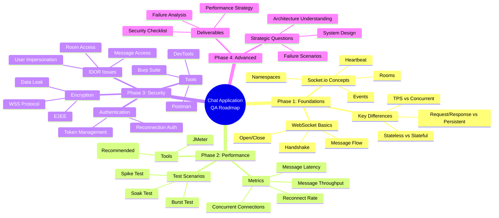
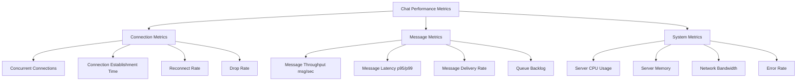

# 🧭 LEARNING ROADMAP: CHAT APPLICATION TESTING (QA / SDET – REAL-TIME)

## 📊 Mind Map Overview




---

## 🎯 Ultimate Goal

After **3–6 months**, you will be able to:

- ✅ **Design Performance Tests** for Real-time Chat systems
- ✅ **Identify & simulate** real-world bottlenecks
- ✅ **Master Security & Privacy** testing for Chat applications
- ✅ **Consult effectively** with Backend / Product / Security teams
- ✅ **Become a specialized Chat QA** (rare & highly-paid role)

---

## 📈 Learning Path Diagram

```
┌─────────────────────────────────────────────────────────────────┐
│                    CHAT APPLICATION QA ROADMAP                   │
└─────────────────────────────────────────────────────────────────┘
                              │
        ┌─────────────────────┼─────────────────────┐
        │                     │                     │
    ┌───▼───┐            ┌───▼───┐            ┌───▼───┐
    │ WEEK  │            │ WEEK  │            │ WEEK  │
    │ 1-3   │            │ 4-9   │            │ 10-13 │
    │       │            │       │            │       │
    │Phase 1│            │Phase 2│            │Phase 3│
    │Foundation          │Performance         │Security│
    └───┬───┘            └───┬───┘            └───┬───┘
        │                    │                    │
        │                    │                    │
    ┌───▼───────────────────────────────────────────▼───┐
    │              WEEK 14-24 (Optional)                │
    │                                                    │
    │                 Phase 4: Advanced                 │
    │         Become "Product Guardian"                 │
    └────────────────────────────────────────────────────┘
```

---

# 📚 PHASE 1 — REAL-TIME FOUNDATIONS (2–3 Weeks)

## 🎓 What You Need to Learn First

### 1️⃣ Understanding Chat ≠ Traditional Web

#### 🔄 Core Differences Explained

| Aspect | Traditional Web | Chat (Real-time) | Why It Matters |
|:---|:---|:---|:---|
| **Communication Pattern** | Request/Response | Persistent Connection | Chat needs constant connection |
| **State Management** | Stateless | Stateful | Chat remembers who's connected |
| **Primary Metric** | TPS (Transactions Per Sec) | Concurrent Connections | We care about users, not requests |
| **Latency Focus** | Page Load Time | Message Latency | Users expect instant delivery |
| **Protocol** | HTTP | WebSocket / Socket.io | Different protocol = different testing |

#### 💡 Visual Comparison

```
Traditional Web (HTTP):
┌──────┐  Request   ┌──────┐
│Client├───────────►│Server│
└──────┘            └──────┘
┌──────┐  Response  ┌──────┐
│Client│◄───────────┤Server│
└──────┘            └──────┘
(Connection closes after each request)

Real-time Chat (WebSocket):
┌──────┐  Handshake  ┌──────┐
│Client├────────────►│Server│
└──────┘             └──────┘
┌──────┐             ┌──────┐
│Client├────────────►│Server│ (Persistent)
└──────┘             └──────┘
│Client│◄────────────┤Server│ (Bi-directional)
└──────┘             └──────┘
(Connection stays open, messages flow both ways)
```

### 2️⃣ Essential Knowledge (You Don't Need to Code Backend!)

#### 🔌 WebSocket Lifecycle (Must Understand)

```mermaid
sequenceDiagram
    participant C as Client
    participant S as Server

    Note over C,S: 1. HANDSHAKE Phase
    C->>S: HTTP Upgrade Request
    S->>C: 101 Switching Protocols
    
    Note over C,S: 2. CONNECTION OPENED
    S->>C: Connection Established
    
    Note over C,S: 3. MESSAGE Exchange
    C->>S: Send Message (text/binary)
    S->>C: Acknowledge
    S->>C: Broadcast to Other Users
    
    Note over C,S: 4. HEARTBEAT (Keep-Alive)
    C->>S: Ping
    S->>C: Pong
    
    Note over C,S: 5. CONNECTION CLOSE
    C->>S: Close Frame
    S->>C: Close Frame
    Connection Closed
```

**What Each Phase Means:**

1. **Handshake**
   - Client sends HTTP request with `Upgrade: websocket` header
   - Server responds with `101 Switching Protocols`
   - Connection upgrades from HTTP to WebSocket

2. **Open**
   - Connection is established
   - Both sides can send/receive immediately
   - No need to open new connection for each message

3. **Message**
   - Data can flow both ways (client ↔ server)
   - Messages can be text or binary
   - No headers needed (unlike HTTP)

4. **Close**
   - Either side can initiate close
   - Connection gracefully terminates
   - Resources are cleaned up

#### 🎯 Socket.io Concepts (Most Chat Apps Use This)

```
Socket.io Architecture:
┌─────────────────────────────────────────┐
│         Socket.io Server                │
│  ┌───────────────────────────────────┐  │
│  │      Namespace: "/chat"           │  │
│  │  ┌─────────────────────────────┐  │  │
│  │  │   Room: "room-123"          │  │  │
│  │  │  ┌─────┐ ┌─────┐ ┌─────┐   │  │  │
│  │  │  │User1│ │User2│ │User3│   │  │  │
│  │  │  └─────┘ └─────┘ └─────┘   │  │  │
│  │  └─────────────────────────────┘  │  │
│  │  ┌─────────────────────────────┐  │  │
│  │  │   Room: "room-456"          │  │  │
│  │  │  ┌─────┐ ┌─────┐           │  │  │
│  │  │  │User4│ │User5│           │  │  │
│  │  │  └─────┘ └─────┘           │  │  │
│  │  └─────────────────────────────┘  │  │
│  └───────────────────────────────────┘  │
└─────────────────────────────────────────┘
```

**Key Concepts Explained:**

1. **Namespace** (`/chat`, `/admin`)
   - Logical separation of different app features
   - Like different "departments" in a building
   - Example: `/chat` for messaging, `/notification` for alerts

2. **Room** (`room-123`, `user-456`)
   - A channel where users can chat
   - Users can join/leave rooms
   - Messages sent to a room reach all users in that room

3. **Event-based Messaging**
   ```javascript
   // Client sends
   socket.emit('send_message', { text: 'Hello' });
   
   // Server receives and broadcasts
   io.to('room-123').emit('new_message', { text: 'Hello' });
   
   // All clients in room-123 receive
   socket.on('new_message', (data) => {
     console.log(data.text); // "Hello"
   });
   ```

4. **Heartbeat (Ping-Pong)**
   - Keep-alive mechanism
   - Server sends ping, client responds with pong
   - If no pong received, connection is considered dead
   - **Why important for testing**: Network issues can cause false disconnections

5. **Fan-out (1 → N users)**
   - **This is the stress point!**
   - 1 user sends message → Server broadcasts to N users
   - If 10,000 users in a room, 1 message = 10,000 server operations
   - **This is where performance testing focuses**

#### 🎓 Practical Learning Exercise

**Week 1-2: Build Understanding**

1. **Day 1-2**: Study WebSocket basics
   - Watch: "WebSocket explained in 5 minutes" (YouTube)
   - Read: MDN WebSocket API documentation
   - **Goal**: Understand the handshake process

2. **Day 3-4**: Explore Socket.io
   - Visit: socket.io/get-started/chat
   - Run their example chat app locally
   - **Goal**: See how rooms and namespaces work

3. **Day 5-7**: Test a simple chat
   - Use browser DevTools → Network → WS tab
   - Observe messages being sent/received
   - **Goal**: Visualize the real-time flow

**Week 3: Deep Dive**

1. **Day 8-10**: Understand fan-out
   - Test: 1 user sends → how many receive?
   - Observe: Server logs during broadcast
   - **Goal**: Grasp the "1 → N" concept

2. **Day 11-14**: Document your learnings
   - Write: "Chat Architecture Notes" for yourself
   - Create: Simple diagram of how chat works
   - **Goal**: Solidify understanding

---

# 🔥 PHASE 2 — PERFORMANCE TESTING FOR CHAT (4–6 Weeks)

## 📊 Why Chat Performance Testing is Different

### The Fundamental Shift

```
Traditional Web Performance Testing:
Focus: How many requests per second?
Metric: TPS (Transactions Per Second)
Test: Can server handle 1000 req/sec?

Chat Performance Testing:
Focus: How many users can stay connected?
Metric: Concurrent Connections
Test: Can 10,000 users stay connected and chat?
```

### 3️⃣ Critical Metrics (Completely Different from Web!)

#### 📈 Metrics Overview Diagram



#### Detailed Metric Explanations

**1. Concurrent Connections** ⭐ Most Important!
- **What it means**: How many users are connected simultaneously
- **Why it matters**: Each connection consumes server resources (memory, file descriptors)
- **How to measure**: Count active WebSocket connections
- **Example**: 
  - ✅ Good: 10,000 concurrent connections, stable
  - ❌ Bad: 5,000 concurrent connections, server crashes

**2. Message Throughput (msg/sec)**
- **What it means**: How many messages can be processed per second
- **Why it matters**: Chat apps need to handle message bursts
- **How to measure**: Messages sent ÷ time
- **Example**:
  - ✅ Good: 50,000 msg/sec (1 user sends → 10,000 receive = 10,001 messages processed)
  - ❌ Bad: 1,000 msg/sec, messages queued and delayed

**3. Message Latency (p95 / p99)**
- **What it means**: Time from sending to receiving
- **Why it matters**: Users expect instant delivery
- **How to measure**: 
  - p95: 95% of messages delivered within X ms
  - p99: 99% of messages delivered within Y ms
- **Example**:
  - ✅ Good: p95 = 50ms, p99 = 100ms
  - ❌ Bad: p95 = 5000ms (5 seconds delay!)

**4. Drop Rate**
- **What it means**: Percentage of connections that fail/disconnect
- **Why it matters**: Dropped connections = bad user experience
- **How to measure**: (Failed connections / Total attempts) × 100
- **Example**:
  - ✅ Good: Drop rate < 0.1%
  - ❌ Bad: Drop rate > 5%

**5. Reconnect Rate**
- **What it means**: How quickly users can reconnect after disconnection
- **Why it matters**: Network issues happen, users need quick recovery
- **How to measure**: Time from disconnect to reconnect
- **Example**:
  - ✅ Good: Reconnect in < 2 seconds
  - ❌ Bad: Reconnect takes 30+ seconds

**6. Queue Backlog**
- **What it means**: Messages waiting to be processed
- **Why it matters**: Growing backlog = system can't keep up
- **How to measure**: Number of messages in queue
- **Example**:
  - ✅ Good: Queue size < 100 messages
  - ❌ Bad: Queue size > 10,000 messages (messages delayed)

**7. Server CPU / Memory**
- **What it means**: Resource usage on server
- **Why it matters**: High usage = potential crashes
- **How to measure**: Monitor server metrics
- **Example**:
  - ✅ Good: CPU < 70%, Memory stable
  - ❌ Bad: CPU > 95%, Memory constantly increasing (memory leak!)

### 4️⃣ Recommended Tools

#### ✅ k6 (Highly Recommended!)

**Why k6 for Chat Testing?**

```
k6 Advantages:
┌─────────────────────────────────────┐
│ ✅ Native WebSocket Support         │
│ ✅ JavaScript-based (easy to learn) │
│ ✅ CI/CD Friendly                   │
│ ✅ Great Documentation              │
│ ✅ Active Community                 │
│ ✅ Lightweight                      │
└─────────────────────────────────────┘
```

**Example k6 Script for Chat Testing:**

```javascript
import ws from 'k6/ws';
import { check } from 'k6';

export const options = {
  stages: [
    { duration: '1m', target: 100 },    // Ramp up to 100 users
    { duration: '3m', target: 100 },    // Stay at 100 users
    { duration: '1m', target: 0 },      // Ramp down
  ],
};

export default function () {
  const url = 'ws://localhost:3000/chat';
  const params = { tags: { name: 'ChatConnection' } };

  // Connect to WebSocket
  const response = ws.connect(url, params, function (socket) {
    // On connection open
    socket.on('open', function () {
      console.log('WebSocket connection opened');
      
      // Join a room
      socket.send(JSON.stringify({
        type: 'join',
        room: 'test-room'
      }));
    });

    // Listen for messages
    socket.on('message', function (data) {
      const message = JSON.parse(data);
      
      check(response, {
        'message received': (r) => message.type === 'chat',
        'message has text': (r) => message.text !== undefined,
      });
    });

    // Send a test message every 5 seconds
    socket.setInterval(function () {
      socket.send(JSON.stringify({
        type: 'message',
        text: 'Hello from k6!',
        room: 'test-room'
      }));
    }, 5000);

    // Close connection after 30 seconds
    socket.setTimeout(function () {
      socket.close();
    }, 30000);
  });

  check(response, {
    'status is 101': (r) => r && r.status === 101,
  });
}
```

**Learning k6 (Week 4-5):**

1. **Day 1-2**: Install and run first test
   ```bash
   # Install k6
   brew install k6  # Mac
   # or
   choco install k6  # Windows
   
   # Run example
   k6 run chat-test.js
   ```

2. **Day 3-5**: Understand WebSocket in k6
   - Read: k6.io/docs/javascript-api/k6-ws
   - Practice: Connect to a test chat server
   - **Goal**: Successfully connect and send messages

3. **Day 6-10**: Build real test scenarios
   - Test concurrent connections
   - Measure message latency
   - **Goal**: Write your first performance test

#### ⚠️ JMeter (Only if Required)

**Why JMeter is Less Ideal:**

```
JMeter Limitations for Chat:
┌─────────────────────────────────────┐
│ ❌ Requires WebSocket Plugin        │
│ ❌ Heavy Resource Usage             │
│ ❌ Hard to Maintain                 │
│ ❌ GUI-based (harder to version)    │
│ ❌ Less flexible for long-running   │
└─────────────────────────────────────┘
```

**When to Use JMeter:**
- Company policy requires JMeter
- Team already uses JMeter extensively
- Need GUI-based testing

### 5️⃣ Real-World Test Scenarios

#### Scenario 1: Spike Connections Test 🔥

**Objective**: Test how server handles sudden connection surge

```
Test Pattern:
Time (minutes)
0:00  ────────────────► 10,000 users
      (Ramp up in 1 minute)
      
Observations:
- How many connections succeed?
- Where does it fail? (Handshake? Auth?)
- Server response time?
- Error messages?
```

**k6 Script Example:**

```javascript
export const options = {
  stages: [
    { duration: '1m', target: 10000 },  // Spike to 10k in 1 min
    { duration: '2m', target: 10000 },  // Hold for 2 min
    { duration: '1m', target: 0 },      // Ramp down
  ],
  thresholds: {
    'ws_connecting': ['rate<0.01'],     // < 1% connection failures
    'ws_session_duration': ['p(95)<2000'], // 95% connect in < 2s
  },
};

export default function () {
  const url = 'ws://your-chat-server.com/chat';
  
  ws.connect(url, {}, function (socket) {
    socket.on('open', () => {
      // Test authentication
      socket.send(JSON.stringify({ type: 'auth', token: 'test-token' }));
    });
    
    socket.setTimeout(() => socket.close(), 60000);
  });
}
```

**What to Look For:**
- ✅ **Good**: 9,950+ connections succeed (< 0.5% failure)
- ❌ **Bad**: Only 5,000 connections succeed (50% failure)
- 🔍 **Debug**: Check server logs for "connection refused" or "timeout"

#### Scenario 2: Soak Test (Long-Running) ⏰

**Objective**: Find memory leaks and zombie connections

```
Test Pattern:
Time (hours)
0:00  ────────────────────────────────────────────► 8:00
      (5,000 users stay connected for 8 hours)
      
What to Monitor:
- Memory usage over time (should be stable)
- Number of active connections (should stay at 5k)
- Message delivery (should remain consistent)
```

**k6 Script Example:**

```javascript
export const options = {
  stages: [
    { duration: '5m', target: 5000 },   // Ramp up to 5k users
    { duration: '8h', target: 5000 },   // Soak for 8 hours
    { duration: '5m', target: 0 },      // Ramp down
  ],
};

export default function () {
  const url = 'ws://your-chat-server.com/chat';
  
  ws.connect(url, {}, function (socket) {
    socket.on('open', () => {
      socket.send(JSON.stringify({ type: 'join', room: 'soak-test' }));
    });
    
    // Send heartbeat every 30 seconds
    socket.setInterval(() => {
      socket.send(JSON.stringify({ type: 'ping' }));
    }, 30000);
    
    // Listen for messages
    socket.on('message', (data) => {
      // Process message
    });
  });
}
```

**What to Look For:**
- ✅ **Good**: Memory usage stays flat, all connections remain active
- ❌ **Bad**: Memory usage increases over time (memory leak!)
- ❌ **Bad**: Connections drop over time (zombie connections)
- 🔍 **Debug**: Use server monitoring tools (Grafana, Prometheus)

#### Scenario 3: Burst Message Test 💥

**Objective**: Test rate limiting and queue overflow

```
Test Pattern:
Time (seconds)
0:00  ──────────────────► User sends 100 messages
      (All within 1 second)
      
What to Test:
- Does rate limiting work?
- Does queue overflow?
- Are messages lost?
- Server stability?
```

**k6 Script Example:**

```javascript
export const options = {
  vus: 10,  // 10 virtual users
  duration: '1m',
};

export default function () {
  const url = 'ws://your-chat-server.com/chat';
  
  ws.connect(url, {}, function (socket) {
    socket.on('open', () => {
      // Send 100 messages rapidly
      for (let i = 0; i < 100; i++) {
        socket.send(JSON.stringify({
          type: 'message',
          text: `Message ${i}`,
          room: 'burst-test'
        }));
      }
    });
    
    socket.on('message', (data) => {
      // Verify message was received
    });
  });
}
```

**What to Look For:**
- ✅ **Good**: Rate limiting kicks in, messages queued properly
- ❌ **Bad**: Server crashes or messages lost
- 🔍 **Debug**: Check server logs for "rate limit exceeded" or "queue full"

### 📚 Learning Path for Phase 2

**Week 4-5: Tool Setup & Basics**
- Day 1-3: Install k6, run first test
- Day 4-7: Learn WebSocket testing in k6
- Day 8-10: Write basic connection test
- Day 11-14: Measure concurrent connections

**Week 6-7: Advanced Scenarios**
- Day 15-17: Implement spike test
- Day 18-21: Implement soak test
- Day 22-24: Implement burst test
- Day 25-28: Analyze results and create reports

**Week 8-9: Real-World Practice**
- Day 29-35: Test a real chat application
- Day 36-42: Create performance test strategy document
- Day 43-49: Present findings to team

---

# 🛡️ PHASE 3 — SECURITY & PRIVACY FOR CHAT (3–4 Weeks)

## 🔒 Why Chat Security is Critical

Chat applications handle sensitive data:
- Personal conversations
- Private information
- Authentication tokens
- User presence status

**One security flaw = Data breach affecting thousands of users!**

### 6️⃣ Common Security Vulnerabilities in Chat

#### 🔥 IDOR (Insecure Direct Object Reference)

**What is IDOR?**
Accessing resources that belong to other users without authorization.

**Why Chat is Vulnerable:**
- Multiple rooms/conversations
- Complex permission models
- Real-time nature makes it hard to verify

**Common IDOR Attacks in Chat:**

```
Attack Scenario 1: Unauthorized Room Access
┌─────────────────────────────────────────┐
│ Attacker's Request:                     │
│ POST /api/rooms/join                    │
│ { "roomId": "room-123" }                │
│                                         │
│ ❌ Vulnerable: No check if user has     │
│    permission to join room-123          │
│                                         │
│ ✅ Secure: Verify user is invited/      │
│    has access before allowing join      │
└─────────────────────────────────────────┘

Attack Scenario 2: Read Other Users' Messages
┌─────────────────────────────────────────┐
│ Attacker's Request:                     │
│ GET /api/messages?conversationId=456    │
│                                         │
│ ❌ Vulnerable: Returns all messages     │
│    without checking if user is part of  │
│    conversation-456                     │
│                                         │
│ ✅ Secure: Verify user is participant   │
│    before returning messages            │
└─────────────────────────────────────────┘

Attack Scenario 3: Send Messages as Another User
┌─────────────────────────────────────────┐
│ Attacker's WebSocket Message:           │
│ {                                       │
│   "type": "send_message",               │
│   "userId": "victim-user-id",  ← ⚠️    │
│   "text": "Fake message"                │
│ }                                       │
│                                         │
│ ❌ Vulnerable: Server trusts userId     │
│    from client message                  │
│                                         │
│ ✅ Secure: Use authenticated session    │
│    userId, ignore client-provided id   │
└─────────────────────────────────────────┘
```

**How to Test for IDOR:**

```javascript
// Test Case 1: Try to join private room
async function testUnauthorizedRoomAccess() {
  // As User A
  const tokenA = await login('userA@example.com', 'password');
  
  // Try to join room that belongs to User B
  const response = await fetch('/api/rooms/join', {
    method: 'POST',
    headers: { 'Authorization': `Bearer ${tokenA}` },
    body: JSON.stringify({ roomId: 'user-b-private-room' })
  });
  
  // Should fail with 403 Forbidden
  expect(response.status).toBe(403);
}

// Test Case 2: Try to read other user's messages
async function testUnauthorizedMessageAccess() {
  const tokenA = await login('userA@example.com', 'password');
  
  // Try to get messages from conversation between User B and User C
  const response = await fetch('/api/messages?conversationId=bc-conversation', {
    headers: { 'Authorization': `Bearer ${tokenA}` }
  });
  
  // Should fail with 403 Forbidden
  expect(response.status).toBe(403);
}

// Test Case 3: Try to send message as another user
async function testUserImpersonation() {
  const socket = io('ws://chat-server.com', {
    auth: { token: 'user-a-token' }
  });
  
  socket.on('connect', () => {
    // Try to send message claiming to be User B
    socket.emit('send_message', {
      userId: 'user-b-id',  // ⚠️ Should be ignored by server
      text: 'Fake message',
      roomId: 'room-123'
    });
  });
  
  // Verify message shows as from User A (not User B)
  socket.on('message_sent', (message) => {
    expect(message.userId).toBe('user-a-id');
  });
}
```

#### 🔐 Authentication & Authorization Issues

**Common Problems:**

```
Problem 1: Token Reuse
┌─────────────────────────────────────────┐
│ ❌ Vulnerable:                           │
│ - Token never expires                   │
│ - Token can be reused multiple times    │
│ - Stolen token = permanent access       │
│                                         │
│ ✅ Secure:                              │
│ - Token expires (JWT with exp claim)    │
│ - One-time tokens for critical actions  │
│ - Refresh token mechanism               │
└─────────────────────────────────────────┘

Problem 2: Reconnection Without Re-authentication
┌─────────────────────────────────────────┐
│ ❌ Vulnerable:                           │
│ Client disconnects → Reconnects         │
│ Server accepts reconnection with old    │
│ session (no auth check)                 │
│                                         │
│ ✅ Secure:                              │
│ Reconnection requires new token or      │
│ re-verification of existing token       │
└─────────────────────────────────────────┘

Problem 3: Token in URL
┌─────────────────────────────────────────┐
│ ❌ Vulnerable:                           │
│ ws://chat.com/chat?token=abc123         │
│                                         │
│ Problems:                               │
│ - Token visible in browser history      │
│ - Token in server logs                  │
│ - Token can be shared via URL           │
│                                         │
│ ✅ Secure:                              │
│ Token in Authorization header or        │
│ cookie (HttpOnly, Secure)               │
└─────────────────────────────────────────┘
```

**Test Cases:**

```javascript
// Test Case 1: Token Expiration
async function testTokenExpiration() {
  const token = await login('user@example.com', 'password');
  
  // Wait for token to expire (or use expired token)
  const expiredToken = 'expired-jwt-token';
  
  const socket = io('ws://chat-server.com', {
    auth: { token: expiredToken }
  });
  
  socket.on('connect_error', (error) => {
    // Should reject connection
    expect(error.message).toContain('token expired');
  });
}

// Test Case 2: Reconnection Authentication
async function testReconnectionAuth() {
  const socket = io('ws://chat-server.com', {
    auth: { token: 'valid-token' }
  });
  
  socket.on('connect', () => {
    // Disconnect
    socket.disconnect();
    
    // Try to reconnect without new token
    socket.connect();
    
    socket.on('connect_error', (error) => {
      // Should require re-authentication
      expect(error.message).toContain('authentication required');
    });
  });
}
```

#### 🔒 Encryption & Data Leak Issues

**End-to-End Encryption (E2EE):**

```
E2EE Flow:
┌──────┐                    ┌──────┐
│User A│                    │User B│
└──┬───┘                    └───┬──┘
   │                            │
   │ 1. Encrypt message         │
   │    with User B's key       │
   │                            │
   ▼                            │
┌──────┐                    │
│Server│ 2. Store encrypted │
│      │◄───────────────────┘
│      │    (Server cannot read)
└──┬───┘
   │
   │ 3. Forward encrypted
   │    message to User B
   │
   ▼
┌──────┐
│User B│ 4. Decrypt with
│      │    private key
└──────┘
```

**Common Data Leak Points:**

```
1. Plaintext in Server Logs
❌ Server logs: "User sent: My password is 12345"
✅ Server logs: "User sent message (encrypted)"

2. WebSocket Traffic (Non-WSS)
❌ ws://chat.com (unencrypted)
✅ wss://chat.com (encrypted with TLS)

3. Error Messages Leak Info
❌ Error: "User john@example.com not found in room-123"
✅ Error: "Access denied"

4. Message Metadata Exposure
❌ API returns: { sender: "admin", isAdmin: true, email: "admin@..." }
✅ API returns: { sender: "user-123" } (minimal info)
```

**Test Cases:**

```javascript
// Test Case 1: Check for WSS (Secure WebSocket)
function testSecureConnection() {
  const socket = io('wss://chat-server.com', {
    // Should use wss:// not ws://
  });
  
  socket.on('connect', () => {
    // Verify connection is secure
    expect(window.location.protocol).toBe('https:');
  });
}

// Test Case 2: Check Error Messages
async function testErrorMessageLeak() {
  try {
    await fetch('/api/rooms/nonexistent-room/messages', {
      headers: { 'Authorization': 'Bearer valid-token' }
    });
  } catch (error) {
    // Error should not contain sensitive info
    expect(error.message).not.toContain('@');
    expect(error.message).not.toContain('password');
    expect(error.message).not.toContain('token');
  }
}

// Test Case 3: Verify E2EE
async function testEndToEndEncryption() {
  // Send message and capture network traffic
  const message = 'Secret message';
  socket.emit('send_message', { text: message });
  
  // Check network tab - message should be encrypted
  // (Not readable plaintext)
}
```

### 7️⃣ Security Testing Tools

#### 🔧 Tool Overview

```
Security Testing Tools for Chat:
┌─────────────────────────────────────────┐
│ 1. Burp Suite                           │
│    - WebSocket interception             │
│    - Modify messages in real-time       │
│    - Replay attacks                     │
│                                         │
│ 2. Browser DevTools                     │
│    - Network → WS tab                   │
│    - View WebSocket frames              │
│    - Inspect message payloads           │
│                                         │
│ 3. Postman                              │
│    - WebSocket client                   │
│    - Manual testing                     │
│    - Test different scenarios           │
│                                         │
│ 4. OWASP ZAP                            │
│    - Automated security scanning        │
│    - API security testing               │
└─────────────────────────────────────────┘
```

**Burp Suite Setup for Chat Testing:**

```
Burp Suite Configuration:
1. Install Burp Suite Community (free)
2. Configure browser proxy (127.0.0.1:8080)
3. Enable WebSocket interception
4. Intercept and modify messages
```

**Browser DevTools Usage:**

```javascript
// Steps to test with DevTools:
// 1. Open Chrome DevTools (F12)
// 2. Go to Network tab
// 3. Filter by "WS" (WebSocket)
// 4. Connect to chat
// 5. View messages in real-time
// 6. Check for:
//    - Plaintext sensitive data
//    - Unencrypted connections (ws://)
//    - Token exposure
```

### 📚 Learning Path for Phase 3

**Week 10-11: Security Fundamentals**
- Day 1-3: Study OWASP Top 10 (focus on A2, A4, A5)
- Day 4-7: Learn IDOR attacks and prevention
- Day 8-10: Study authentication/authorization patterns
- Day 11-14: Practice with Burp Suite

**Week 12-13: Practical Testing**
- Day 15-17: Test IDOR vulnerabilities in chat app
- Day 18-21: Test authentication flows
- Day 22-24: Test encryption and data leak
- Day 25-28: Create security test report

---

# 🚀 PHASE 4 — ADVANCED: BECOME "THE PRODUCT GUARDIAN" (Optional, 10+ Weeks)

## 🎯 Moving Beyond Testing

At this phase, you're not just testing—you're thinking like an architect.

### 8️⃣ Strategic Questioning (Think Like a System Designer)

**Instead of asking: "Does it work?"**

**Ask these questions instead:**

#### Question 1: Architecture Understanding

```
❌ Bad Question:
"Can users send messages?"

✅ Strategic Question:
"How does the server broadcast one message to 1,000 users?
 - Does it use fan-out?
 - Is there a message queue?
 - How does it handle failures?"
```

#### Question 2: Failure Scenarios

```
❌ Bad Question:
"What happens if server is down?"

✅ Strategic Question:
"If one node in the cluster crashes:
 - Are messages lost?
 - How is chat history synced?
 - Can users reconnect to different node?
 - What's the recovery time?"
```

#### Question 3: Data Consistency

```
❌ Bad Question:
"Are messages saved?"

✅ Strategic Question:
"How is chat history synced when a user reconnects after 1 hour?
 - Are missed messages delivered?
 - Is there a message queue?
 - How are duplicates prevented?"
```

#### Question 4: Rate Limiting Strategy

```
❌ Bad Question:
"Is there rate limiting?"

✅ Strategic Question:
"Where is rate limiting implemented?
 - At gateway level?
 - At application level?
 - Per user or per room?
 - What happens when limit is exceeded?"
```

### 9️⃣ High-Value Deliverables

Create these documents to prove your expertise:

#### Document 1: Chat Performance Test Strategy

**Template Structure:**

```markdown
# Chat Application Performance Test Strategy

## 1. Executive Summary
- Current capacity: X concurrent users
- Target capacity: Y concurrent users
- Key risks identified

## 2. Test Objectives
- Concurrent connection limits
- Message throughput requirements
- Latency SLAs

## 3. Test Scenarios
### Scenario 1: Spike Connections
- Objective
- Test design
- Success criteria

### Scenario 2: Soak Test
- Objective
- Test design
- Success criteria

## 4. Metrics & KPIs
- Concurrent connections
- Message latency (p95, p99)
- Error rates

## 5. Tools & Infrastructure
- k6 scripts
- Test data
- Monitoring setup

## 6. Results & Recommendations
- Findings
- Bottlenecks identified
- Optimization suggestions
```

#### Document 2: Security Checklist for Real-time Messaging

**Template:**

```markdown
# Security Checklist: Real-time Chat Application

## Authentication & Authorization
- [ ] Tokens expire properly
- [ ] Reconnection requires re-auth
- [ ] Tokens not in URL
- [ ] Role-based access control works

## IDOR Prevention
- [ ] Users cannot join unauthorized rooms
- [ ] Users cannot read other users' messages
- [ ] Users cannot impersonate others
- [ ] Room permissions verified server-side

## Encryption & Privacy
- [ ] WebSocket uses WSS (not WS)
- [ ] E2EE implemented (if required)
- [ ] No sensitive data in logs
- [ ] Error messages don't leak info

## Rate Limiting
- [ ] Message rate limiting
- [ ] Connection rate limiting
- [ ] Prevents spam/DoS

## Data Protection
- [ ] Messages encrypted at rest
- [ ] Backup encryption
- [ ] GDPR compliance (if applicable)
```

#### Document 3: Real-time Failure Mode Analysis (FMA)

**Template:**

```markdown
# Failure Mode Analysis: Chat Application

## Failure Scenarios

### Scenario 1: Single Node Failure
- **Impact**: High
- **Probability**: Medium
- **Detection**: Automated monitoring
- **Recovery**: Auto-failover to standby node
- **User Impact**: Temporary disconnection (< 5 seconds)

### Scenario 2: Database Failure
- **Impact**: Critical
- **Probability**: Low
- **Detection**: Health checks
- **Recovery**: Database replication, failover
- **User Impact**: No message history until recovery

### Scenario 3: Network Partition
- **Impact**: High
- **Probability**: Low
- **Detection**: Heartbeat monitoring
- **Recovery**: Automatic reconnection
- **User Impact**: Messages queued, delivered after reconnection

## Mitigation Strategies
- Redundancy
- Monitoring & Alerting
- Graceful Degradation
```

### 📚 Learning Path for Phase 4

**Week 14-16: System Design**
- Study distributed systems basics
- Learn about message queues (RabbitMQ, Kafka)
- Understand load balancing and failover

**Week 17-20: Create Deliverables**
- Write Performance Test Strategy
- Create Security Checklist
- Document Failure Mode Analysis

**Week 21-24: Present & Refine**
- Present to team/stakeholders
- Get feedback
- Refine documents
- Build portfolio

---

# ⏳ Realistic Timeline Summary

```
Timeline Overview:
┌─────────────────────────────────────────────────────┐
│ Month 1: Foundation                                 │
│ ✅ Understand WebSocket/Socket.io                   │
│ ✅ Grasp real-time concepts                         │
│ ✅ Test basic chat functionality                    │
└─────────────────────────────────────────────────────┘
                    │
                    ▼
┌─────────────────────────────────────────────────────┐
│ Month 2-3: Performance Testing                      │
│ ✅ Set up k6                                        │
│ ✅ Write performance test scripts                   │
│ ✅ Execute spike, soak, burst tests                 │
│ ✅ Analyze results                                  │
└─────────────────────────────────────────────────────┘
                    │
                    ▼
┌─────────────────────────────────────────────────────┐
│ Month 4: Security Testing                           │
│ ✅ Learn security testing tools                     │
│ ✅ Test IDOR vulnerabilities                        │
│ ✅ Test authentication/authorization                │
│ ✅ Create security checklist                        │
└─────────────────────────────────────────────────────┘
                    │
                    ▼
┌─────────────────────────────────────────────────────┐
│ Month 5-6: Advanced (Optional)                      │
│ ✅ System design thinking                           │
│ ✅ Create comprehensive documents                   │
│ ✅ Become specialized Chat QA                       │
└─────────────────────────────────────────────────────┘
```

---

# 📖 Quick Reference Guide

## Key Metrics Cheat Sheet

| Metric | What It Measures | Good Value | How to Measure |
|:---|:---|:---|:---|
| **Concurrent Connections** | Users connected simultaneously | 10,000+ | Count active WebSocket connections |
| **Message Throughput** | Messages processed per second | 50,000+ msg/sec | Messages sent ÷ time |
| **Message Latency (p95)** | 95% of messages delivered within | < 100ms | Time from send to receive |
| **Drop Rate** | Percentage of failed connections | < 0.1% | Failed connections / Total attempts |
| **Reconnect Rate** | Time to reconnect after disconnect | < 2 seconds | Time from disconnect to reconnect |

## Common Test Scenarios

1. **Spike Test**: 0 → 10k users in 1 minute
2. **Soak Test**: 5k users for 8 hours
3. **Burst Test**: 1 user sends 100 messages/second

## Security Test Checklist

- [ ] IDOR: Can users access unauthorized rooms?
- [ ] IDOR: Can users read other users' messages?
- [ ] Auth: Do tokens expire?
- [ ] Auth: Is reconnection authenticated?
- [ ] Encryption: Is WSS used (not WS)?
- [ ] Encryption: Are messages encrypted?
- [ ] Data Leak: Are error messages safe?

## Tools Quick Reference

- **k6**: Performance testing (recommended)
- **Burp Suite**: Security testing
- **DevTools**: Manual inspection
- **Postman**: WebSocket client testing

---

# 🎓 Conclusion

Chat application testing requires a completely different mindset from traditional web testing. Focus on:

1. **Understanding real-time concepts** (WebSocket, persistent connections)
2. **Performance metrics** (concurrent connections, not just TPS)
3. **Security vulnerabilities** (IDOR is very common in chat)
4. **System thinking** (how does it work under the hood?)

**Remember**: Chat QA is a specialized skill. Master this, and you'll be in high demand! 🚀

---

## 📚 Additional Resources

- [WebSocket API - MDN](https://developer.mozilla.org/en-US/docs/Web/API/WebSocket)
- [Socket.io Documentation](https://socket.io/docs/v4/)
- [k6 WebSocket Testing](https://k6.io/docs/javascript-api/k6-ws/)
- [OWASP Top 10](https://owasp.org/www-project-top-ten/)
- [Real-time Systems Testing Guide](https://www.guru99.com/real-time-testing.html)

---

# 🗺️ LỘ TRÌNH HỌC ỨNG DỤNG CHAT TỪ CON SỐ 0 ĐẾN CHUYÊN GIA QA/SDET (TIẾNG VIỆT)

## 🎯 PHẦN 0: THIẾT LẬP TƯ DUY ĐÚNG - CHAT KHÁC WEB THÔNG THƯỜNG

### Sự Khác Biệt Cốt Lõi: Một Ví Dụ Thực Tế

Hãy tưởng tượng bạn có hai cách để liên lạc với đồng nghiệp:

| Giao Tiếp Thông Thường (HTTP) | Giao Tiếp Real-time (WebSocket) |
|:---|:---|
| Giống như gửi email: Bạn viết thư → gửi đi → chờ đợi → đồng nghiệp nhận được → họ viết thư trả lời → gửi lại → bạn nhận được. Mỗi lần trao đổi là một quy trình độc lập. | Giống như gọi điện thoại: Bạn nhấc máy → thiết lập cuộc gọi → giữ đường dây mở → nói chuyện qua lại ngay lập tức → khi xong thì tắt máy. Kết nối được duy trì. |

### Bảng So Sánh Kỹ Thuật Chi Tiết

| Tiêu Chí | Web Thông Thường (HTTP) | Chat Real-time | Ý Nghĩa Trong Kiểm Thử |
|:---|:---|:---|:---|
| **Mô hình** | Request/Response (Client luôn chủ động) | Persistent Connection (Kết nối liên tục, 2 chiều) | Thay vì test API endpoint, bạn test kết nối và luồng sự kiện |
| **Trạng thái** | Stateless (Mỗi request độc lập) | Stateful (Server biết client nào đang kết nối) | Cần test duy trì trạng thái user trong room, session timeout |
| **Đơn vị đo** | TPS (Transactions Per Second) | Concurrent Connections + Messages Per Second | 10,000 TPS ≠ 10,000 user chat cùng lúc. Chat cần giữ 10,000 kết nối đồng thời |
| **Độ trễ** | Page Load Time (vài giây) | Message Latency (vài trăm mili giây) | Người dùng nhận thấy ngay nếu tin nhắn chậm 1-2 giây |
| **Giao thức** | HTTP/HTTPS | WebSocket (ws://, wss://), thường qua Socket.IO | Công cụ test phải hỗ trợ WebSocket, không dùng được tool HTTP thông thường |

**Ví dụ thực tế về sự khác biệt:**

- Khi bạn vào Facebook, trình duyệt gửi 1 request để lấy news feed.
- Khi bạn chat trên Messenger, trình duyệt mở 1 kết nối WebSocket và giữ nó trong nhiều giờ, qua đó nhận được tin nhắn mới ngay lập tức mà không cần refresh.

---

## 🔧 PHẦN 1: NỀN TẢNG WEB SOCKET & SOCKET.IO (3-4 TUẦN)

### Tuần 1: WebSocket - Hiểu Từ Gốc Rễ

#### 1.1. Lifecycle của WebSocket (Vòng Đời Kết Nối)

**QUÁ TRÌNH HANDSHAKE (BẮT TAY):**

```javascript
// Client gửi HTTP request đặc biệt
GET /chat HTTP/1.1
Host: server.example.com
Upgrade: websocket          // "Tôi muốn nâng cấp lên WebSocket"
Connection: Upgrade
Sec-WebSocket-Key: dGhlIHNhbXBsZSBub25jZQ==
Sec-WebSocket-Version: 13

// Server trả lời
HTTP/1.1 101 Switching Protocols
Upgrade: websocket          // "Đồng ý nâng cấp!"
Connection: Upgrade
Sec-WebSocket-Accept: s3pPLMBiTxaQ9kYGzzhZRbK+xOo=

// Từ đây, kết nối đã "nâng cấp" từ HTTP sang WebSocket
// Client và server có thể gửi/nhận data tự do
```

**Ví dụ thực tế để hiểu Handshake:**

- Giống như bạn gọi cho khách sạn: "Alo, tôi muốn đặt phòng" (HTTP request)
- Lễ tân trả lời: "Vâng, tôi chuyển máy cho bộ phận đặt phòng" (101 Switching Protocols)
- Sau đó bạn nói chuyện trực tiếp với nhân viên đặt phòng mà không cần thông qua lễ tân nữa (WebSocket connection)

#### 1.2. Cấu trúc một Frame WebSocket

Mỗi tin nhắn qua WebSocket được đóng gói trong "frame":

```
0                   1                   2                   3
0 1 2 3 4 5 6 7 8 9 0 1 2 3 4 5 6 7 8 9 0 1 2 3 4 5 6 7 8 9 0 1
+-+-+-+-+-------+-+-------------+-------------------------------+
|F|R|R|R| opcode|M| Payload len |    Extended payload length    |
|I|S|S|S|  (4)  |A|     (7)     |             (16/64)           |
|N|V|V|V|       |S|             |   (if payload len==126/127)   |
| |1|2|3|       |K|             |                               |
+-+-+-+-+-------+-+-------------+ - - - - - - - - - - - - - - - +
|     Extended payload length continued, if payload len == 127  |
+ - - - - - - - - - - - - - - - +-------------------------------+
|                               |Masking-key, if MASK set to 1  |
+-------------------------------+-------------------------------+
| Masking-key (continued)       |          Payload Data         |
+-------------------------------- - - - - - - - - - - - - - - - +
:                     Payload Data continued ...                :
+ - - - - - - - - - - - - - - - - - - - - - - - - - - - - - - - +
|                     Payload Data continued ...                |
+---------------------------------------------------------------+
```

**Ý nghĩa thực tế:**

- **FIN bit**: Cho biết đây là frame cuối cùng của message
- **Opcode**: 1 = text, 2 = binary (gửi file, hình ảnh)
- **Mask**: Client phải mask payload để bảo mật
- **Payload length**: Độ dài thực tế của dữ liệu

**Ví dụ debug thực tế:**

1. Mở Chrome DevTools (F12)
2. Vào tab Network → WS (WebSocket)
3. Click vào một kết nối WebSocket
4. Bạn sẽ thấy các frame được hiển thị real-time:

```
▼ Frame 45 (sent from client, 15 bytes)
  Message: {"type":"chat","text":"Hello!"}

▼ Frame 46 (received from server, 32 bytes)  
  Message: {"type":"chat","from":"user123","text":"Hi there!"}
```

---

### Tuần 2: Socket.IO - Thư Viện "Thông Minh" Hơn WebSocket Thuần

#### 2.1. Tại Sao Cần Socket.IO?

**Vấn đề với WebSocket thuần:**

- ❌ Không tự reconnect: Nếu mạng yếu, kết nối đứt → user phải refresh trang
- ❌ Không fallback: Trường hợp firewall chặn WebSocket → ứng dụng không hoạt động
- ❌ Không có room/namespace: Phải tự implement cơ chế nhóm chat

**Giải pháp Socket.IO:**

```javascript
// Server đơn giản nhất với Socket.IO
const express = require('express');
const http = require('http');
const { Server } = require('socket.io');

const app = express();
const server = http.createServer(app);
const io = new Server(server);

// Khi có client kết nối
io.on('connection', (socket) => {
  console.log('User connected:', socket.id);
  
  // Gửi message riêng cho user này
  socket.emit('welcome', { message: 'Chào mừng!' });
  
  // Khi client gửi 'chat message'
  socket.on('chat message', (msg) => {
    console.log('Message from', socket.id, ':', msg);
    
    // Gửi tin nhắn cho TẤT CẢ client đang kết nối
    io.emit('chat message', {
      from: socket.id,
      text: msg,
      timestamp: new Date()
    });
  });
  
  // Khi client ngắt kết nối
  socket.on('disconnect', () => {
    console.log('User disconnected:', socket.id);
  });
});

server.listen(3000, () => {
  console.log('Server running on port 3000');
});
```

#### 2.2. Cơ Chế Fallback Thực Tế - Socket.IO "Linh Hoạt"

```
Client muốn kết nối tới Server
         ↓
Thử kết nối WebSocket (ws://)
         ↓
    [Thành công?]
         ↓
     /        \
   YES        NO (bị chặn/firewall)
    ↓           ↓
Dùng WebSocket  Thử HTTP Long-Polling
                ↓
           [Thành công?]
                ↓
            /        \
          YES        NO
           ↓           ↓
    Dùng Long-Polling  Lỗi kết nối
```

**Ví dụ thực tế về fallback:**

- Bạn dùng chat app trong tòa nhà văn phòng (firewall nghiêm ngặt)
- Ứng dụng tự động chuyển sang chế độ "compatible" (long-polling)
- Bạn vẫn chat được, nhưng độ trễ cao hơn (1-2 giây thay vì vài trăm ms)
- Khi về nhà, ứng dụng tự động nâng cấp lên WebSocket

#### 2.3. Các Khái Niệm Quan Trọng Trong Socket.IO

**a) Namespace (Không gian tên):**

```javascript
// Tạo namespace riêng cho admin
const adminNamespace = io.of('/admin');

adminNamespace.on('connection', (socket) => {
  // Chỉ những client kết nối đến '/admin' mới vào được đây
  socket.emit('adminLog', 'Welcome to admin panel');
});

// Client kết nối đến namespace
const socket = io('http://localhost:3000/admin');
```

**Ví dụ thực tế:** Giống như một tòa nhà có nhiều phòng ban:

- `/` - Lobby chung (chat công khai)
- `/admin` - Phòng admin (quản lý user, xóa tin nhắn)
- `/support` - Phòng hỗ trợ khách hàng

**b) Room (Phòng chat):**

```javascript
// User tham gia phòng
socket.on('join room', (roomId) => {
  // Rời tất cả phòng trước đó
  socket.leaveAll();
  
  // Tham gia phòng mới
  socket.join(roomId);
  console.log(`User ${socket.id} joined room ${roomId}`);
  
  // Thông báo cho mọi người trong phòng (TRỪ người vừa join)
  socket.to(roomId).emit('user joined', {
    userId: socket.id,
    roomId: roomId
  });
});

// Gửi tin nhắn đến 1 phòng cụ thể
socket.on('send to room', (data) => {
  // Chỉ gửi đến user trong room 'data.roomId'
  io.to(data.roomId).emit('new message', {
    from: socket.id,
    text: data.text,
    room: data.roomId
  });
});
```

**Ví dụ thực tế về room:**

- Slack: Mỗi channel (#general, #random) là một room
- Zoom: Mỗi phòng họp là một room
- Game online: Mỗi phòng chơi là một room

**c) Broadcast (Phát sóng):**

```javascript
// 1. Gửi cho tất cả client (kể cả người gửi)
io.emit('event', data);

// 2. Gửi cho tất cả client (TRỪ người gửi)
socket.broadcast.emit('event', data);

// 3. Gửi cho tất cả client trong namespace (TRỪ người gửi)
socket.broadcast.to('roomName').emit('event', data);

// 4. Gửi cho tất cả client trong room (kể cả người gửi)
io.to('roomName').emit('event', data);
```

---

### Tuần 3-4: Xây Dựng Ứng Dụng Chat Thực Tế

#### 3.1. Ứng Dụng Chat Đầy Đủ Tính Năng

**Server (server.js):**

```javascript
// server.js - Server hoàn chỉnh
const express = require('express');
const http = require('http');
const { Server } = require('socket.io');
const cors = require('cors');

const app = express();
app.use(cors());
app.use(express.static('public'));

const server = http.createServer(app);
const io = new Server(server, {
  cors: {
    origin: "http://localhost:3000",
    methods: ["GET", "POST"]
  },
  // Cấu hình quan trọng cho production
  pingTimeout: 60000, // 60 giây không phản hồi thì timeout
  pingInterval: 25000, // Mỗi 25 giây gửi ping một lần
});

// Lưu trữ tạm thời
const users = new Map(); // socket.id → user info
const rooms = new Map(); // roomId → { users: [], messages: [] }

io.on('connection', (socket) => {
  console.log('New connection:', socket.id);
  
  // 1. XÁC THỰC USER
  socket.on('authenticate', (authData) => {
    // Trong thực tế: verify JWT token
    const user = {
      id: socket.id,
      username: authData.username,
      joinedAt: new Date()
    };
    
    users.set(socket.id, user);
    socket.emit('authenticated', { success: true, user });
    
    // Thông báo có user mới (cho mọi người trừ user này)
    socket.broadcast.emit('user online', user);
  });
  
  // 2. THAM GIA/THOÁT PHÒNG
  socket.on('join room', (roomId) => {
    const user = users.get(socket.id);
    
    // Rời phòng cũ (nếu có)
    if (socket.rooms.size > 1) {
      const oldRoom = Array.from(socket.rooms).find(r => r !== socket.id);
      if (oldRoom) {
        socket.leave(oldRoom);
        socket.to(oldRoom).emit('user left', {
          userId: socket.id,
          username: user.username
        });
      }
    }
    
    // Tham gia phòng mới
    socket.join(roomId);
    
    // Khởi tạo phòng nếu chưa có
    if (!rooms.has(roomId)) {
      rooms.set(roomId, {
        id: roomId,
        users: new Set(),
        messages: []
      });
    }
    
    const room = rooms.get(roomId);
    room.users.add(socket.id);
    
    // Gửi lịch sử chat cho user mới
    socket.emit('room history', {
      roomId,
      messages: room.messages.slice(-50) // 50 tin nhắn gần nhất
    });
    
    // Thông báo cho phòng
    socket.to(roomId).emit('user joined', {
      userId: socket.id,
      username: user.username,
      roomId
    });
  });
  
  // 3. GỬI TIN NHẮN
  socket.on('send message', (data) => {
    const user = users.get(socket.id);
    const { roomId, text } = data;
    
    const message = {
      id: Date.now().toString(),
      from: socket.id,
      username: user.username,
      text,
      timestamp: new Date(),
      roomId
    };
    
    // Lưu vào lịch sử phòng
    const room = rooms.get(roomId);
    if (room) {
      room.messages.push(message);
      
      // Giới hạn lịch sử (1000 tin nhắn mỗi phòng)
      if (room.messages.length > 1000) {
        room.messages = room.messages.slice(-1000);
      }
    }
    
    // Gửi đến tất cả user trong phòng
    io.to(roomId).emit('new message', message);
    
    // Log để debug
    console.log(`[${roomId}] ${user.username}: ${text}`);
  });
  
  // 4. TYPING INDICATOR (đang gõ...)
  socket.on('typing', (roomId) => {
    const user = users.get(socket.id);
    socket.to(roomId).emit('user typing', {
      userId: socket.id,
      username: user.username
    });
  });
  
  // 5. XỬ LÝ NGẮT KẾT NỐI
  socket.on('disconnect', (reason) => {
    const user = users.get(socket.id);
    console.log(`User disconnected: ${socket.id}, reason: ${reason}`);
    
    if (user) {
      // Thông báo user offline
      io.emit('user offline', { userId: socket.id });
      
      // Xóa khỏi tất cả phòng
      rooms.forEach((room, roomId) => {
        if (room.users.has(socket.id)) {
          room.users.delete(socket.id);
          io.to(roomId).emit('user left', {
            userId: socket.id,
            username: user.username
          });
        }
      });
      
      users.delete(socket.id);
    }
  });
});

// API để lấy thông tin server
app.get('/api/stats', (req, res) => {
  res.json({
    totalConnections: io.engine.clientsCount,
    totalUsers: users.size,
    totalRooms: rooms.size,
    uptime: process.uptime()
  });
});

server.listen(3000, () => {
  console.log('Server running at http://localhost:3000');
  console.log('WebSocket endpoint: ws://localhost:3000');
});
```

#### 3.2. Client HTML/JS Đầy Đủ

```html
<!-- public/index.html -->
<!DOCTYPE html>
<html>
<head>
  <title>Real-time Chat App</title>
  <style>
    * { margin: 0; padding: 0; box-sizing: border-box; }
    body { font-family: Arial, sans-serif; }
    
    #app {
      max-width: 800px;
      margin: 20px auto;
      padding: 20px;
    }
    
    .auth-section, .chat-section {
      background: #f5f5f5;
      padding: 20px;
      border-radius: 10px;
      margin-bottom: 20px;
    }
    
    .room-list {
      display: flex;
      gap: 10px;
      margin: 10px 0;
    }
    
    .room-btn {
      padding: 8px 16px;
      background: #4CAF50;
      color: white;
      border: none;
      border-radius: 5px;
      cursor: pointer;
    }
    
    .room-btn.active {
      background: #2E7D32;
    }
    
    .chat-container {
      display: flex;
      gap: 20px;
    }
    
    .messages {
      flex: 3;
      height: 400px;
      overflow-y: auto;
      background: white;
      padding: 15px;
      border-radius: 5px;
    }
    
    .users {
      flex: 1;
      background: white;
      padding: 15px;
      border-radius: 5px;
    }
    
    .message {
      margin: 10px 0;
      padding: 8px;
      background: #e3f2fd;
      border-radius: 5px;
    }
    
    .message.own {
      background: #c8e6c9;
      text-align: right;
    }
    
    .typing-indicator {
      font-style: italic;
      color: #666;
      font-size: 0.9em;
    }
    
    input, button {
      padding: 10px;
      margin: 5px 0;
      width: 100%;
    }
  </style>
</head>
<body>
  <div id="app">
    <!-- Phần xác thực -->
    <div class="auth-section" id="authSection">
      <h2>Đăng nhập vào Chat</h2>
      <input type="text" id="usernameInput" placeholder="Tên của bạn">
      <button onclick="login()">Vào Chat</button>
    </div>
    
    <!-- Phần chat (ẩn lúc đầu) -->
    <div class="chat-section" id="chatSection" style="display: none;">
      <h2>Chat Room</h2>
      
      <!-- Danh sách phòng -->
      <div class="room-list">
        <button class="room-btn active" onclick="joinRoom('general')">#general</button>
        <button class="room-btn" onclick="joinRoom('random')">#random</button>
        <button class="room-btn" onclick="joinRoom('support')">#support</button>
      </div>
      
      <!-- Khu vực chat -->
      <div class="chat-container">
        <!-- Tin nhắn -->
        <div class="messages" id="messages">
          <div class="message system">Chào mừng đến với chat!</div>
        </div>
        
        <!-- Danh sách user online -->
        <div class="users" id="usersList">
          <h3>Online Users (<span id="onlineCount">0</span>)</h3>
          <div id="users"></div>
        </div>
      </div>
      
      <!-- Input tin nhắn -->
      <div style="margin-top: 20px;">
        <div id="typingIndicator" class="typing-indicator"></div>
        <div style="display: flex; gap: 10px;">
          <input type="text" id="messageInput" placeholder="Nhập tin nhắn..." 
                 onkeyup="handleTyping(event)"
                 onkeypress="if(event.key=='Enter') sendMessage()">
          <button onclick="sendMessage()" style="width: auto;">Gửi</button>
        </div>
      </div>
    </div>
  </div>
  
  <script src="/socket.io/socket.io.js"></script>
  <script>
    let socket;
    let currentUser = null;
    let currentRoom = 'general';
    let typingTimeout = null;
    
    // Hàm đăng nhập
    function login() {
      const username = document.getElementById('usernameInput').value.trim();
      if (!username) return alert('Vui lòng nhập tên');
      
      // Kết nối Socket.IO
      socket = io('http://localhost:3000');
      
      // Lắng nghe các sự kiện
      socket.on('connect', () => {
        console.log('Connected with ID:', socket.id);
        
        // Gửi thông tin xác thực
        socket.emit('authenticate', { username });
      });
      
      socket.on('authenticated', (data) => {
        if (data.success) {
          currentUser = data.user;
          
          // Hiển thị giao diện chat
          document.getElementById('authSection').style.display = 'none';
          document.getElementById('chatSection').style.display = 'block';
          
          // Tham gia phòng mặc định
          joinRoom('general');
          
          // Hiển thị thông báo
          addSystemMessage(`Bạn đã đăng nhập với tên: ${username}`);
        }
      });
      
      socket.on('user online', (user) => {
        addSystemMessage(`${user.username} đã online`);
        updateOnlineUsers();
      });
      
      socket.on('user offline', (data) => {
        addSystemMessage(`User ${data.userId} đã offline`);
        updateOnlineUsers();
      });
      
      socket.on('room history', (data) => {
        // Hiển thị lịch sử chat
        const messagesDiv = document.getElementById('messages');
        messagesDiv.innerHTML = '';
        
        data.messages.forEach(msg => {
          addMessage(msg, msg.from === socket.id);
        });
        
        // Cuộn xuống dưới cùng
        messagesDiv.scrollTop = messagesDiv.scrollHeight;
      });
      
      socket.on('new message', (message) => {
        addMessage(message, message.from === socket.id);
      });
      
      socket.on('user joined', (data) => {
        if (data.roomId === currentRoom) {
          addSystemMessage(`${data.username} đã tham gia phòng`);
        }
      });
      
      socket.on('user left', (data) => {
        if (currentRoom === data.roomId) {
          addSystemMessage(`${data.username} đã rời phòng`);
        }
      });
      
      socket.on('user typing', (data) => {
        if (data.userId !== socket.id) {
          const indicator = document.getElementById('typingIndicator');
          indicator.textContent = `${data.username} đang nhập...`;
          
          // Clear sau 2 giây
          clearTimeout(typingTimeout);
          typingTimeout = setTimeout(() => {
            indicator.textContent = '';
          }, 2000);
        }
      });
      
      socket.on('disconnect', (reason) => {
        addSystemMessage(`Mất kết nối: ${reason}. Đang thử kết nối lại...`);
      });
      
      socket.on('connect_error', (error) => {
        console.error('Connection error:', error);
        addSystemMessage('Lỗi kết nối đến server');
      });
    }
    
    // Tham gia phòng
    function joinRoom(roomId) {
      if (socket && currentRoom !== roomId) {
        // Cập nhật UI
        document.querySelectorAll('.room-btn').forEach(btn => {
          btn.classList.remove('active');
        });
        event.target.classList.add('active');
        
        // Gửi yêu cầu tham gia phòng
        socket.emit('join room', roomId);
        currentRoom = roomId;
        
        // Clear messages
        document.getElementById('messages').innerHTML = 
          `<div class="message system">Đã tham gia phòng: ${roomId}</div>`;
      }
    }
    
    // Gửi tin nhắn
    function sendMessage() {
      const input = document.getElementById('messageInput');
      const text = input.value.trim();
      
      if (text && socket) {
        socket.emit('send message', {
          roomId: currentRoom,
          text: text
        });
        
        input.value = '';
      }
    }
    
    // Xử lý typing indicator
    function handleTyping(event) {
      if (event.key === 'Enter') {
        sendMessage();
      } else if (socket) {
        socket.emit('typing', currentRoom);
      }
    }
    
    // Thêm tin nhắn vào UI
    function addMessage(message, isOwn = false) {
      const messagesDiv = document.getElementById('messages');
      const messageDiv = document.createElement('div');
      
      messageDiv.className = `message ${isOwn ? 'own' : ''}`;
      messageDiv.innerHTML = `
        <strong>${message.username || 'Unknown'}</strong>
        <span style="font-size: 0.8em; color: #666;">
          (${new Date(message.timestamp).toLocaleTimeString()})
        </span>
        <div>${message.text}</div>
      `;
      
      messagesDiv.appendChild(messageDiv);
      messagesDiv.scrollTop = messagesDiv.scrollHeight;
    }
    
    function addSystemMessage(text) {
      const messagesDiv = document.getElementById('messages');
      const messageDiv = document.createElement('div');
      
      messageDiv.className = 'message system';
      messageDiv.textContent = text;
      
      messagesDiv.appendChild(messageDiv);
      messagesDiv.scrollTop = messagesDiv.scrollHeight;
    }
    
    function updateOnlineUsers() {
      // Trong thực tế, server sẽ gửi danh sách user
      // Ở đây chỉ minh họa
      console.log('Updating online users...');
    }
  </script>
</body>
</html>
```

### Bài Tập Thực Hành Tuần 3-4

#### Bài tập 1: Chạy ứng dụng cơ bản

1. Cài đặt Node.js
2. Tạo thư mục `chat-app`
3. Chạy `npm init -y`
4. Cài đặt dependencies: `npm install express socket.io cors`
5. Copy code `server.js` vào
6. Tạo thư mục `public`, copy file `index.html` vào
7. Chạy `node server.js`
8. Mở 2 tab trình duyệt ở `http://localhost:3000`
9. Test chat giữa 2 tab

#### Bài tập 2: Thêm tính năng

- Thêm nút "Create Room" để tạo phòng mới
- Thêm tính năng gửi hình ảnh (dùng base64)
- Thêm notification sound khi có tin nhắn mới
- Thêm chức năng "seen" (đã xem)

#### Bài tập 3: Debug với DevTools

1. Mở DevTools → Network → WS
2. Quan sát handshake WebSocket
3. Xem các frame message được gửi/nhận
4. Thử tắt WiFi để xem Socket.IO reconnect thế nào
5. Check memory usage trong tab Memory

